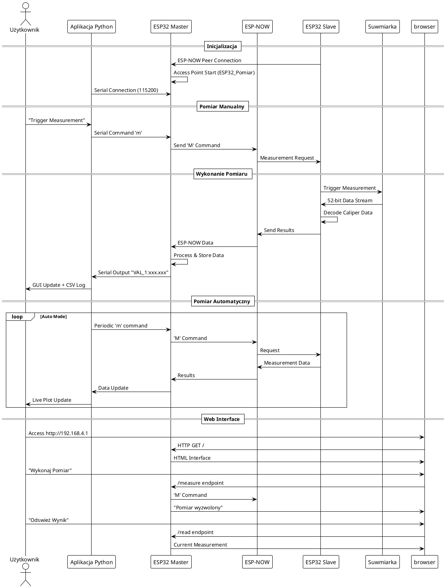
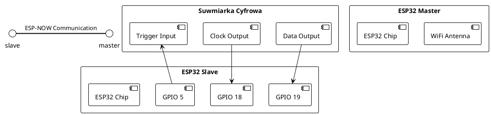

# System Pomiarowy ESP32 - Suwmiarka Bezprzewodowa

System bezprzewodowego pomiaru długości wykorzystujący suwarkę cyfrową oraz mikrokontrolery ESP32 z komunikacją ESP-NOW i interfejsem webowym.

## Opis Projektu

System składa się z trzech głównych komponentów:

1. **ESP32 Master** - pełni rolę punktu dostępu WiFi oraz serwera HTTP
2. **ESP32 Slave** - podłączony do suwarki cyfrowej, obsługuje odczyt danych pomiarowych
3. **Aplikacja Python** - interfejs graficzny do sterowania i wizualizacji danych

### Główne Funkcjonalności

- ✅ Bezprzewodowy odczyt pomiarów z suwarki cyfrowej
- ✅ Interfejs webowy do zdalnego sterowania
- ✅ Aplikacja desktop z wizualizacją w czasie rzeczywistym
- ✅ Zapisywanie danych do plików CSV
- ✅ Wykresy pomiarów na żywo
- ✅ Obsługa trybu automatycznego pomiaru
- ✅ Komunikacja dwukierunkowa ESP-NOW
- ✅ Zaawansowana walidacja danych i obsługa błędów
- ✅ Retry mechanizm dla niezawodnej komunikacji
- ✅ Optymalizacja wydajności i responsywności

## Architektura Systemu

```plantuml
@startuml
!theme plain
package "System Pomiarowy ESP32" {
  node "ESP32 Master" {
    component "Serwer HTTP" as http
    component "Access Point WiFi" as ap
    component "ESP-NOW Receiver" as recv
    component "Web Interface" as web
  }
  
  node "ESP32 Slave" {
    component "Caliper Interface" as cal
    component "ESP-NOW Sender" as send
    component "Data Processor" as proc
  }
  
  node "Aplikacja Python" as py
  node "Przeglądarka" as browser
  node "Suwmiarka Cyfrowa" as suw
  
  suw --> cal : Digital Data
  cal --> proc
  proc --> send
  send -.->|ESP-NOW| recv
  recv --> http
  http --> web
  web --> browser
  
  http <--> py : Serial Communication
  py --> browser : GUI Visualization
}

cloud "WiFi Network" {
  ap
  browser
}
@enduml
```

## Przepływ Komunikacji



## Połączenia Hardware



## Struktura Plików

```
caliper/
├── README.md                    # Ten plik
├── caliper_master/
│   ├── caliper_master.ino      # Kod Master ESP32
│   └── caliper_master_gui.py   # Aplikacja Python GUI
├── caliper_slave/
│   └── caliper_slave.ino       # Kod Slave ESP32
└── caliper_hw/
    ├── esp32_slave.kicad_pcb   # Projekt PCB
    ├── esp32_slave.kicad_sch   # Schemat
    └── ESP32-DevKit-V1-Pinout-Diagram-r0.1-CIRCUITSTATE-Electronics-2-1280x896.png
```

## Specyfikacja Techniczna

### ESP32 Master
- **Funkcje**: Access Point, Serwer HTTP, ESP-NOW Receiver
- **WiFi**: AP mode (ESP32_Pomiar, hasło: 12345678)
- **ESP-NOW**: Kanał 1, odbieranie danych z retry mechanizmem
- **Bezpieczeństwo**: Walidacja zakresu danych, obsługa błędów pakietów
- **Interfejsy**:
  - HTTP Server (port 80)
  - Serial (115200 baud)
  - ESP-NOW Communication

### ESP32 Slave
- **Funkcje**: Caliper Interface, ESP-NOW Sender
- **GPIO**:
  - GPIO 18: Clock Input (z suwarki)
  - GPIO 19: Data Input (z suwarki)
  - GPIO 5: Trigger Output (do suwarki)
- **ESP-NOW**: Kanał 1, wysyłanie danych z retry mechanizmem
- **Bezpieczeństwo**: Walidacja danych pomiarowych, timeout 200ms
- **Obsługa**: Dekodowanie 52-bitowego strumienia danych z walidacją

### Aplikacja Python
- **Framework**: Dear PyGui
- **Funkcje**:
  - Serial Communication z Master
  - Live plotting (matplotlib)
  - CSV logging
  - Auto measurement mode
  - Port management
  - Zaawansowana walidacja danych
- **Bezpieczeństwo**: Obsługa wyjątków, walidacja zakresu wartości
- **Wymagania**: Python 3.7+, dearpygui, pyserial

## Instalacja i Uruchomienie

### Wymagania Hardware
- 2x ESP32 DevKit V1
- 1x Suwmiarka cyfrowa z wyjściem danych
- Kable połączeniowe
- Komputer z Python 3.7+

### Kompilacja ESP32

1. **Instalacja Arduino IDE** z dodatkiem ESP32
2. **Wgranie caliper_master.ino** do pierwszego ESP32
3. **Wgranie caliper_slave.ino** do drugiego ESP32
4. **Połączenia suwarki**:
   ```
   Suwmiarka CLK  -> ESP32 Slave GPIO 18
   Suwmiarka DATA -> ESP32 Slave GPIO 19  
   Suwmiarka TRIG <- ESP32 Slave GPIO 5
   ```

### Konfiguracja Aplikacji Python

1. **Instalacja zależności**:
```bash
pip install dearpygui pyserial
```

2. **Uruchomienie aplikacji**:
```bash
cd caliper_master
python caliper_master_gui.py
```

3. **Połączenie Serial**:
   - Wybierz odpowiedni port COM
   - Kliknij "Open port"
   - Status: "Connected to COMx"

### Konfiguracja WiFi

1. **Master ESP32** tworzy Access Point:
   - SSID: `ESP32_Pomiar`
   - Hasło: `12345678`
   - IP: `192.168.4.1`

2. **Połączenie z siecią**:
   - Połącz się z WiFi `ESP32_Pomiar`
   - Otwórz przeglądarkę: `http://192.168.4.1`

## Użytkowanie

### Interfejs Aplikacji Python

1. **Sterowanie pomiarem**:
   - "Trigger measurement" - pojedynczy pomiar
   - "Auto trigger" - tryb automatyczny
   - "Interval (ms)" - interwał pomiarów

2. **Wizualizacja**:
   - **Measurement History** - lista wszystkich pomiarów
   - **Live Plot** - wykres pomiarów w czasie rzeczywistym
   - **Include timestamp** - dodanie znacznika czasu

3. **Logging**:
   - Automatyczne zapisywanie do pliku CSV
   - Plik: `measurement_YYYYMMDD_HHMMSS.csv`
   - Format: `timestamp,value` lub tylko `value`

4. **Debug**:
   - **Log tab** (Ctrl+Alt+L) - pełny log komunikacji
   - Serial monitor - monitorowanie ESP32

### Interfejs Web

1. **Główna strona**:
   - Wyświetlanie ostatniego pomiaru
   - Przyciski sterowania
   - Status połączenia

2. **Funkcje**:
   - **"Wykonaj Pomiar"** - inicjuje pomiar
   - **"Odswież Wynik"** - pobiera najnowsze dane
   - **API endpoint**: `/api` - dane JSON

### Obsługa Błędów

1. **Problemy z ESP-NOW**:
    - Sprawdź MAC adresy w kodzie (wyświetlane przy starcie)
    - Upewnij się, że urządzenia są w zasięgu (< 50m)
    - Sprawdź kanał WiFi (domyślnie 1)
    - System automatycznie ponawia wysyłanie w przypadku błędów

2. **Problemy z suwarką**:
    - Sprawdź połączenia GPIO
    - Upewnij się, że suwmiarka jest w trybie wyjścia danych
    - Sprawdź napięcie zasilania suwarki
    - System waliduje zakres pomiarów (-1000 do +1000 mm)

3. **Problemy z aplikacją**:
    - Sprawdź dostępność portu COM
    - Upewnij się, że ESP32 Master jest podłączony
    - Sprawdź baud rate (115200)
    - Aplikacja obsługuje nieprawidłowe dane i błędy parsowania

4. **Komunikaty błędów**:
    - `BLAD: Nieprawidlowa dlugosc pakietu` - błędny pakiet ESP-NOW
    - `BLAD: Wartosc poza zakresem` - pomiar poza zakresem -1000/+1000 mm
    - `BLAD: Nieprawidlowa wartosc pomiaru` - błędne dane z suwarki
    - `BLAD wysylania zadania/wyniku` - problemy z komunikacją ESP-NOW

## Protokół Komunikacji

### ESP-NOW Messages

**Command** (Master → Slave):
```
uint8_t command = 'M'  // Request measurement
```

**Data** (Slave → Master):
```c
typedef struct struct_message {
  float measurement;   // Wartość pomiaru w mm
  bool valid;         // Czy pomiar jest poprawny
  uint32_t timestamp; // Czas od startu systemu
} struct_message;
```

### Serial Protocol

**Trigger** (Python → Master):
```
'm' + '\n'  // Single measurement trigger
```

**Response** (Master → Python):
```
"VAL_1:xxx.xxx"  // Measurement value
```

### HTTP API

**GET** `/` - Główna strona HTML  
**GET** `/measure` - Wyzwolenie pomiaru  
**GET** `/read` - Odczyt ostatniego wyniku  
**GET** `/api` - Dane JSON:
```json
{
  "measurement": "25.430 mm",
  "timestamp": 12345,
  "valid": true
}
```

## Format Danych Suwarki

System obsługuje 52-bitowy strumień danych z suwarki cyfrowej:

1. **Clock ISR** - zbiera 52 bity danych
2. **Bit Reversal** - odwraca kolejność bitów  
3. **Bit Shifting** - przesuwa o 8 pozycji
4. **Nibble Decoding** - dekoduje 13 nibbli (4 bity każdy)
5. **Value Calculation** - oblicza wartość pomiaru
6. **Sign Detection** - wykrywa wartości ujemne
7. **Unit Detection** - rozpoznaje mm vs inch

**Obsługiwane tryby**:
- Millimetry (mm) - domyślny
- Cale (inch) - automatyczna konwersja × 25.4
- Wartości ujemne - dla pomiarów względnych

## Rozwój i Modyfikacje

### Dodanie nowych funkcji

1. **Master enhancements**:
   - WebSocket support dla实时 updates
   - Data storage (EEPROM/SPIFFS)
   - Additional HTTP endpoints

2. **Slave improvements**:
   - Multiple sensor support
   - Calibration routines  
   - Battery monitoring

3. **Python GUI**:
   - Advanced plotting (matplotlib)
   - Statistical analysis
   - Export to various formats
   - Network communication

### Troubleshooting

1. **ESP-NOW nie działa**:
   - Sprawdź MAC adresy
   - Sprawdź kanał WiFi
   - Sprawdź zasilanie ESP32

2. **Błędne pomiary**:
   - Sprawdź połączenia suwarki
   - Skalibruj dekoder bitów
   - Sprawdź timing sygnałów

3. **Aplikacja Python**:
   - Sprawdź porty COM
   - Sprawdź uprawnienia
   - Sprawdź dependencies

## Licencja

Projekt stworzony do celów edukacyjnych i hobbystycznych.

## Wersja i Aktualizacje

**Wersja 1.1** (2025-11-10)
- ✅ Dodano zaawansowaną walidację danych
- ✅ Zaimplementowano retry mechanizm ESP-NOW
- ✅ Poprawiono obsługę błędów i timeoutów
- ✅ Zoptymalizowano wydajność systemu
- ✅ Dodano wyświetlanie MAC Address
- ✅ Ulepszono aplikację Python z lepszą obsługą błędów

**Wersja 1.0** (2025-11-10)
- Wersja początkowa z podstawowymi funkcjonalnościami

## Autor

System pomiarowy ESP32 - bezprzewodowa suwmiarka

---

*README.md wygenerowany z diagramami PlantUML*