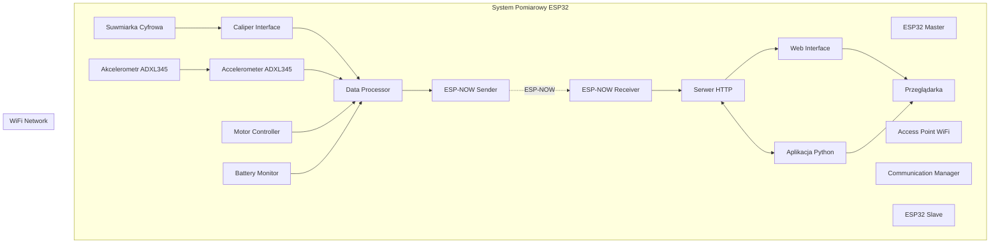
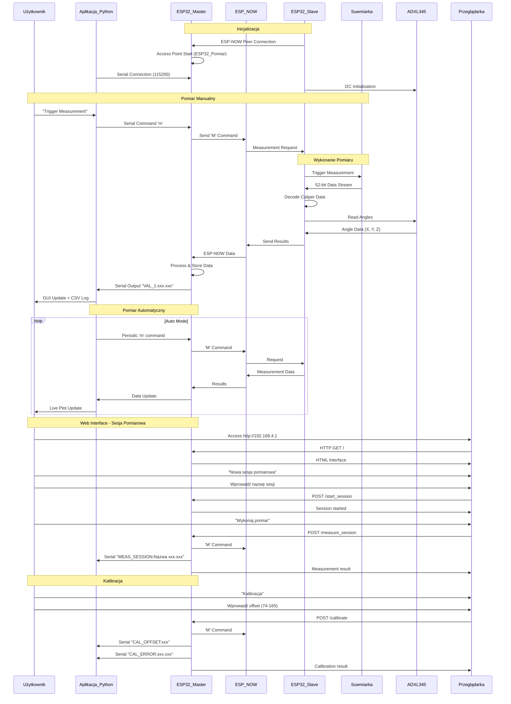

# System Pomiarowy ESP32 - Suwmiarka Bezprzewodowa

System bezprzewodowego pomiaru długości wykorzystujący suwarkę cyfrową, akcelerometr oraz mikrokontrolery ESP32 z komunikacją ESP-NOW i interfejsem webowym.

## Opis Projektu

System składa się z trzech głównych komponentów:

1. **ESP32 Master** - pełni rolę punktu dostępu WiFi oraz serwera HTTP
2. **ESP32 Slave** - podłączony do suwarki cyfrowej i akcelerometru, obsługuje odczyt danych pomiarowych
3. **Aplikacja Python** - interfejs graficzny do sterowania i wizualizacji danych

### Główne Funkcjonalności

- ✅ Bezprzewodowy odczyt pomiarów z suwarki cyfrowej
- ✅ Interfejs webowy do zdalnego sterowania
- ✅ Aplikacja desktop z wizualizacją w czasie rzeczywistym
- ✅ Zapisywanie danych do plików CSV
- ✅ Wykresy pomiarów na żywo
- ✅ Obsługa trybu automatycznego pomiaru
- ✅ Komunikacja dwukierunkowa ESP-NOW
- ✅ Zaawansowana walidacja danych i obsługa błędów
- ✅ Retry mechanizm dla niezawodnej komunikacji
- ✅ Optymalizacja wydajności i responsywności
- ✅ **Moduł sterowania silnikiem DC z MP6550GG-Z**
- ✅ **Akcelerometr ADXL345 do pomiaru kątów**
- ✅ **Sesje pomiarowe z nazwami**
- ✅ **Funkcja kalibracji z offsetem**
- ✅ **Monitorowanie napięcia baterii**

## Architektura Systemu



## Struktura Projektu

```
caliper/
├── README.md                    # Ten plik
├── caliper_master/              # ESP32 Master - PlatformIO project
│   ├── platformio.ini           # Konfiguracja PlatformIO
│   ├── src/
│   │   ├── main.cpp             # Główny plik Master
│   │   ├── communication.h      # Moduł komunikacji ESP-NOW - nagłówek
│   │   ├── communication.cpp    # Moduł komunikacji ESP-NOW - implementacja
│   │   ├── config.h             # Centralna konfiguracja
│   │   └── common.h             # Wspólne definicje i struktury
│   ├── include/                 # Dodatkowe nagłówki
│   └── lib/                     # Biblioteki
├── caliper_master_gui/          # Aplikacja Python GUI
│   └── caliper_master_gui.py    # Główny plik aplikacji
├── caliper_slave/               # ESP32 Slave - PlatformIO project
│   ├── platformio.ini           # Konfiguracja PlatformIO
│   ├── src/
│   │   ├── main.cpp             # Główny plik Slave
│   │   ├── caliper_slave_motor_ctrl.h    # Sterownik silnika - nagłówek
│   │   ├── caliper_slave_motor_ctrl.cpp  # Sterownik silnika - implementacja
│   │   ├── config.h             # Centralna konfiguracja
│   │   └── common.h             # Wspólne definicje i struktury
│   ├── include/                 # Dodatkowe nagłówki
│   └── lib/                     # Biblioteki
└── doc/                         # Dokumentacja sprzętowa
    ├── ESP32-DevKit-V1-Pinout-Diagram-r0.1-CIRCUITSTATE-Electronics-2-1280x896.png
    ├── MP6550GG-Z.pdf           # Dokumentacja sterownika silnika
    └── schematic.png            # Schemat połączeń
```

## Modułowa Architektura

### Moduł Komunikacji (CommunicationManager)

Klasa [`CommunicationManager`](caliper_master/src/communication.h:17) zarządza komunikacją ESP-NOW:

**Funkcje:**
- [`initialize()`](caliper_master/src/communication.h:32) - Inicjalizacja ESP-NOW
- [`sendCommand()`](caliper_master/src/communication.h:40) - Wysyłanie komend z retry mechanizmem
- [`sendMessage()`](caliper_master/src/communication.h:48) - Wysyłanie wiadomości
- [`setReceiveCallback()`](caliper_master/src/communication.h:66) - Ustawienie callbacku odbioru
- [`setSendCallback()`](caliper_master/src/communication.h:72) - Ustawienie callbacku wysyłki

### Moduł Konfiguracji (config.h)

Centralny plik konfiguracyjny zawierający:
- Konfigurację ESP-NOW (kanał, retry, timeout)
- Definicje pinów GPIO
- Parametry walidacji pomiarów
- Konfigurację WiFi
- Ustawienia ADC
- Konfigurację serwera web

### Moduł Wspólny (common.h)

Wspólne definicje i struktury:
- [`CommandType`](caliper_master/src/common.h:15) - Typy komend ESP-NOW
- [`MotorState`](caliper_master/src/common.h:24) - Stany silnika
- [`ErrorCode`](caliper_master/src/common.h:32) - Kody błędów
- [`Message`](caliper_master/src/common.h:42) - Struktura wiadomości
- [`SystemStatus`](caliper_master/src/common.h:51) - Struktura statusu systemu

### Moduł Sterowania Silnikiem DC

Moduł sterowania silnikiem DC wykorzystuje sterownik **MP6550GG-Z** w minimalistycznej konfiguracji.

#### Pliki:
- **[`caliper_slave_motor_ctrl.h`](caliper_slave/src/caliper_slave_motor_ctrl.h:1)** - Plik nagłówkowy z definicjami i deklaracjami funkcji
- **[`caliper_slave_motor_ctrl.cpp`](caliper_slave/src/caliper_slave_motor_ctrl.cpp:1)** - Plik implementacji C++ z funkcjami sterowania

#### Dostępne funkcje:

##### Inicjalizacja:
- [`initializeMotorController()`](caliper_slave/src/caliper_slave_motor_ctrl.h:36) - Inicjalizacja sterownika i konfiguracja pinów

##### Sterowanie silnikiem:
- [`setMotorSpeed(uint8_t speed, MotorState direction)`](caliper_slave/src/caliper_slave_motor_ctrl.h:45) - Ustawienie prędkości i kierunku silnika (PWM)
  - `speed=0, direction=MOTOR_STOP` - Zatrzymanie (tryb coast) (IN1=LOW, IN2=LOW)
  - `speed>0, direction=MOTOR_FORWARD` - Rotacja do przodu z PWM
  - `speed>0, direction=MOTOR_REVERSE` - Rotacja do tyłu z PWM
  - `speed>0, direction=MOTOR_BRAKE` - Hamowanie aktywne

#### Struktury danych:

```c
typedef enum {
  MOTOR_STOP = 0,        // Zatrzymanie/Coast
  MOTOR_FORWARD = 1,     // Rotacja do przodu
  MOTOR_REVERSE = 2,     // Rotacja do tyłu
  MOTOR_BRAKE = 3        // Hamowanie aktywne
} MotorState;
```

#### Użycie w głównym programie:

```cpp
#include "caliper_slave_motor_ctrl.h"

// W setup():
initializeMotorController();

// W loop():
setMotorSpeed(128, MOTOR_FORWARD);  // Silnik pracuje do przodu z prędkością 50%
setMotorSpeed(0, MOTOR_STOP);       // Zatrzymanie silnika
```

#### Specyfikacje techniczne:

- **Sterownik**: MP6550GG-Z (Single H-Bridge)
- **Tryb sterowania**: PWM Input (IN1/IN2)
- **Napięcie zasilania**: 1.8V - 22V

#### Mapa pinów ESP32:

```cpp
#define MOTOR_IN1_PIN 13       // IN1 input (PWM control input 1)
#define MOTOR_IN2_PIN 12       // IN2 input (PWM control input 2)
```

#### Tabela sterowania MP6550GG-Z:

| IN1  | IN2  | OUT1        | OUT2        | Funkcja                         |
|------|------|-------------|-------------|----------------------------------|
| 0    | 0    | Z           | Z           | Coast (outputs off)              |
| PWM  | 0    | PWM (H/Z)   | PWM (L/Z)   | Forward/Coast at speed PWM %     |
| 0    | PWM  | PWM (L/Z)   | PWM (H/Z)   | Reverse/Coast at speed PWM %     |
| 1    | 1    | L           | L           | Brake low (outputs shorted)      |

**Implementacja w kodzie:**
- `setMotorSpeed(speed, MOTOR_FORWARD)` → IN1=PWM, IN2=0
- `setMotorSpeed(speed, MOTOR_REVERSE)` → IN1=0, IN2=PWM
- `setMotorSpeed(0, MOTOR_STOP)` → IN1=0, IN2=0 (Coast)
- `setMotorSpeed(speed, MOTOR_BRAKE)` → IN1=1, IN2=1 (Brake low)

### Akcelerometr ADXL345

Slave ESP32 posiada zintegrowany akcelerometr ADXL345 do pomiaru kątów nachylenia:

**Funkcje:**
- Pomiar kątów X, Y, Z
- Pomiar przyspieszenia grawitacyjnego
- Automatyczna kalibracja kątów
- Komunikacja przez I2C (adres 0x53)

**Konfiguracja:**
- Data rate: 50 Hz
- Range: ±2g

## Przepływ Komunikacji



## Połączenia Hardware

```mermaid
graph LR
    subgraph "ESP32 Slave"
        GPIO18[GPIO 18 - Clock]
        GPIO19[GPIO 19 - Data]
        GPIO5[GPIO 5 - Trigger]
        GPIO13[GPIO 13 - Motor IN1]
        GPIO12[GPIO 12 - Motor IN2]
        GPIO34[GPIO 34 - Battery ADC]
        SDA[GPIO 21 - I2C SDA]
        SCL[GPIO 22 - I2C SCL]
        Chip[ESP32 Chip]
    end
    
    subgraph "Suwmiarka Cyfrowa"
        Clock[Clock Output]
        Data[Data Output]
        Trigger[Trigger Input]
    end
    
    subgraph "Sterownik Silnika"
        IN1[MP6550GG-Z IN1]
        IN2[MP6550GG-Z IN2]
    end
    
    subgraph "Akcelerometr"
        ADXL[ADXL345]
    end
    
    subgraph "Bateria"
        Batt[Battery 0-3.3V]
    end
    
    Clock --> GPIO18
    Data --> GPIO19
    Trigger <-- GPIO5
    IN1 <-- GPIO13
    IN2 <-- GPIO12
    Batt --> GPIO34
    SDA --> ADXL
    SCL --> ADXL
```

## Specyfikacja Techniczna

### ESP32 Master
- **Funkcje**: Access Point, Serwer HTTP, ESP-NOW Receiver, Communication Manager
- **WiFi**: AP mode (ESP32_Pomiar, hasło: 12345678)
- **ESP-NOW**: Kanał 1, odbieranie danych z retry mechanizmem
- **Bezpieczeństwo**: Walidacja zakresu danych, obsługa błędów pakietów
- **Interfejsy**:
  - HTTP Server (port 80)
  - Serial (115200 baud)
  - ESP-NOW Communication
- **Moduły**:
  - [`CommunicationManager`](caliper_master/src/communication.h:17) - zarządzanie ESP-NOW
  - [`SystemStatus`](caliper_master/src/common.h:51) - śledzenie statusu systemu

### ESP32 Slave
- **Funkcje**: Caliper Interface, ESP-NOW Sender, Motor Controller, Battery Monitor, Accelerometer
- **GPIO**:
  - GPIO 18: Clock Input (z suwarki)
  - GPIO 19: Data Input (z suwarki)
  - GPIO 5: Trigger Output (do suwarki)
  - GPIO 13: Motor IN1 (sterownik MP6550GG-Z)
  - GPIO 12: Motor IN2 (sterownik MP6550GG-Z)
  - GPIO 34: Battery Voltage Input (ADC)
  - GPIO 21: I2C SDA (ADXL345)
  - GPIO 22: I2C SCL (ADXL345)
- **ESP-NOW**: Kanał 1, wysyłanie danych z retry mechanizmem
- **Bezpieczeństwo**: Walidacja danych pomiarowych, timeout 200ms
- **Obsługa**: Dekodowanie 52-bitowego strumienia danych z walidacją
- **Sterowanie silnikiem**: PWM 8-bit, 4 tryby pracy (Stop, Forward, Reverse, Brake)
- **Monitorowanie baterii**: Pomiar napięcia 0-3.3V przez ADC z uśrednianiem
- **Akcelerometr**: ADXL345, pomiar kątów X, Y, Z

### Aplikacja Python
- **Framework**: Dear PyGui
- **Funkcje**:
  - Serial Communication z Master
  - Live plotting (matplotlib)
  - CSV logging
  - Auto measurement mode
  - Port management
  - Zaawansowana walidacja danych
- **Bezpieczeństwo**: Obsługa wyjątków, walidacja zakresu wartości
- **Wymagania**: Python 3.7+, dearpygui, pyserial

## Instalacja i Uruchomienie

### Wymagania Hardware
- 2x ESP32 DevKit V1
- 1x Suwmiarka cyfrowa z wyjściem danych
- 1x Akcelerometr ADXL345
- 1x Sterownik silnika MP6550GG-Z
- 1x Silnik DC
- Kable połączeniowe
- Komputer z Python 3.7+

### Kompilacja ESP32 (PlatformIO)

1. **Instalacja PlatformIO** w VS Code lub jako samodzielne narzędzie
2. **Wgranie kodu Master**:
   ```bash
   cd caliper_master
   pio run --target upload
   ```

3. **Wgranie kodu Slave**:
   ```bash
   cd caliper_slave
   pio run --target upload
   ```

4. **Połączenia suwarki**:
   ```
   Suwmiarka CLK  -> ESP32 Slave GPIO 18
   Suwmiarka DATA -> ESP32 Slave GPIO 19
   Suwmiarka TRIG <- ESP32 Slave GPIO 5
   ```

5. **Połączenia sterownika silnika**:
   ```
   MP6550GG-Z IN1 -> ESP32 Slave GPIO 13
   MP6550GG-Z IN2 -> ESP32 Slave GPIO 12
   ```

6. **Połączenia akcelerometru**:
   ```
   ADXL345 SDA -> ESP32 Slave GPIO 21
   ADXL345 SCL -> ESP32 Slave GPIO 22
   ADXL345 VCC -> 3.3V
   ADXL345 GND -> GND
   ```

7. **Połączenia monitorowania baterii**:
   ```
   Bateria (0-3.3V) -> ESP32 Slave GPIO 34 (przez dzielnik napięcia jeśli potrzeba)
   ```

### Konfiguracja Aplikacji Python

1. **Instalacja zależności**:
```bash
pip install dearpygui pyserial
```

2. **Uruchomienie aplikacji**:
```bash
cd caliper_master_gui
python caliper_master_gui.py
```

3. **Połączenie Serial**:
   - Wybierz odpowiedni port COM
   - Kliknij "Open port"
   - Status: "Connected to COMx"

### Konfiguracja WiFi

1. **Master ESP32** tworzy Access Point:
   - SSID: `ESP32_Pomiar`
   - Hasło: `12345678`
   - IP: `192.168.4.1`

2. **Połączenie z siecią**:
   - Połącz się z WiFi `ESP32_Pomiar`
   - Otwórz przeglądarkę: `http://192.168.4.1`

## Użytkowanie

### Interfejs Aplikacji Python

1. **Sterowanie pomiarem**:
   - "Trigger measurement" - pojedynczy pomiar
   - "Auto trigger" - tryb automatyczny
   - "Interval (ms)" - interwał pomiarów

2. **Wizualizacja**:
   - **Measurement History** - lista wszystkich pomiarów
   - **Live Plot** - wykres pomiarów w czasie rzeczywistym
   - **Include timestamp** - dodanie znacznika czasu

3. **Logging**:
   - Automatyczne zapisywanie do pliku CSV
   - Plik: `measurement_YYYYMMDD_HHMMSS.csv`
   - Format: `timestamp,value` lub tylko `value`

4. **Debug**:
   - **Log tab** (Ctrl+Alt+L) - pełny log komunikacji
   - Serial monitor - monitorowanie ESP32

### Interfejs Web

1. **Menu główne**:
   - **Kalibracja** - funkcja kalibracji z offsetem
   - **Nowa sesja pomiarowa** - tworzenie nazwanej sesji

2. **Widok Kalibracja**:
   - Wprowadź offset (zakres 74-165)
   - Kliknij "Kalibruj"
   - Wynik: offset i błąd kalibracji

3. **Widok Sesja Pomiarowa**:
   - Wyświetlanie nazwy sesji
   - Wyświetlanie ostatniego pomiaru
   - Wyświetlanie napięcia baterii
   - Przyciski sterowania

4. **Funkcje pomiarowe**:
   - **"Wykonaj pomiar"** - inicjuje pomiar w sesji
   - **"Odśwież wynik"** - pobiera najnowsze dane

5. **Funkcje sterowania silnikiem**:
   - **"Forward"** - uruchom silnik do przodu
   - **"Reverse"** - uruchom silnik do tyłu
   - **"Stop"** - zatrzymaj silnik

6. **API endpointy**:
   - `/api` - dane JSON z pomiarami i statusem
   - `/forward` - sterowanie silnikiem do przodu
   - `/reverse` - sterowanie silnikiem do tyłu
   - `/stop` - zatrzymanie silnika
   - `/calibrate` (POST) - kalibracja z offsetem
   - `/start_session` (POST) - rozpoczęcie sesji
   - `/measure_session` (POST) - pomiar w sesji

### Obsługa Błędów

1. **Problemy z ESP-NOW**:
    - Sprawdź MAC adresy w kodzie (wyświetlane przy starcie)
    - Upewnij się, że urządzenia są w zasięgu (< 50m)
    - Sprawdź kanał WiFi (domyślnie 1)
    - System automatycznie ponawia wysyłanie w przypadku błędów

2. **Problemy z suwarką**:
    - Sprawdź połączenia GPIO
    - Upewnij się, że suwmiarka jest w trybie wyjścia danych
    - Sprawdź napięcie zasilania suwarki
    - System waliduje zakres pomiarów (-1000 do +1000 mm)

3. **Problemy z aplikacją**:
    - Sprawdź dostępność portu COM
    - Upewnij się, że ESP32 Master jest podłączony
    - Sprawdź baud rate (115200)
    - Aplikacja obsługuje nieprawidłowe dane i błędy parsowania

4. **Komunikaty błędów**:
    - `BLAD: Nieprawidlowa dlugosc pakietu` - błędny pakiet ESP-NOW
    - `BLAD: Wartosc poza zakresem` - pomiar poza zakresem -1000/+1000 mm
    - `BLAD: Nieprawidlowa wartosc pomiaru` - błędne dane z suwarki
    - `BLAD wysylania zadania/wyniku` - problemy z komunikacją ESP-NOW

## Protokół Komunikacji

### ESP-NOW Messages

**Command** (Master → Slave):
```c
uint8_t command = 'M'; // Request measurement
uint8_t command = 'F'; // Motor forward
uint8_t command = 'R'; // Motor reverse
uint8_t command = 'S'; // Motor stop
```

**Data** (Slave → Master):
```c
typedef struct struct_message {
  float measurement;   // Wartość pomiaru w mm
  bool valid;         // Czy pomiar jest poprawny
  uint32_t timestamp; // Czas od startu systemu
  CommandType command;       // Typ komendy ('M' - measurement, 'U' - update, 'F'/'R'/'S' - motor)
  uint16_t batteryVoltage; // Napięcie baterii w milliwoltach
} struct_message;
```

### Serial Protocol

**Trigger** (Python → Master):
```c
'm' + '\n'; // Single measurement trigger
'f' + '\n'; // Motor forward
'r' + '\n'; // Motor reverse
's' + '\n'; // Motor stop
'h' + '\n'; // Help
```

**Response** (Master → Python):
```c
"VAL_1:xxx.xxx"; // Measurement value
"CAL_OFFSET:xxx"; // Calibration offset
"CAL_ERROR:xxx.xxx"; // Calibration error
"MEAS_SESSION:Nazwa xxx.xxx"; // Session measurement
```

**Available commands** (Master Serial Console):
- `M/m` - Wykonaj pomiar
- `F/f` - Silnik do przodu (Forward)
- `R/r` - Silnik do tyłu (Reverse)
- `S/s` - Zatrzymaj silnik (Stop)
- `H/h/?` - Wyświetl pomoc

### HTTP API

**GET** `/` - Główna strona HTML
**GET** `/measure` - Wyzwolenie pomiaru
**GET** `/read` - Odczyt ostatniego wyniku
**GET** `/forward` - Sterowanie silnikiem do przodu
**GET** `/reverse` - Sterowanie silnikiem do tyłu
**GET** `/stop` - Zatrzymanie silnika
**GET** `/api` - Dane JSON:
```json
{
  "measurement": "25.430 mm",
  "timestamp": 12345,
  "valid": true,
  "batteryVoltage": 3300,
  "command": "M"
}
```

**POST** `/calibrate` - Kalibracja z offsetem:
```json
{
  "offset": 100,
  "error": 0.123
}
```

**POST** `/start_session` - Rozpoczęcie sesji:
```json
{
  "sessionName": "Sesja1",
  "active": true
}
```

**POST** `/measure_session` - Pomiar w sesji:
```json
{
  "sessionName": "Sesja1",
  "measurement": "25.430 mm"
}
```

## Format Danych Suwarki

System obsługuje 52-bitowy strumień danych z suwarki cyfrowej:

1. **Clock ISR** - zbiera 52 bity danych
2. **Bit Reversal** - odwraca kolejność bitów  
3. **Bit Shifting** - przesuwa o 8 pozycji
4. **Nibble Decoding** - dekoduje 13 nibbli (4 bity każdy)
5. **Value Calculation** - oblicza wartość pomiaru
6. **Sign Detection** - wykrywa wartości ujemne
7. **Unit Detection** - rozpoznaje mm vs inch

**Obsługiwane tryby**:
- Millimetry (mm) - domyślny
- Cale (inch) - automatyczna konwersja × 25.4
- Wartości ujemne - dla pomiarów względnych

## Rozwój i Modyfikacje

### Dodanie nowych funkcji

1. **Master enhancements**:
    - WebSocket support dla realtime updates
    - Data storage (EEPROM/SPIFFS)
    - Additional HTTP endpoints
    - Rozszerzenie CommunicationManager

2. **Slave improvements**:
    - Multiple sensor support
    - Calibration routines  
    - Battery monitoring
    - Dodatkowe funkcje akcelerometru

3. **Python GUI**:
    - Advanced plotting (matplotlib)
    - Statistical analysis
    - Export to various formats
    - Network communication
    - Obsługa sesji pomiarowych

### Troubleshooting

1. **ESP-NOW nie działa**:
    - Sprawdź MAC adresy
    - Sprawdź kanał WiFi
    - Sprawdź zasilanie ESP32

2. **Błędne pomiary**:
    - Sprawdź połączenia suwarki
    - Skalibruj dekoder bitów
    - Sprawdź timing sygnałów

3. **Aplikacja Python**:
    - Sprawdź porty COM
    - Sprawdź uprawnienia
    - Sprawdź dependencies

4. **PlatformIO**:
    - Sprawdź konfigurację platformio.ini
    - Zaktualizuj platform i framework
    - Sprawdź dostępność portów

## Licencja

Projekt stworzony do celów edukacyjnych i hobbystycznych.

## Wersja i Aktualizacje

**Wersja 2.0** (2025-12-26)
- ✅ **REFACTORING**: Przeniesienie z Arduino IDE na PlatformIO
- ✅ **ARCHITEKTURA**: Modularna struktura z oddzielnymi plikami .cpp/.h
- ✅ **MODUŁY**: Dodano CommunicationManager do zarządzania ESP-NOW
- ✅ **KONFIGURACJA**: Centralny plik config.h dla obu urządzeń
- ✅ **WSPÓLNE**: Plik common.h ze wspólnymi definicjami
- ✅ **AKCELEROMETR**: Dodano ADXL345 do pomiaru kątów
- ✅ **SESJE**: Dodano funkcję sesji pomiarowych z nazwami
- ✅ **KALIBRACJA**: Dodano funkcję kalibracji z offsetem
- ✅ **STATUS**: Dodano SystemStatus do śledzenia stanu systemu
- ✅ **WEB**: Rozszerzono interfejs web o sesje i kalibrację
- ✅ **SERIAL**: Dodano komendy CAL_OFFSET, CAL_ERROR, MEAS_SESSION
- ✅ **DOKUMENTACJA**: Przeniesiono dokumentację sprzętową do folderu doc/
- ✅ **STRUKTURA**: Nowa struktura folderów zgodna z PlatformIO

**Wersja 1.2** (2025-11-30)
- ✅ **REFACTORING**: Usunięto funkcję `setMotorState` i zastąpiono przez `setMotorSpeed`
- ✅ **REFACTORING**: Usunięto funkcję `motorStop` i zastąpiono przez `setMotorSpeed(0, MOTOR_STOP)`
- ✅ **OPTYMALIZACJA**: Usunięto nieużywaną definicję `MOTOR_SLEEP` z enuma MotorState
- ✅ **POPRAWKA IMPLEMENTACJI**: Zaktualizowano sterowanie MP6550GG-Z zgodnie ze specyfikacją (PWM na IN1/IN2)
- ✅ **MODUŁ SILNIKA**: Zaktualizowano sterowanie silnikiem do używania PWM z kontrolą prędkości
- ✅ **MONITOROWANIE BATERII**: Dodano pomiar napięcia baterii przez ADC (GPIO 34)
- ✅ **KOMUNIKACJA**: Rozszerzono protokół ESP-NOW o przesyłanie napięcia baterii
- ✅ **INTERFEJS WEB**: Dodano przyciski sterowania silnikiem i wyświetlanie napięcia baterii
- ✅ **SERIAL COMMANDS**: Dodano komendy sterowania silnikiem przez konsolę szeregową
- ✅ **DOKUMENTACJA**: Zaktualizowano README.md i dokumentację kodu

**Wersja 1.1** (2025-11-10)
- ✅ Dodano zaawansowaną walidację danych
- ✅ Zaimplementowano retry mechanizm ESP-NOW
- ✅ Poprawiono obsługę błędów i timeoutów
- ✅ Zoptymalizowano wydajność systemu
- ✅ Dodano wyświetlanie MAC Address
- ✅ Ulepszono aplikację Python z lepszą obsługą błędów

**Wersja 1.0** (2025-11-10)
- Wersja początkowa z podstawowymi funkcjonalnościami

## Autor

System pomiarowy ESP32 - bezprzewodowa suwmiarka

---

*README.md wygenerowany z diagramami PlantUML*
