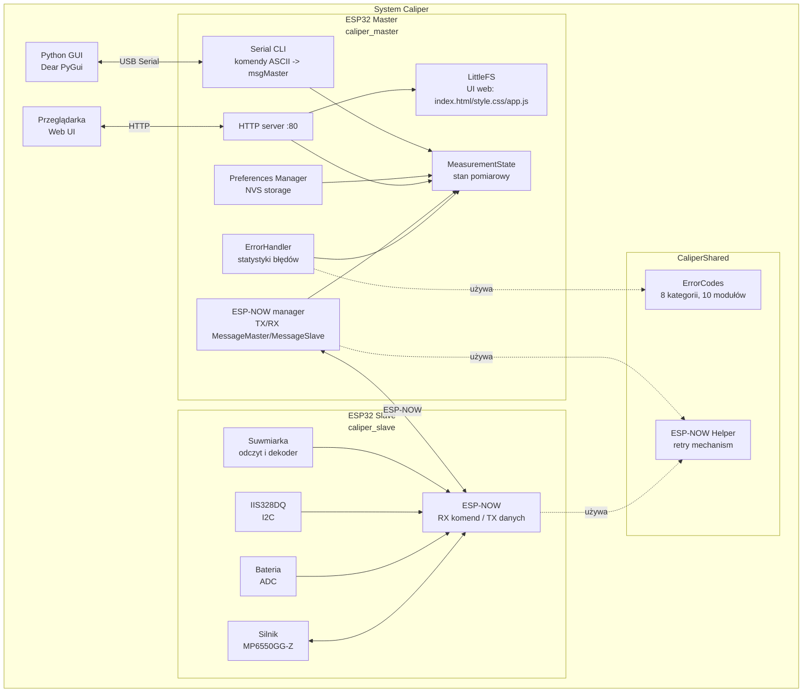
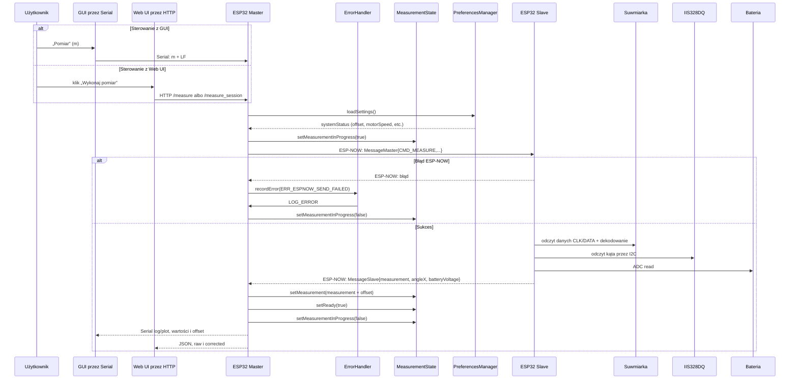

# Caliper — bezprzewodowy system pomiarowy (ESP32 + suwmiarka)

Projekt **Caliper** to zaawansowany system bezprzewodowego pomiaru długości oparty na platformie ESP32, cyfrowej suwmiarce (odczyt strumienia bitów), akcelerometrze IIS328DQ oraz sterowniku silnika MP6550GG-Z. Dane są przesyłane dwukierunkowo przez protokół **ESP-NOW**, a sterowanie odbywa się przez:

- **Web UI** hostowane przez ESP32 Master (WiFi AP + HTTP + LittleFS)
- **Desktop GUI** w Pythonie (Dear PyGui) komunikujące się z Master po **Serial**
- **Serial CLI** - interfejs wiersza poleceń przez port szeregowy

## 📑 Spis treści

- [Funkcjonalności](#funkcjonalności)
- [Architektura systemu](#architektura-systemu)
- [Wymagania](#wymagania)
- [Szybki start](#szybki-start)
- [Instalacja i konfiguracja](#instalacja-i-konfiguracja)
- [Użytkowanie](#użytkowanie)
- [Dokumentacja API](#dokumentacja-api)
- [Struktura projektu](#struktura-projektu)
- [Konfiguracja](#konfiguracja)
- [Rozwiązywanie problemów](#rozwiązywanie-problemów)
- [Współpraca](#współpraca)
- [Licencja](#licencja)

## ✨ Funkcjonalności

### Pomiar i sensory
- **Pomiar z cyfrowej suwmiarki** - dekodowanie danych z interfejsu CLK/DATA/TRIG
- **Walidacja zakresów** - automatyczna walidacja pomiarów (-1000.0 do 1000.0 mm)
- **Odczyt kąta z IIS328DQ** - akcelerometr I2C do pomiaru pochylenia
- **Pomiar napięcia baterii** - monitorowanie stanu baterii przez ADC

### Sterowanie silnikiem
- **Sterowanie silnikiem DC** przez sterownik MP6550GG-Z
- **PWM na IN1/IN2** - precyzyjna kontrola prędkości i momentu
- **Automatyzacja pomiarów** - silnik uruchamiany automatycznie przy pomiarze

### Komunikacja
- **ESP-NOW** - dwukierunkowa komunikacja bezprzewodowa Master↔Slave
- **HTTP API** - REST API dla Web UI
- **Serial CLI** - interfejs wiersza poleceń dla diagnostyki i konfiguracji
- **Retry mechanism** - automatyczne ponawianie wysyłek przy błędach

### Interfejsy użytkownika
- **Web UI** - responsywny interfejs HTML/CSS/JS hostowany na ESP32
- **Python GUI** - aplikacja desktopowa z Dear PyGui
  - Wykresy pomiarów w czasie rzeczywistym
  - Eksport danych do CSV
  - Logi systemowe
  - Kalibracja i konfiguracja

### Przechowywanie danych
- **Persistent Storage** - ustawienia zapisywane w NVS (Preferences)
- **Nazwy sesji pomiarowych** - organizacja pomiarów
- **Offset kalibracji** - trwałe przechowywanie wartości kalibracji
- **MeasurementState** - klasa zarządzająca stanem pomiarowym z buforami tekstowymi
- **PreferencesManager** - menedżer ustawień z walidacją i trwałym przechowywaniem

### System obsługi błędów
- **Kompleksowy system kodów błędów** - 8 kategorii (Communication, Sensor, Motor, Power, Storage, Network, Validation, System)
- **10 modułów źródłowych** - ESP-NOW, Serial, Caliper, Accelerometer, Motor, Battery, LittleFS, Preferences, Web Server, CLI
- **Makra logowania** - LOG_ERROR, LOG_WARNING, LOG_INFO z automatycznym dekodowaniem
- **ErrorHandler** - singleton do śledzenia statystyk błędów
- **Funkcje pomocnicze ESP-NOW** - espnow_send_with_retry, espnow_add_peer_with_retry

## 🏗️ Architektura systemu

### Komponenty systemu



### Przepływ pomiaru (typowy)



### Połączenia hardware


## 📋 Wymagania

### Wymagania sprzętowe
- **2× ESP32 DOIT DEVKIT V1** (lub kompatybilne)
  - Mikrokontroler: ESP32 240MHz, 320KB RAM, 4MB Flash
- **Cyfrowa suwmiarka** z interfejsem CLK/DATA/TRIG
- **Akcelerometr IIS328DQ** (I2C)
- **Sterownik silnika MP6550GG-Z**
- **Silnik DC**
- **Bateria** z obwodem pomiaru napięcia
- **Kable połączeniowe** zgodnie z diagramem hardware

### Wymagania programowe
- **PlatformIO** - do kompilacji firmware ESP32
  - Ścieżka do skryptów: `C:\Users\tiim\.platformio\penv\Scripts`
- **Python 3.x** - do uruchomienia GUI
- **Visual Studio Code** (zalecane) z rozszerzeniem PlatformIO

### Zależności Python
Zobacz [`caliper_master_gui/requirements.txt`](caliper_master_gui/requirements.txt:1):
```
dearpygui>=1.9.0
pyserial>=3.5
```

## 🚀 Szybki start

### 1. Klonowanie repozytorium
```bash
git clone <repository-url>
cd caliper
```

### 2. Instalacja zależności Python
```powershell
cd caliper_master_gui
python -m pip install -r requirements.txt
```

### 3. Kompilacja firmware
```powershell
# Slave
cd caliper_slave
C:\Users\tiim\.platformio\penv\Scripts\platformio.exe run --environment esp32doit-devkit-v1

# Master
cd ..\caliper_master
C:\Users\tiim\.platformio\penv\Scripts\platformio.exe run --environment esp32doit-devkit-v1
```

### 4. Wgrywanie firmware
```powershell
# Slave (COM8)
cd caliper_slave
C:\Users\tiim\.platformio\penv\Scripts\platformio.exe run --target upload -s --environment esp32doit-devkit-v1 --upload-port COM8

# Master (COM7)
cd ..\caliper_master
C:\Users\tiim\.platformio\penv\Scripts\platformio.exe run --target upload -s --environment esp32doit-devkit-v1 --upload-port COM7
```

### 5. Wgrywanie Web UI (LittleFS)
```powershell
cd caliper_master
C:\Users\tiim\.platformio\penv\Scripts\platformio.exe run --target uploadfs -s --environment esp32doit-devkit-v1 --upload-port COM7
```

### 6. Uruchomienie GUI
```powershell
cd caliper_master_gui
python caliper_master_gui.py
```

### 7. Użycie Web UI
1. Połącz się z WiFi: `Orange_WiFi` (hasło: `1670$2026`)
2. Otwórz w przeglądarce: `http://192.168.4.1`

## ⚙️ Instalacja i konfiguracja

### Instalacja PlatformIO

#### Windows
1. Zainstaluj [Visual Studio Code](https://code.visualstudio.com/)
2. Zainstaluj rozszerzenie [PlatformIO](https://marketplace.visualstudio.com/items?itemName=platformio.platformio-ide)
3. Alternatywnie: zainstaluj PlatformIO CLI:
   ```powershell
   pip install platformio
   ```

### Konfiguracja portów COM

Domyślne porty są zdefiniowane w [`platformio.ini`](caliper_master/platformio.ini:1):
- **Master**: `COM7`
- **Slave**: `COM8`

Aby zmienić port, dodaj `--upload-port COMx` do komendy upload.

### Konfiguracja adresów MAC

Adresy MAC są zdefiniowane w plikach konfiguracyjnych:

**Master** ([`caliper_master/src/config.h`](caliper_master/src/config.h:28)):
```cpp
#define SLAVE_MAC_ADDR {0xA0, 0xB7, 0x65, 0x21, 0x77, 0x5C}
```

**Slave** ([`caliper_slave/src/config.h`](caliper_slave/src/config.h:28)):
```cpp
#define MASTER_MAC_ADDR {0xA0, 0xB7, 0x65, 0x20, 0xC0, 0x8C}
```

Aby znaleźć adres MAC urządzenia, uruchom firmware i sprawdź wyjście Serial przy starcie.

### Konfiguracja WiFi

WiFi AP jest konfigurowane w [`caliper_master/src/config.h`](caliper_master/src/config.h:33):
```cpp
#define WIFI_SSID "Orange_WiFi"
#define WIFI_PASSWORD "1670$2026"
#define WIFI_AP_IP IPAddress(192, 168, 4, 1)
```

## 📖 Użytkowanie

### Web UI

#### Menu główne
1. **Kalibracja** - ustawianie offsetu kalibracji
2. **Nowa sesja pomiarowa** - tworzenie nowej sesji

#### Kalibracja
1. Kliknij "Pobierz bieżący pomiar" - wykona pomiar i pokaże surową wartość
2. Wprowadź offset w polu input (-14.999 do 14.999)
3. Kliknij "Zastosuj offset" - zapisze offset w systemie

#### Sesja pomiarowa
1. Utwórz sesję przez podanie nazwy
2. Kliknij "Wykonaj pomiar" - wykona pomiar z uruchomieniem silnika
3. Wynik pokaże:
   - Pomiar skorygowany (raw + offset)
   - Pomiar surowy
   - Offset
   - Napięcie baterii
   - Kąt X

### Python GUI

#### Zakładka "Pomiary"
- **Wykres** - wizualizacja pomiarów w czasie rzeczywistym
- **Historia** - lista ostatnich pomiarów
- **Eksport CSV** - zapis pomiarów do pliku
- **Hotkey 'p'** - szybkie wykonanie pomiaru

#### Zakładka "Kalibracja"
- **Offset kalibracji** - ustawianie i wyświetlanie offsetu
- **Konfiguracja silnika** - prędkość, moment, stan, timeout
- **Logi aplikacji** - komunikaty systemowe
- **Logi szeregowe** - komunikacja z Masterem

### Serial CLI

Podłącz Master przez USB Serial i użyj terminala (np. PuTTY, Arduino Serial Monitor) z ustawieniami:
- Baud rate: 115200
- Data bits: 8
- Parity: None
- Stop bits: 1

#### Dostępne komendy

| Komenda | Opis |
|---------|------|
| `m` | Wykonaj pomiar |
| `u` | Zaktualizuj status |
| `t` | Test silnika |
| `o <wartość>` | Ustaw offset kalibracji (-14.999..14.999) |
| `q <wartość>` | Ustaw timeout (ms, 0..600000) |
| `s <wartość>` | Ustaw prędkość silnika (0..255) |
| `r <wartość>` | Ustaw moment silnika (0..255) |
| `n <nazwa>` | Ustaw nazwę sesji (maks 31 znaków) |
| `h` | Pomoc |
| `d` | Wyświetl stan systemu |

## 🔌 Dokumentacja API

### HTTP API

#### Endpointy pomiaru

**POST /measure**
Wyzwala pojedynczy pomiar.
```http
POST /measure HTTP/1.1
```
**Odpowiedź:**
```
Pomiar wyzwolony
```

**POST /measure_session**
Wyzwala pomiar w ramach aktywnej sesji.
```http
POST /measure_session HTTP/1.1
```
**Odpowiedź (JSON):**
```json
{
  "sessionName": "moja_sesja",
  "measurementRaw": 12.345,
  "calibrationOffset": 0.000,
  "measurementCorrected": 12.345,
  "valid": true,
  "batteryVoltage": 3.7,
  "angleX": 5
}
```

#### Endpointy kalibracji

**POST /api/calibration/measure**
Wykonuje pomiar i zwraca surową wartość.
```http
POST /api/calibration/measure HTTP/1.1
```
**Odpowiedź (JSON):**
```json
{
  "success": true,
  "measurementRaw": 12.345,
  "calibrationOffset": 0.000
}
```

**POST /api/calibration/offset**
Ustawia offset kalibracji.
```http
POST /api/calibration/offset?offset=1.234 HTTP/1.1
```
**Odpowiedź (JSON):**
```json
{
  "success": true,
  "calibrationOffset": 1.234
}
```

#### Endpointy sesji

**POST /start_session**
Rozpoczyna nową sesję pomiarową.
```http
POST /start_session?sessionName=moja_sesja HTTP/1.1
```
**Odpowiedź (JSON):**
```json
{
  "sessionName": "moja_sesja"
}
```

### Serial Protocol

Master wysyła dane przez Serial w formacie `DEBUG_PLOT`:
```
>measurement:12.345
>calibrationOffset:0.000
>angleX:5
>batteryVoltage:3.700
>timeout:1000
>motorSpeed:100
>motorTorque:100
>motorState:0
>sessionName:moja_sesja
```

## 📁 Struktura projektu

```
caliper/
├── caliper_master/              # Firmware Master ESP32
│   ├── src/
│   │   ├── main.cpp             # Główna logika: AP WiFi + HTTP + ESP-NOW + LittleFS
│   │   ├── config.h             # Konfiguracja specyficzna dla Master
│   │   ├── communication.h/.cpp # Menedżer komunikacji ESP-NOW
│   │   ├── serial_cli.h/.cpp    # Interfejs wiersza poleceń
│   │   ├── measurement_state.h/.cpp # Zarządzanie stanem pomiarowym
│   │   └── preferences_manager.h/.cpp # Przechowywanie ustawień w NVS
│   ├── data/                    # Pliki LittleFS (HTML/CSS/JS)
│   │   ├── index.html
│   │   ├── style.css
│   │   └── app.js
│   └── platformio.ini
│
├── caliper_slave/               # Firmware Slave ESP32
│   ├── src/
│   │   ├── main.cpp             # Główna logika: ESP-NOW + harmonogram
│   │   ├── config.h             # Konfiguracja specyficzna dla Slave
│   │   ├── sensors/
│   │   │   ├── caliper.h/.cpp   # Obsługa suwmiarki
│   │   │   └── accelerometer.h/.cpp # Obsługa IIS328DQ
│   │   ├── motor/
│   │   │   └── motor_ctrl.h/.cpp # Sterowanie silnikiem
│   │   └── power/
│   │       └── battery.h/.cpp   # Pomiar napięcia baterii
│   └── platformio.ini
│
├── caliper_master_gui/          # Aplikacja GUI Python
│   ├── caliper_master_gui.py    # Entry-point GUI (Dear PyGui)
│   ├── requirements.txt
│   ├── src/
│   │   ├── __init__.py
│   │   ├── serial_handler.py    # Obsługa portu szeregowego
│   │   ├── utils/
│   │   │   └── csv_handler.py   # Obsługa CSV
│   │   └── gui/
│   │       ├── calibration_tab.py # Zakładka kalibracji
│   │       ├── measurement_tab.py # Zakładka pomiarów
│   │       └── log_tab.py         # Zakładka logów
│   └── tests/
│       └── test_serial.py       # Testy jednostkowe
│
├── lib/CaliperShared/           # Współdzielona biblioteka
│   ├── shared_common.h          # Wspólne definicje typów/struktur
│   ├── shared_config.h          # Wspólna konfiguracja (piny, stałe)
│   ├── MacroDebugger.h          # Makra debug/log/plot
│   ├── error_codes.h/.cpp       # System kodów błędów (8 kategorii, 10 modułów)
│   ├── error_handler.h          # Makra logowania błędów i klasa ErrorHandler
│   ├── espnow_helper.h/.cpp     # Funkcje pomocnicze ESP-NOW z retry
│   └── ERROR_HANDLING.md        # Dokumentacja systemu obsługi błędów
│
├── doc/                         # Dokumentacja sprzętowa
│   ├── ESP32-DevKit-V1-Pinout-Diagram-r0.1-CIRCUITSTATE-Electronics-2-1280x896.png
│   ├── MP6550GG-Z.pdf
│   └── schematic.png
│
├── AGENTS.md                    # Instrukcje dla AI
├── CHANGELOG.md                 # Historia zmian
├── CONTRIBUTING.md              # Współpraca z projektem
└── README.md                    # Ten plik
```

## ⚙️ Konfiguracja

### System obsługi błędów ([`lib/CaliperShared/ERROR_HANDLING.md`](lib/CaliperShared/ERROR_HANDLING.md:1))

System obsługi błędów zapewnia spójne zarządzanie błędami w całym projekcie:

**Format kodu błędu (16 bitów):**
```
[Category:4 bits][Module:4 bits][Code:8 bits]
```

**Kategorie błędów:**
- `ERR_CAT_NONE` (0x00) - Brak błędu
- `ERR_CAT_COMMUNICATION` (0x01) - Błędy komunikacji (ESP-NOW, Serial, WiFi)
- `ERR_CAT_SENSOR` (0x02) - Błędy sensorów (suwmiarka, akcelerometr)
- `ERR_CAT_MOTOR` (0x03) - Błędy sterownika silnika
- `ERR_CAT_POWER` (0x04) - Błędy zasilania (bateria, ADC)
- `ERR_CAT_STORAGE` (0x05) - Błędy pamięci (LittleFS, NVS/Preferences)
- `ERR_CAT_NETWORK` (0x06) - Błędy sieci (WiFi AP, Web Server)
- `ERR_CAT_VALIDATION` (0x07) - Błędy walidacji danych
- `ERR_CAT_SYSTEM` (0x08) - Błędy systemowe

**Przykłady kodów błędów:**
- `ERR_ESPNOW_SEND_FAILED` (0x0102) - Wysłanie ESP-NOW nieudane
- `ERR_CALIPER_TIMEOUT` (0x0201) - Timeout pomiaru suwmiarki
- `ERR_PREFS_SAVE_FAILED` (0x0507) - Zapis Preferences nieudany

**Makra logowania:**
```cpp
LOG_ERROR(errorCode, "Szczegóły...");
LOG_WARNING(errorCode, "Szczegóły...");
LOG_INFO(errorCode, "Szczegóły...");
RETURN_ERROR(errorCode, "Szczegóły...");
RETURN_IF_NOT_OK(errorCode, "Szczegóły...");
```

### Wspólna konfiguracja ([`lib/CaliperShared/shared_config.h`](lib/CaliperShared/shared_config.h:1))

#### ESP-NOW
```cpp
#define ESPNOW_WIFI_CHANNEL 1
#define ESPNOW_RETRY_DELAY_MS 100
#define ESPNOW_MAX_RETRIES 3
```

#### Piny
```cpp
// Suwmiarka
#define CALIPER_CLOCK_PIN 18
#define CALIPER_DATA_PIN 19
#define CALIPER_TRIG_PIN 5

// Silnik
#define MOTOR_IN1_PIN 13
#define MOTOR_IN2_PIN 12

// Bateria
#define BATTERY_VOLTAGE_PIN 34
```

#### Walidacja pomiarów
```cpp
#define MEASUREMENT_MIN_VALUE -1000.0f
#define MEASUREMENT_MAX_VALUE 1000.0f
#define INVALID_MEASUREMENT_VALUE -999.0f
```

### Klasa MeasurementState ([`caliper_master/src/measurement_state.h`](caliper_master/src/measurement_state.h:1))

Klasa zarządzająca stanem pomiarowym systemu:

```cpp
static MeasurementState measurementState;

// Ustawienie pomiaru
measurementState.setMeasurement(123.456f);

// Pobranie flagi gotowości
if (measurementState.isReady()) {
    float value = measurementState.getValue();
}

// Resetowanie flagi gotowości
measurementState.setReady(false);
```

### Klasa PreferencesManager ([`caliper_master/src/preferences_manager.h`](caliper_master/src/preferences_manager.h:1))

Menedżer ustawień z trwałym przechowywaniem w NVS:

```cpp
static PreferencesManager prefsManager;

// Inicjalizacja i wczytanie ustawień
prefsManager.begin();
prefsManager.loadSettings(&systemStatus);

// Zapisanie ustawienia
prefsManager.saveMotorSpeed(150);
prefsManager.saveCalibrationOffset(1.234f);

// Reset do wartości domyślnych
prefsManager.resetToDefaults();
```

**Zakresy wartości:**
- `motorSpeed`: 0-255 (domyślnie: 100)
- `motorTorque`: 0-255 (domyślnie: 100)
- `timeout`: 0-600000 ms (domyślnie: 1000)
- `calibrationOffset`: -14.999..14.999 mm (domyślnie: 0.0)

### Konfiguracja Master ([`caliper_master/src/config.h`](caliper_master/src/config.h:1))

#### WiFi
```cpp
#define WIFI_SSID "Orange_WiFi"
#define WIFI_PASSWORD "1670$2026"
#define WIFI_AP_IP IPAddress(192, 168, 4, 1)
```

#### Web Server
```cpp
#define WEB_SERVER_PORT 80
#define HTML_BUFFER_SIZE 2048
#define WEB_UPDATE_INTERVAL_MS 10
```

#### Ustawienia
```cpp
#define MAX_LOG_ENTRIES 200
```

### Konfiguracja Slave ([`caliper_slave/src/config.h`](caliper_slave/src/config.h:1))

#### Ustawienia
```cpp
#define ADC_SAMPLES 8
```

## 🔧 Rozwiązywanie problemów

### Problemy z ESP-NOW

**Problem:** Master nie otrzymuje danych od Slave

**Rozwiązania:**
1. Sprawdź adresy MAC w plikach konfiguracyjnych
2. Upewnij się, że oba urządzenia są na tym samym kanale WiFi (kanał 1)
3. Sprawdź zasięg między urządzeniami
4. Uruchom ponownie oba urządzenia

### Problemy z kompilacją

**Problem:** Błędy kompilacji PlatformIO

**Rozwiązania:**
1. Wyczyść pliki kompilacji:
   ```powershell
   cd caliper_slave && C:\Users\tiim\.platformio\penv\Scripts\platformio.exe run --target clean --environment esp32doit-devkit-v1
   cd caliper_master && C:\Users\tiim\.platformio\penv\Scripts\platformio.exe run --target clean --environment esp32doit-devkit-v1
   ```
2. Zaktualizuj PlatformIO:
   ```powershell
   pio upgrade
   pio pkg update
   ```
3. Sprawdź, czy używasz poprawnego środowiska: `esp32doit-devkit-v1`

### Problemy z Web UI

**Problem:** Web UI nie ładuje się

**Rozwiązania:**
1. Upewnij się, że LittleFS został wgrany:
   ```powershell
   cd caliper_master
   C:\Users\tiim\.platformio\penv\Scripts\platformio.exe run --target uploadfs -s --environment esp32doit-devkit-v1 --upload-port COM7
   ```
2. Sprawdź połączenie z WiFi AP
3. Sprawdź adres IP: `http://192.168.4.1`

### Problemy z Python GUI

**Problem:** GUI nie łączy się z Masterem

**Rozwiązania:**
1. Sprawdź, czy Master jest podłączony przez USB
2. Wybierz poprawny port COM w GUI
3. Sprawdź, czy inne aplikacje nie używają portu
4. Upewnij się, że Master jest uruchomiony

### Problemy z suwmiarką

**Problem:** Odczyt suwmiarky zwraca nieprawidłowe wartości

**Rozwiązania:**
1. Sprawdź połączenia CLK, DATA, TRIG
2. Sprawdź zasilanie suwmiarki
3. Sprawdź, czy suwmiarka jest kompatybilna z protokołem
4. Uruchom debug mode i sprawdź logi

### Debugowanie

Aby włączyć szczegółowe logowanie, ustaw `DEBUG_ENABLED` na `true` w [`lib/CaliperShared/shared_config.h`](lib/CaliperShared/shared_config.h:64):
```cpp
#define DEBUG_ENABLED true
```

Logi są wysyłane przez Serial z prędkością 115200 baud.

## 🤝 Współpraca

Chcesz wnieść wkład w projekt? Zobacz [`CONTRIBUTING.md`](CONTRIBUTING.md:1) dla szczegółowych instrukcji.

### Proces rozwoju
1. Forknij repozytorium
2. Utwórz branch dla swojej zmiany
3. Wprowadź zmiany
4. Przetestuj
5. Wyślij Pull Request

### Zgłaszanie błędów
Użyj GitHub Issues z szablonem zgłoszenia błędu.

## 📄 Licencja

Projekt hobbystyczny/edukacyjny.

---

**Wersja:** 3.0
**Data aktualizacji:** 2026-01-04
**Platforma:** ESP32 DOIT DEVKIT V1
