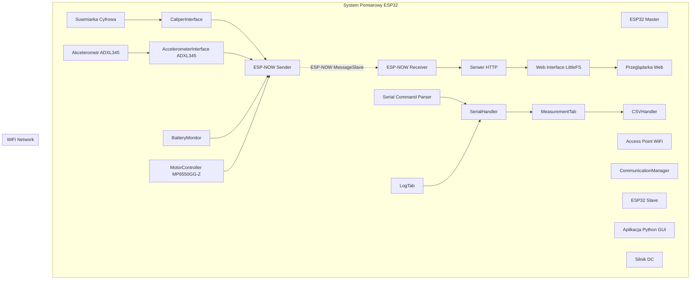
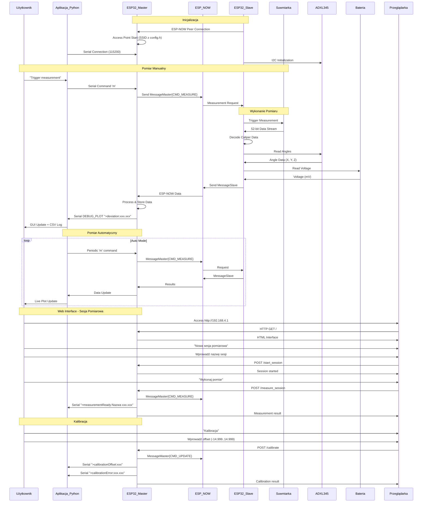
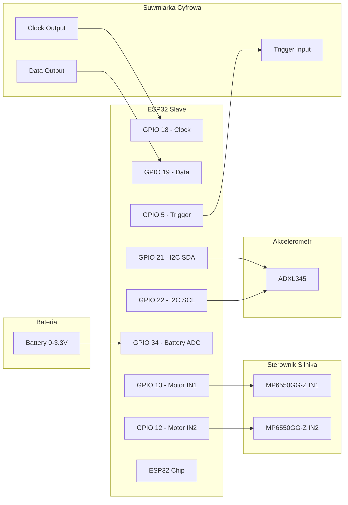

# System Pomiarowy ESP32 - Suwmiarka Bezprzewodowa

System bezprzewodowego pomiaru długości wykorzystujący suwarkę cyfrową, akcelerometr oraz mikrokontrolery ESP32 z komunikacją ESP-NOW i interfejsem webowym.

## Opis Projektu

System składa się z trzech głównych komponentów:

1. **ESP32 Master** - pełni rolę punktu dostępu WiFi oraz serwera HTTP
2. **ESP32 Slave** - podłączony do suwarki cyfrowej i akcelerometru, obsługuje odczyt danych pomiarowych
3. **Aplikacja Python** - interfejs graficzny do sterowania i wizualizacji danych

### Główne Funkcjonalności

- ✅ Bezprzewodowy odczyt pomiarów z suwarki cyfrowej
- ✅ Interfejs webowy do zdalnego sterowania
- ✅ Aplikacja desktop z wizualizacją w czasie rzeczywistym
- ✅ Zapisywanie danych do plików CSV
- ✅ Wykresy pomiarów na żywo
- ✅ Obsługa trybu automatycznego pomiaru
- ✅ Komunikacja dwukierunkowa ESP-NOW
- ✅ Zaawansowana walidacja danych i obsługa błędów
- ✅ Retry mechanizm dla niezawodnej komunikacji
- ✅ Optymalizacja wydajności i responsywności
- ✅ **Moduł sterowania silnikiem DC z MP6550GG-Z**
- ✅ **Akcelerometr ADXL345 do pomiaru kątów**
- ✅ **Sesje pomiarowe z nazwami**
- ✅ **Funkcja kalibracji z offsetem**
- ✅ **Monitorowanie napięcia baterii**

## Architektura Systemu



## Struktura Projektu

```
caliper/
├── README.md                    # Ten plik
├── AGENTS.md                    # Instrukcje build/flash dla modeli AI
├── CHANGELOG.md                 # Historia zmian
├── CONTRIBUTING.md              # Współpraca z projektem
├── caliper_master/              # ESP32 Master (PlatformIO)
│   ├── platformio.ini
│   ├── src/
│   │   ├── main.cpp             # AP WiFi + HTTP + ESP-NOW + LittleFS
│   │   ├── config.h             # Konfiguracja specyficzna dla Master
│   │   └── communication.h/.cpp # CommunicationManager (ESP-NOW)
│   └── data/                    # UI web (LittleFS)
│       ├── index.html
│       ├── style.css
│       └── app.js
├── caliper_slave/               # ESP32 Slave (PlatformIO)
│   ├── platformio.ini
│   └── src/
│       ├── main.cpp             # ESP-NOW + harmonogram (timery) + spinanie modułów
│       ├── config.h             # Konfiguracja specyficzna dla Slave
│       ├── sensors/             # suwmiarka + akcelerometr
│       │   ├── caliper.h/.cpp   # Obsługa suwmiarki + dekodowanie danych
│       │   └── accelerometer.h/.cpp # Obsługa ADXL345 (I2C) + wyliczanie kątów
│       ├── motor/               # sterowanie silnikiem
│       │   └── motor_ctrl.h/.cpp # Sterowanie silnikiem (MP6550GG-Z)
│       └── power/               # pomiar baterii
│           └── battery.h/.cpp   # Pomiar napięcia baterii (ADC)
├── caliper_master_gui/          # Aplikacja GUI (Python/DearPyGUI)
│   ├── caliper_master_gui.py    # Entry-point
│   ├── requirements.txt
│   ├── src/
│   │   ├── __init__.py
│   │   ├── app.py               # Klasa stanu aplikacji (CaliperApp)
│   │   ├── serial_handler.py    # Obsługa portu szeregowego
│   │   ├── gui/
│   │   │   ├── __init__.py
│   │   │   ├── measurement_tab.py # Zakładka pomiarów
│   │   │   └── log_tab.py       # Zakładka logów
│   │   └── utils/
│   │       ├── __init__.py
│   │       └── csv_handler.py   # Obsługa CSV
│   └── tests/
│       └── test_serial.py       # Testy jednostkowe
├── lib/CaliperShared/           # Wspólna biblioteka (typy/protokół/debug)
│   ├── shared_common.h          # Wspólne definicje typów/struktur/protokołu
│   ├── shared_config.h          # Wspólna konfiguracja (piny, stałe)
│   └── MacroDebugger.h          # Makra debug/log/plot
└── doc/                         # Dokumentacja
    ├── architecture.md          # Architektura systemu
    ├── api/
    │   └── protocol.md          # Dokumentacja protokołów komunikacji
    ├── ESP32-DevKit-V1-Pinout-Diagram-r0.1-CIRCUITSTATE-Electronics-2-1280x896.png
    ├── MP6550GG-Z.pdf           # Dokumentacja sterownika silnika
    └── schematic.png            # Schemat połączeń
```

## Modułowa Architektura

### Moduł Komunikacji (CommunicationManager)

Klasa [`CommunicationManager`](caliper_master/src/communication.h:17) zarządza komunikacją ESP-NOW:

**Funkcje:**
- [`initialize()`](caliper_master/src/communication.h:33) – Inicjalizacja ESP-NOW
- [`sendMessage()`](caliper_master/src/communication.h:41) – Wysyłanie komend z retry mechanizmem
- [`isInitialized()`](caliper_master/src/communication.h:47) – Sprawdzenie stanu inicjalizacji
- [`getLastError()`](caliper_master/src/communication.h:53) – Pobranie ostatniego błędu
- [`setReceiveCallback()`](caliper_master/src/communication.h:59) – Ustawienie callbacku odbioru
- [`setSendCallback()`](caliper_master/src/communication.h:65) – Ustawienie callbacku wysyłki

### Moduł Konfiguracji (config.h)

Centralny plik konfiguracyjny zawierający:
- Konfigurację ESP-NOW (kanał, retry, timeout)
- Definicje pinów GPIO
- Parametry walidacji pomiarów
- Konfigurację WiFi (SSID, hasło)
- Ustawienia ADC
- Konfigurację serwera web

### Moduł Wspólny (`lib/CaliperShared`)

Wspólne definicje protokołu i struktur danych znajdują się w bibliotece `lib/CaliperShared`:
- [`CommandType`](lib/CaliperShared/shared_common.h:22) – typy komend ESP-NOW
- [`MotorState`](lib/CaliperShared/shared_common.h:32) – stany silnika
- [`ErrorCode`](lib/CaliperShared/shared_common.h:43) – kody błędów
- [`MessageMaster`](lib/CaliperShared/shared_common.h:68) – struktura wiadomości (Master → Slave)
- [`MessageSlave`](lib/CaliperShared/shared_common.h:59) – struktura wiadomości (Slave → Master)
- [`SystemStatus`](lib/CaliperShared/shared_common.h:84) – status systemu (Master)
- [`MacroDebugger.h`](lib/CaliperShared/MacroDebugger.h:1) – makra debug/log/plot

### Moduł Sterowania Silnikiem DC

Moduł sterowania silnikiem DC wykorzystuje sterownik **MP6550GG-Z** w minimalistycznej konfiguracji.

#### Pliki:
- **[`motor_ctrl.h`](caliper_slave/src/motor/motor_ctrl.h:1)** – nagłówek sterownika silnika (MP6550GG-Z)
- **`motor_ctrl.cpp`** – implementacja (w tym samym katalogu)

#### Dostępne funkcje:

##### Inicjalizacja:
- [`motorCtrlInit()`](caliper_slave/src/motor/motor_ctrl.h:38) – inicjalizacja sterownika i konfiguracja pinów

##### Sterowanie silnikiem:
- [`motorCtrlRun(uint8_t speed, uint8_t torque, MotorState direction)`](caliper_slave/src/motor/motor_ctrl.h:47) – ustawienie prędkości i kierunku (PWM)
  - `speed=0, direction=MOTOR_STOP` – zatrzymanie (coast)
  - `speed>0, direction=MOTOR_FORWARD` – rotacja do przodu
  - `speed>0, direction=MOTOR_REVERSE` – rotacja do tyłu
  - `speed>0, direction=MOTOR_BRAKE` – hamowanie aktywne

#### Struktury danych:

```c
enum MotorState : uint8_t {
  MOTOR_STOP = 0,
  MOTOR_FORWARD = 1,
  MOTOR_REVERSE = 2,
  MOTOR_BRAKE = 3
};
```

#### Użycie w głównym programie (Slave):

```cpp
#include "motor/motor_ctrl.h"

void setup() {
  motorCtrlInit();
}

void loop() {
  motorCtrlRun(128, 0, MOTOR_FORWARD);
  motorCtrlRun(0, 0, MOTOR_STOP);
}
```

#### Specyfikacje techniczne:

- **Sterownik**: MP6550GG-Z (Single H-Bridge)
- **Tryb sterowania**: PWM Input (IN1/IN2)
- **Napięcie zasilania**: 1.8V - 22V

#### Mapa pinów ESP32:

```cpp
#define MOTOR_IN1_PIN 13       // IN1 input (PWM control input 1)
#define MOTOR_IN2_PIN 12       // IN2 input (PWM control input 2)
```

#### Tabela sterowania MP6550GG-Z:

| IN1  | IN2  | OUT1        | OUT2        | Funkcja                         |
|------|------|-------------|-------------|----------------------------------|
| 0    | 0    | Z           | Z           | Coast (outputs off)              |
| PWM  | 0    | PWM (H/Z)   | PWM (L/Z)   | Forward/Coast at speed PWM %     |
| 0    | PWM  | PWM (L/Z)   | PWM (H/Z)   | Reverse/Coast at speed PWM %     |
| 1    | 1    | L           | L           | Brake low (outputs shorted)      |

**Implementacja w kodzie:**
- `motorCtrlRun(speed, 0, MOTOR_FORWARD)` → IN1=PWM, IN2=0
- `motorCtrlRun(speed, 0, MOTOR_REVERSE)` → IN1=0, IN2=PWM
- `motorCtrlRun(0, 0, MOTOR_STOP)` → IN1=0, IN2=0 (Coast)
- `motorCtrlRun(speed, 0, MOTOR_BRAKE)` → IN1=1, IN2=1 (Brake low)

### Akcelerometr ADXL345

Slave ESP32 posiada zintegrowany akcelerometr ADXL345 do pomiaru kątów nachylenia:

**Funkcje:**
- Pomiar kątów X, Y, Z
- Pomiar przyspieszenia grawitacyjnego
- Automatyczna kalibracja kątów
- Komunikacja przez I2C (adres 0x53)

**Konfiguracja:**
- Data rate: 50 Hz
- Range: ±2g

## Przepływ Komunikacji



## Połączenia Hardware



## Specyfikacja Techniczna

### ESP32 Master
- **Funkcje**: Access Point, Serwer HTTP, ESP-NOW Receiver, Communication Manager, Serial Command Parser
- **WiFi**: AP mode (SSID i hasło zdefiniowane w [`config.h`](caliper_master/src/config.h:33))
- **ESP-NOW**: Kanał 1, odbieranie danych z retry mechanizmem
- **Bezpieczeństwo**: Walidacja zakresu danych, obsługa błędów pakietów
- **Interfejsy**:
  - HTTP Server (port 80)
  - Serial (115200 baud)
  - ESP-NOW Communication
- **Moduły**:
  - [`CommunicationManager`](caliper_master/src/communication.h:17) – zarządzanie ESP-NOW
  - [`SystemStatus`](lib/CaliperShared/shared_common.h:84) – śledzenie statusu systemu
  - [`serialCommandParser()`](caliper_master/src/main.cpp:360) – parser komend Serial

### ESP32 Slave
- **Funkcje**: Caliper Interface, ESP-NOW Sender, Motor Controller, Battery Monitor, Accelerometer
- **GPIO**:
  - GPIO 18: Clock Input (z suwarki) – [`CALIPER_CLOCK_PIN`](lib/CaliperShared/shared_config.h:46)
  - GPIO 19: Data Input (z suwarki) – [`CALIPER_DATA_PIN`](lib/CaliperShared/shared_config.h:47)
  - GPIO 5: Trigger Output (do suwarki) – [`CALIPER_TRIG_PIN`](lib/CaliperShared/shared_config.h:48)
  - GPIO 13: Motor IN1 (sterownik MP6550GG-Z) – [`MOTOR_IN1_PIN`](lib/CaliperShared/shared_config.h:53)
  - GPIO 12: Motor IN2 (sterownik MP6550GG-Z) – [`MOTOR_IN2_PIN`](lib/CaliperShared/shared_config.h:54)
  - GPIO 34: Battery Voltage Input (ADC) – [`BATTERY_VOLTAGE_PIN`](lib/CaliperShared/shared_config.h:59)
  - GPIO 21: I2C SDA (ADXL345)
  - GPIO 22: I2C SCL (ADXL345)
- **ESP-NOW**: Kanał 1, wysyłanie danych z retry mechanizmem
- **Bezpieczeństwo**: Walidacja danych pomiarowych, timeout 200ms
- **Obsługa**: Dekodowanie 52-bitowego strumienia danych z walidacją
- **Sterowanie silnikiem**: PWM 8-bit, 4 tryby pracy (Stop, Forward, Reverse, Brake)
- **Monitorowanie baterii**: Pomiar napięcia 0-3.3V przez ADC z uśrednianiem
- **Akcelerometr**: ADXL345, pomiar kątów X, Y, Z

### Aplikacja Python
- **Framework**: Dear PyGui
- **Funkcje**:
  - komunikacja Serial z Master
  - live plot wbudowany w DearPyGUI (bez `matplotlib`)
  - zapis do CSV
  - sterowanie silnikiem z GUI (komendy `r <0-3>`, `t`)
  - zarządzanie portami COM
  - walidacja danych (np. zakres pomiaru)
- **Bezpieczeństwo**: obsługa wyjątków, walidacja zakresu wartości
- **Wymagania**: Python 3.x, `dearpygui`, `pyserial` (zobacz [`requirements.txt`](caliper_master_gui/requirements.txt:1))

## Instalacja i Uruchomienie

### Wymagania Hardware
- 2x ESP32 DevKit V1
- 1x Suwmiarka cyfrowa z wyjściem danych
- 1x Akcelerometr ADXL345
- 1x Sterownik silnika MP6550GG-Z
- 1x Silnik DC
- Kable połączeniowe
- Komputer z Python 3.7+

### Kompilacja ESP32 (PlatformIO)

Szczegółowe instrukcje znajdują się w [`AGENTS.md`](AGENTS.md:1).

1. **Instalacja PlatformIO** w VS Code lub jako samodzielne narzędzie
2. **Wgranie kodu Master**:
   ```bash
   cd caliper_master
   pio run --target upload --environment esp32doit-devkit-v1
   ```

3. **Wgranie kodu Slave**:
   ```bash
   cd caliper_slave
   pio run --target upload --environment esp32doit-devkit-v1
   ```

4. **Wgranie systemu plików LittleFS (UI web) – tylko `caliper_master`**:
   ```bash
   cd caliper_master
   pio run --target uploadfs --environment esp32doit-devkit-v1
   ```

5. **Połączenia suwarki**:
   ```
   Suwmiarka CLK  -> ESP32 Slave GPIO 18 (CALIPER_CLOCK_PIN)
   Suwmiarka DATA -> ESP32 Slave GPIO 19 (CALIPER_DATA_PIN)
   Suwmiarka TRIG <- ESP32 Slave GPIO 5  (CALIPER_TRIG_PIN)
   ```

6. **Połączenia sterownika silnika**:
   ```
   MP6550GG-Z IN1 -> ESP32 Slave GPIO 13 (MOTOR_IN1_PIN)
   MP6550GG-Z IN2 -> ESP32 Slave GPIO 12 (MOTOR_IN2_PIN)
   ```

7. **Połączenia akcelerometru**:
   ```
   ADXL345 SDA -> ESP32 Slave GPIO 21
   ADXL345 SCL -> ESP32 Slave GPIO 22
   ADXL345 VCC -> 3.3V
   ADXL345 GND -> GND
   ```

8. **Połączenia monitorowania baterii**:
   ```
   Bateria (0-3.3V) -> ESP32 Slave GPIO 34 (BATTERY_VOLTAGE_PIN)
   ```

### Konfiguracja Aplikacji Python

1. **Instalacja zależności**:
```bash
cd caliper_master_gui
pip install -r requirements.txt
```

2. **Uruchomienie aplikacji**:
```bash
cd caliper_master_gui
python caliper_master_gui.py
```

3. **Połączenie Serial**:
   - Wybierz odpowiedni port COM
   - Kliknij "Open port"
   - Status: "Connected to COMx"

### Konfiguracja WiFi

1. **Master ESP32** tworzy Access Point:
   - SSID: zdefiniowany w [`WIFI_SSID`](caliper_master/src/config.h:33)
   - Hasło: zdefiniowane w [`WIFI_PASSWORD`](caliper_master/src/config.h:34)
   - IP: `192.168.4.1`

2. **Połączenie z siecią**:
   - Połącz się z WiFi zdefiniowanym w [`config.h`](caliper_master/src/config.h:33)
   - Otwórz przeglądarkę: `http://192.168.4.1`

## Użytkowanie

### Interfejs Aplikacji Python

1. **Sterowanie pomiarem**:
   - "Trigger measurement" – pojedynczy pomiar (wysyła `m` przez Serial)
   - "Auto trigger" – tryb automatyczny
   - "Interval (ms)" – interwał pomiarów

2. **Wizualizacja**:
   - **Measurement History** – lista wszystkich pomiarów
   - **Live Plot** – wykres pomiarów w czasie rzeczywistym
   - **Include timestamp** – dodanie znacznika czasu

3. **Logging**:
   - Automatyczne zapisywanie do pliku CSV
   - Plik: `measurement_YYYYMMDD_HHMMSS.csv`
   - Format: `timestamp,value` lub tylko `value`

4. **Debug**:
   - **Log tab** (Ctrl+Alt+L) – pełny log komunikacji
   - Serial monitor – monitorowanie ESP32

### Interfejs Web

1. **Menu główne**:
   - **Kalibracja** – funkcja kalibracji z offsetem
   - **Nowa sesja pomiarowa** – tworzenie nazwanej sesji

2. **Widok Kalibracja**:
   - Wprowadź offset (zakres -14.999..14.999)
   - Kliknij "Kalibruj"
   - Wynik: offset i błąd kalibracji

3. **Widok Sesja Pomiarowa**:
   - Wyświetlanie nazwy sesji
   - Wyświetlanie ostatniego pomiaru
   - Wyświetlanie napięcia baterii
   - Wyświetlanie kąta X
   - Przyciski sterowania

4. **Funkcje pomiarowe**:
   - **"Wykonaj pomiar"** – inicjuje pomiar w sesji
   - **"Odśwież wynik"** – pobiera najnowsze dane

5. **API endpointy**:
   - `GET /measure` – wyzwolenie pomiaru
   - `GET /read` – odczyt ostatniego wyniku
   - `POST /calibrate` – kalibracja z offsetem
   - `POST /start_session` – rozpoczęcie sesji
   - `POST /measure_session` – pomiar w sesji

### Obsługa Błędów

1. **Problemy z ESP-NOW**:
     - Sprawdź MAC adresy w kodzie (wyświetlane przy starcie)
     - Upewnij się, że urządzenia są w zasięgu (< 50m)
     - Sprawdź kanał WiFi (domyślnie 1)
     - System automatycznie ponawia wysyłanie w przypadku błędów

2. **Problemy z suwarką**:
     - Sprawdź połączenia GPIO
     - Upewnij się, że suwmiarka jest w trybie wyjścia danych
     - Sprawdź napięcie zasilania suwarki
     - System waliduje zakres pomiarów (-1000 do +1000 mm)

3. **Problemy z aplikacją**:
     - Sprawdź dostępność portu COM
     - Upewnij się, że ESP32 Master jest podłączony
     - Sprawdź baud rate (115200)
     - Aplikacja obsługuje nieprawidłowe dane i błędy parsowania

4. **Komunikaty błędów**:
     - `BLAD: Nieprawidlowa dlugosc pakietu` – błędny pakiet ESP-NOW
     - `BLAD: Wartosc poza zakresem` – pomiar poza zakresem -1000/+1000 mm
     - `BLAD: Nieprawidlowa wartosc pomiaru` – błędne dane z suwarki
     - `BLAD wysylania zadania/wyniku` – problemy z komunikacją ESP-NOW

## Protokół Komunikacji

### ESP-NOW Messages

**Command** (Master → Slave):
```c
enum CommandType : char {
  CMD_MEASURE = 'M',  // Request measurement
  CMD_UPDATE = 'U',   // Request update status
  CMD_MOTORTEST = 'T' // Generic motor control
};
```

**Data** (Master → Slave) – [`MessageMaster`](lib/CaliperShared/shared_common.h:68):
```c
struct MessageMaster {
  uint32_t timestamp;      // Timestamp from system start (ms)
  uint32_t timeout;        // Timeout for run motor while measure (ms)
  CommandType command;     // Command type
  MotorState motorState;   // Current motor state
  uint8_t motorSpeed;      // Motor speed (PWM value 0-255)
  uint8_t motorTorque;     // Motor torque (PWM value 0-255)
};
```

**Data** (Slave → Master) – [`MessageSlave`](lib/CaliperShared/shared_common.h:59):
```c
struct MessageSlave {
  uint32_t timestamp;      // Timestamp from system start (ms)
  float measurement;       // Measurement value in mm
  float batteryVoltage;    // Battery voltage in V
  CommandType command;     // Command type
  uint8_t angleX;          // Angle X from accelerometer ADXL345
};
```

### Serial Protocol

**Trigger** (Python → Master):
```c
'm' + '\n'; // Single measurement trigger
'u' + '\n'; // Request update
'o <ms>' + '\n'; // Set msgMaster.timeout
'q <0-255>' + '\n'; // Set msgMaster.motorTorque
's <0-255>' + '\n'; // Set msgMaster.motorSpeed
'r <0-3>' + '\n'; // Set msgMaster.motorState and send CMD_MOTORTEST
't' + '\n'; // Send CMD_MOTORTEST with current msgMaster fields
'c <±14.999>' + '\n'; // Set calibration offset
'h' + '\n'; // Help
'?' + '\n'; // Help
```

**Response** (Master → Python) – przez [`DEBUG_PLOT`](lib/CaliperShared/MacroDebugger.h:113):
```c
">deviation:xxx.xxx"; // Measurement value with calibration offset
">angleX:xxx"; // Angle X from accelerometer
">batteryVoltage:xxx.xxx"; // Battery voltage in V
">calibrationOffset:xxx.xxx"; // Calibration offset
">calibrationError:xxx.xxx"; // Calibration error
">measurementReady:Nazwa xxx.xxx"; // Session measurement
```

**Available commands** (Master Serial Console – zobacz [`printSerialHelp()`](caliper_master/src/main.cpp:287)):
- `M/m` – Wykonaj pomiar
- `U/u` – Żądanie aktualizacji statusu
- `o <ms>` – Ustaw msgMaster.timeout (0..600000 ms)
- `q <0-255>` – Ustaw msgMaster.motorTorque
- `s <0-255>` – Ustaw msgMaster.motorSpeed
- `r <0-3>` – Ustaw msgMaster.motorState i wyślij CMD_MOTORTEST
- `t` – Wyślij CMD_MOTORTEST z bieżących pól msgMaster
- `c <±14.999>` – Ustaw offset kalibracji w mm
- `H/h/?` – Wyświetl pomoc

### HTTP API

**GET** `/` – Główna strona HTML
**GET** `/measure` – Wyzwolenie pomiaru
**GET** `/read` – Odczyt ostatniego wyniku

**POST** `/calibrate` – Kalibracja z offsetem:
```json
{
  "offset": 0.123,
  "error": 0.456
}
```

**POST** `/start_session` – Rozpoczęcie sesji:
```json
{
  "sessionName": "Sesja1",
  "active": true
}
```

**POST** `/measure_session` – Pomiar w sesji:
```json
{
  "sessionName": "Sesja1",
  "measurement": "25.430 mm",
  "valid": true,
  "timestamp": 12345,
  "batteryVoltage": 4.200,
  "angleX": 123
}
```

## Format Danych Suwarki

System obsługuje 52-bitowy strumień danych z suwarki cyfrowej:

1. **Clock ISR** – zbiera 52 bity danych
2. **Bit Reversal** – odwraca kolejność bitów  
3. **Bit Shifting** – przesuwa o 8 pozycji
4. **Nibble Decoding** – dekoduje 13 nibbli (4 bity każdy)
5. **Value Calculation** – oblicza wartość pomiaru
6. **Sign Detection** – wykrywa wartości ujemne
7. **Unit Detection** – rozpoznaje mm vs inch

**Obsługiwane tryby**:
- Millimetry (mm) – domyślny
- Cale (inch) – automatyczna konwersja × 25.4
- Wartości ujemne – dla pomiarów względnych

## Rozwój i Modyfikacje

### Dodanie nowych funkcji

1. **Master enhancements**:
     - WebSocket support dla realtime updates
     - Data storage (EEPROM/SPIFFS)
     - Additional HTTP endpoints
     - Rozszerzenie CommunicationManager

2. **Slave improvements**:
     - Multiple sensor support
     - Calibration routines  
     - Battery monitoring
     - Dodatkowe funkcje akcelerometru

3. **Python GUI**:
     - rozbudowa widoków i logiki GUI (DearPyGUI)
     - statystyki/analiza pomiarów
     - eksport do różnych formatów
     - komunikacja sieciowa
     - obsługa sesji pomiarowych

### Troubleshooting

1. **ESP-NOW nie działa**:
     - Sprawdź MAC adresy w [`config.h`](caliper_master/src/config.h:28) i [`config.h`](caliper_slave/src/config.h:28)
     - Sprawdź kanał WiFi ([`ESPNOW_WIFI_CHANNEL`](lib/CaliperShared/shared_config.h:19))
     - Sprawdź zasilanie ESP32

2. **Błędne pomiary**:
     - Sprawdź połączenia suwarki
     - Skalibruj dekoder bitów
     - Sprawdź timing sygnałów

3. **Aplikacja Python**:
     - Sprawdź porty COM
     - Sprawdź uprawnienia
     - Sprawdź dependencies w [`requirements.txt`](caliper_master_gui/requirements.txt:1)

4. **PlatformIO**:
     - Sprawdź konfigurację [`platformio.ini`](caliper_master/platformio.ini:1)
     - Zaktualizuj platform i framework
     - Sprawdź dostępność portów

## Wersja i Aktualizacje

Szczegółowa historia zmian znajduje się w [`CHANGELOG.md`](CHANGELOG.md:1).

**Wersja 2.0** (2025-12-26)
- ✅ **REFACTORING**: Przeniesienie z Arduino IDE na PlatformIO
- ✅ **ARCHITEKTURA**: Modularna struktura z oddzielnymi plikami .cpp/.h
- ✅ **MODUŁY**: Dodano CommunicationManager do zarządzania ESP-NOW
- ✅ **KONFIGURACJA**: Centralny plik config.h dla obu urządzeń
- ✅ **WSPÓLNE**: Biblioteka `lib/CaliperShared` ze wspólnymi definicjami
- ✅ **AKCELEROMETR**: Dodano ADXL345 do pomiaru kątów
- ✅ **SESJE**: Dodano funkcję sesji pomiarowych z nazwami
- ✅ **KALIBRACJA**: Dodano funkcję kalibracji z offsetem
- ✅ **STATUS**: Dodano SystemStatus do śledzenia stanu systemu
- ✅ **WEB**: Rozszerzono interfejs web o sesje i kalibrację
- ✅ **SERIAL**: Dodano komendy CAL_OFFSET, CAL_ERROR, MEAS_SESSION
- ✅ **DOKUMENTACJA**: Przeniesiono dokumentację sprzętową do folderu doc/
- ✅ **STRUKTURA**: Nowa struktura folderów zgodna z PlatformIO

**Wersja 1.2** (2025-11-30)
- ✅ **REFACTORING**: Usunięto funkcję `setMotorState` i zastąpiono przez `motorCtrlRun`
- ✅ **OPTYMALIZACJA**: Usunięto nieużywaną definicję `MOTOR_SLEEP` z enuma MotorState
- ✅ **POPRAWKA IMPLEMENTACJI**: Zaktualizowano sterowanie MP6550GG-Z zgodnie ze specyfikacją (PWM na IN1/IN2)
- ✅ **MODUŁ SILNIKA**: Zaktualizowano sterowanie silnikiem do używania PWM z kontrolą prędkości
- ✅ **MONITOROWANIE BATERII**: Dodano pomiar napięcia baterii przez ADC (GPIO 34)
- ✅ **KOMUNIKACJA**: Rozszerzono protokół ESP-NOW o przesyłanie napięcia baterii
- ✅ **INTERFEJS WEB**: Dodano przyciski sterowania silnikiem i wyświetlanie napięcia baterii
- ✅ **SERIAL COMMANDS**: Dodano komendy sterowania silnikiem przez konsolę szeregową
- ✅ **DOKUMENTACJA**: Zaktualizowano README.md i dokumentację kodu

**Wersja 1.1** (2025-11-10)
- ✅ Dodano zaawansowaną walidację danych
- ✅ Zaimplementowano retry mechanizm ESP-NOW
- ✅ Poprawiono obsługę błędów i timeoutów
- ✅ Zoptymalizowano wydajność systemu
- ✅ Dodano wyświetlanie MAC Address
- ✅ Ulepszono aplikację Python z lepszą obsługą błędów

**Wersja 1.0** (2025-11-10)
- Wersja początkowa z podstawowymi funkcjonalnościami

## Licencja

Projekt stworzony do celów edukacyjnych i hobbystycznych.

## Autor

System pomiarowy ESP32 – bezprzewodowa suwmiarka

---

*README.md wygenerowany z diagramami Mermaid*
