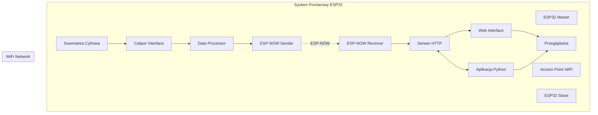
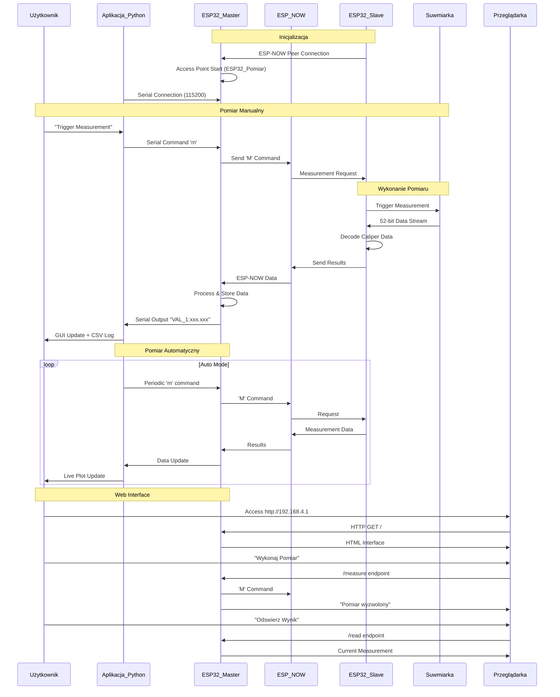

# System Pomiarowy ESP32 - Suwmiarka Bezprzewodowa

System bezprzewodowego pomiaru długości wykorzystujący suwarkę cyfrową oraz mikrokontrolery ESP32 z komunikacją ESP-NOW i interfejsem webowym.

## Opis Projektu

System składa się z trzech głównych komponentów:

1. **ESP32 Master** - pełni rolę punktu dostępu WiFi oraz serwera HTTP
2. **ESP32 Slave** - podłączony do suwarki cyfrowej, obsługuje odczyt danych pomiarowych
3. **Aplikacja Python** - interfejs graficzny do sterowania i wizualizacji danych

### Główne Funkcjonalności

- ✅ Bezprzewodowy odczyt pomiarów z suwarki cyfrowej
- ✅ Interfejs webowy do zdalnego sterowania
- ✅ Aplikacja desktop z wizualizacją w czasie rzeczywistym
- ✅ Zapisywanie danych do plików CSV
- ✅ Wykresy pomiarów na żywo
- ✅ Obsługa trybu automatycznego pomiaru
- ✅ Komunikacja dwukierunkowa ESP-NOW
- ✅ Zaawansowana walidacja danych i obsługa błędów
- ✅ Retry mechanizm dla niezawodnej komunikacji
- ✅ Optymalizacja wydajności i responsywności
- ✅ **Moduł sterowania silnikiem DC z MP6550GG-Z**

## Architektura Systemu



## Przepływ Komunikacji



## Połączenia Hardware

```mermaid
graph LR
    subgraph "ESP32 Slave"
        GPIO18[GPIO 18]
        GPIO19[GPIO 19]
        GPIO5[GPIO 5]
        Chip[ESP32 Chip]
    end
    
    subgraph "Suwmiarka Cyfrowa"
        Clock[Clock Output]
        Data[Data Output]
        Trigger[Trigger Input]
    end
    
    subgraph "ESP32 Master"
├── README.md                    # Ten plik
├── caliper_master/
│   ├── caliper_master.ino      # Kod Master ESP32
│   └── caliper_master_gui.py   # Aplikacja Python GUI
├── caliper_slave/
│   ├── caliper_slave.ino         # Kod Slave ESP32
│   ├── caliper_slave_motor_ctrl.h    # Moduł sterowania silnikiem - nagłówek
│   ├── caliper_slave_motor_ctrl.cpp  # Moduł sterowania silnikiem - implementacja
│   └── MOTOR_CTRL_README.md     # Dokumentacja modułu (do usunięcia)
└── caliper_hw/
    ├── esp32_slave.kicad_pcb    # Projekt PCB
    ├── esp32_slave.kicad_sch      # Schemat
    └── ESP32-DevKit-V1-Pinout-Diagram-r0.1-CIRCUITSTATE-Electronics-2-1280x896.png
```

## Moduł Sterowania Silnikiem DC

Moduł sterowania silnikiem DC wykorzystuje sterownik **MP6550GG-Z** w minimalistycznej konfiguracji.

### Struktura Modułu

#### Pliki:
- **`caliper_slave_motor_ctrl.h`** - Plik nagłówkowy z definicjami i deklaracjami funkcji
- **`caliper_slave_motor_ctrl.cpp`** - Plik implementacji C++ z funkcjami sterowania
- **`caliper_slave.ino`** - Główny plik używający modułu sterowania silnikiem

#### Dostępne funkcje:

##### Inicjalizacja:
- `initializeMotorController()` - Inicjalizacja sterownika i konfiguracja pinów

##### Sterowanie silnikiem:
- `setMotorSpeed(uint8_t speed, MotorState direction)` - Ustawienie prędkości i kierunku silnika (PWM)
  - `speed=0, direction=MOTOR_STOP` - Zatrzymanie (tryb coast) (IN1=LOW, IN2=LOW)
  - `speed>0, direction=MOTOR_FORWARD` - Rotacja do przodu z PWM
  - `speed>0, direction=MOTOR_REVERSE` - Rotacja do tyłu z PWM
  - `speed>0, direction=MOTOR_BRAKE` - Hamowanie aktywne

#### Struktury danych:

```c
typedef enum {
  MOTOR_STOP = 0,        // Zatrzymanie/Coast
  MOTOR_FORWARD = 1,     // Rotacja do przodu
  MOTOR_REVERSE = 2,     // Rotacja do tyłu
  MOTOR_BRAKE = 3        // Hamowanie aktywne
} MotorState;
```

#### Użycie w głównym programie:

```cpp
#include "caliper_slave_motor_ctrl.h"

// W setup():
initializeMotorController();

// W loop():
setMotorSpeed(128, MOTOR_FORWARD);  // Silnik pracuje do przodu z prędkością 50%
setMotorSpeed(0, MOTOR_STOP);       // Zatrzymanie silnika
```

#### Specyfikacje techniczne:

- **Sterownik**: MP6550GG-Z (Single H-Bridge)
- **Tryb sterowania**: PWM Input (IN1/IN2)
- **Napięcie zasilania**: 1.8V - 22V

#### Mapa pinów ESP32:

```cpp
#define MOTOR_IN1_PIN 12       // IN1 input (PWM control input 1)
#define MOTOR_IN2_PIN 13       // IN2 input (PWM control input 2)
```

#### Tabela sterowania MP6550GG-Z:

| IN1  | IN2  | OUT1        | OUT2        | Funkcja                         |
|------|------|-------------|-------------|----------------------------------|
| 0    | 0    | Z           | Z           | Coast (outputs off)              |
| PWM  | 0    | PWM (H/Z)   | PWM (L/Z)   | Forward/Coast at speed PWM %     |
| 0    | PWM  | PWM (L/Z)   | PWM (H/Z)   | Reverse/Coast at speed PWM %     |
| 1    | 1    | L           | L           | Brake low (outputs shorted)      |

**Implementacja w kodzie:**
- `setMotorSpeed(speed, MOTOR_FORWARD)` → IN1=PWM, IN2=0
- `setMotorSpeed(speed, MOTOR_REVERSE)` → IN1=0, IN2=PWM
- `setMotorSpeed(0, MOTOR_STOP)` → IN1=0, IN2=0 (Coast)
- `setMotorSpeed(speed, MOTOR_BRAKE)` → IN1=1, IN2=1 (Brake low)

Moduł jest gotowy do użycia w projekcie kalibratora z ESP32.

## Specyfikacja Techniczna

### ESP32 Master
- **Funkcje**: Access Point, Serwer HTTP, ESP-NOW Receiver
- **WiFi**: AP mode (ESP32_Pomiar, hasło: 12345678)
- **ESP-NOW**: Kanał 1, odbieranie danych z retry mechanizmem
- **Bezpieczeństwo**: Walidacja zakresu danych, obsługa błędów pakietów
- **Interfejsy**:
  - HTTP Server (port 80)
  - Serial (115200 baud)
  - ESP-NOW Communication

### ESP32 Slave
- **Funkcje**: Caliper Interface, ESP-NOW Sender, Motor Controller, Battery Monitor
- **GPIO**:
  - GPIO 18: Clock Input (z suwarki)
  - GPIO 19: Data Input (z suwarki)
  - GPIO 5: Trigger Output (do suwarki)
  - GPIO 13: Motor IN1 (sterownik MP6550GG-Z)
  - GPIO 12: Motor IN2 (sterownik MP6550GG-Z)
  - GPIO 34: Battery Voltage Input (ADC)
- **ESP-NOW**: Kanał 1, wysyłanie danych z retry mechanizmem
- **Bezpieczeństwo**: Walidacja danych pomiarowych, timeout 200ms
- **Obsługa**: Dekodowanie 52-bitowego strumienia danych z walidacją
- **Sterowanie silnikiem**: PWM 8-bit, 4 tryby pracy (Stop, Forward, Reverse, Brake)
- **Monitorowanie baterii**: Pomiar napięcia 0-3.3V przez ADC

### Aplikacja Python
- **Framework**: Dear PyGui
- **Funkcje**:
  - Serial Communication z Master
  - Live plotting (matplotlib)
  - CSV logging
  - Auto measurement mode
  - Port management
  - Zaawansowana walidacja danych
- **Bezpieczeństwo**: Obsługa wyjątków, walidacja zakresu wartości
- **Wymagania**: Python 3.7+, dearpygui, pyserial

## Instalacja i Uruchomienie

### Wymagania Hardware
- 2x ESP32 DevKit V1
- 1x Suwmiarka cyfrowa z wyjściem danych
- Kable połączeniowe
- Komputer z Python 3.7+

### Kompilacja ESP32

1. **Instalacja Arduino IDE** z dodatkiem ESP32
2. **Wgranie caliper_master.ino** do pierwszego ESP32
3. **Wgranie caliper_slave.ino** do drugiego ESP32
4. **Połączenia suwarki**:
   ```
   Suwmiarka CLK  -> ESP32 Slave GPIO 18
   Suwmiarka DATA -> ESP32 Slave GPIO 19
   Suwmiarka TRIG <- ESP32 Slave GPIO 5
   ```

5. **Połączenia sterownika silnika**:
   ```
   MP6550GG-Z IN1 -> ESP32 Slave GPIO 13
   MP6550GG-Z IN2 -> ESP32 Slave GPIO 12
   ```

6. **Połączenia monitorowania baterii**:
   ```
   Bateria (0-3.3V) -> ESP32 Slave GPIO 34 (przez dzielnik napięcia jeśli potrzeba)
   ```

### Konfiguracja Aplikacji Python

1. **Instalacja zależności**:
```bash
pip install dearpygui pyserial
```

2. **Uruchomienie aplikacji**:
```bash
cd caliper_master
python caliper_master_gui.py
```

3. **Połączenie Serial**:
   - Wybierz odpowiedni port COM
   - Kliknij "Open port"
   - Status: "Connected to COMx"

### Konfiguracja WiFi

1. **Master ESP32** tworzy Access Point:
   - SSID: `ESP32_Pomiar`
   - Hasło: `12345678`
   - IP: `192.168.4.1`

2. **Połączenie z siecią**:
   - Połącz się z WiFi `ESP32_Pomiar`
   - Otwórz przeglądarkę: `http://192.168.4.1`

## Użytkowanie

### Interfejs Aplikacji Python

1. **Sterowanie pomiarem**:
   - "Trigger measurement" - pojedynczy pomiar
   - "Auto trigger" - tryb automatyczny
   - "Interval (ms)" - interwał pomiarów

2. **Wizualizacja**:
   - **Measurement History** - lista wszystkich pomiarów
   - **Live Plot** - wykres pomiarów w czasie rzeczywistym
   - **Include timestamp** - dodanie znacznika czasu

3. **Logging**:
   - Automatyczne zapisywanie do pliku CSV
   - Plik: `measurement_YYYYMMDD_HHMMSS.csv`
   - Format: `timestamp,value` lub tylko `value`

4. **Debug**:
   - **Log tab** (Ctrl+Alt+L) - pełny log komunikacji
   - Serial monitor - monitorowanie ESP32

### Interfejs Web

1. **Główna strona**:
   - Wyświetlanie ostatniego pomiaru
   - Wyświetlanie napięcia baterii
   - Przyciski sterowania
   - Status połączenia

2. **Funkcje pomiarowe**:
   - **"Wykonaj Pomiar"** - inicjuje pomiar
   - **"Odswież Wynik"** - pobiera najnowsze dane

3. **Funkcje sterowania silnikiem**:
   - **"Forward"** - uruchom silnik do przodu
   - **"Reverse"** - uruchom silnik do tyłu
   - **"Stop"** - zatrzymaj silnik

4. **API endpointy**:
   - `/api` - dane JSON z pomiarami i statusem
   - `/forward` - sterowanie silnikiem do przodu
   - `/reverse` - sterowanie silnikiem do tyłu
   - `/stop` - zatrzymanie silnika

### Obsługa Błędów

1. **Problemy z ESP-NOW**:
    - Sprawdź MAC adresy w kodzie (wyświetlane przy starcie)
    - Upewnij się, że urządzenia są w zasięgu (< 50m)
    - Sprawdź kanał WiFi (domyślnie 1)
    - System automatycznie ponawia wysyłanie w przypadku błędów

2. **Problemy z suwarką**:
    - Sprawdź połączenia GPIO
    - Upewnij się, że suwmiarka jest w trybie wyjścia danych
    - Sprawdź napięcie zasilania suwarki
    - System waliduje zakres pomiarów (-1000 do +1000 mm)

3. **Problemy z aplikacją**:
    - Sprawdź dostępność portu COM
    - Upewnij się, że ESP32 Master jest podłączony
    - Sprawdź baud rate (115200)
    - Aplikacja obsługuje nieprawidłowe dane i błędy parsowania

4. **Komunikaty błędów**:
    - `BLAD: Nieprawidlowa dlugosc pakietu` - błędny pakiet ESP-NOW
    - `BLAD: Wartosc poza zakresem` - pomiar poza zakresem -1000/+1000 mm
    - `BLAD: Nieprawidlowa wartosc pomiaru` - błędne dane z suwarki
    - `BLAD wysylania zadania/wyniku` - problemy z komunikacją ESP-NOW

## Protokół Komunikacji

### ESP-NOW Messages

**Command** (Master → Slave):
```c
uint8_t command = 'M'; // Request measurement
uint8_t command = 'F'; // Motor forward
uint8_t command = 'R'; // Motor reverse
uint8_t command = 'S'; // Motor stop
```

**Data** (Slave → Master):
```c
typedef struct struct_message {
  float measurement;   // Wartość pomiaru w mm
  bool valid;         // Czy pomiar jest poprawny
  uint32_t timestamp; // Czas od startu systemu
  char command;       // Typ komendy ('M' - measurement, 'U' - update, 'F'/'R'/'S' - motor)
  uint16_t batteryVoltage; // Napięcie baterii w milliwoltach
} struct_message;
```

### Serial Protocol

**Trigger** (Python → Master):
```c
'm' + '\n'; // Single measurement trigger
'f' + '\n'; // Motor forward
'r' + '\n'; // Motor reverse
's' + '\n'; // Motor stop
'h' + '\n'; // Help
```

**Response** (Master → Python):
```c
"VAL_1:xxx.xxx"; // Measurement value
```

**Available commands** (Master Serial Console):
- `M/m` - Wykonaj pomiar
- `F/f` - Silnik do przodu (Forward)
- `R/r` - Silnik do tyłu (Reverse)
- `S/s` - Zatrzymaj silnik (Stop)
- `H/h/?` - Wyświetl pomoc

### HTTP API

**GET** `/` - Główna strona HTML
**GET** `/measure` - Wyzwolenie pomiaru
**GET** `/read` - Odczyt ostatniego wyniku
**GET** `/forward` - Sterowanie silnikiem do przodu
**GET** `/reverse` - Sterowanie silnikiem do tyłu
**GET** `/stop` - Zatrzymanie silnika
**GET** `/api` - Dane JSON:
```json
{
  "measurement": "25.430 mm",
  "timestamp": 12345,
  "valid": true,
  "batteryVoltage": 3300,
  "command": "M"
}
```

## Format Danych Suwarki

System obsługuje 52-bitowy strumień danych z suwarki cyfrowej:

1. **Clock ISR** - zbiera 52 bity danych
2. **Bit Reversal** - odwraca kolejność bitów  
3. **Bit Shifting** - przesuwa o 8 pozycji
4. **Nibble Decoding** - dekoduje 13 nibbli (4 bity każdy)
5. **Value Calculation** - oblicza wartość pomiaru
6. **Sign Detection** - wykrywa wartości ujemne
7. **Unit Detection** - rozpoznaje mm vs inch

**Obsługiwane tryby**:
- Millimetry (mm) - domyślny
- Cale (inch) - automatyczna konwersja × 25.4
- Wartości ujemne - dla pomiarów względnych

## Rozwój i Modyfikacje

### Dodanie nowych funkcji

1. **Master enhancements**:
   - WebSocket support dla realtime updates
   - Data storage (EEPROM/SPIFFS)
   - Additional HTTP endpoints

2. **Slave improvements**:
   - Multiple sensor support
   - Calibration routines  
   - Battery monitoring

3. **Python GUI**:
   - Advanced plotting (matplotlib)
   - Statistical analysis
   - Export to various formats
   - Network communication

### Troubleshooting

1. **ESP-NOW nie działa**:
   - Sprawdź MAC adresy
   - Sprawdź kanał WiFi
   - Sprawdź zasilanie ESP32

2. **Błędne pomiary**:
   - Sprawdź połączenia suwarki
   - Skalibruj dekoder bitów
   - Sprawdź timing sygnałów

3. **Aplikacja Python**:
   - Sprawdź porty COM
   - Sprawdź uprawnienia
   - Sprawdź dependencies

## Licencja

Projekt stworzony do celów edukacyjnych i hobbystycznych.

## Wersja i Aktualizacje

**Wersja 1.2** (2025-11-30)
- ✅ **REFACTORING**: Usunięto funkcję `setMotorState` i zastąpiono przez `setMotorSpeed`
- ✅ **REFACTORING**: Usunięto funkcję `motorStop` i zastąpiono przez `setMotorSpeed(0, MOTOR_STOP)`
- ✅ **OPTYMALIZACJA**: Usunięto nieużywaną definicję `MOTOR_SLEEP` z enuma MotorState
- ✅ **POPRAWKA IMPLEMENTACJI**: Zaktualizowano sterowanie MP6550GG-Z zgodnie ze specyfikacją (PWM na IN1/IN2)
- ✅ **MODUŁ SILNIKA**: Zaktualizowano sterowanie silnikiem do używania PWM z kontrolą prędkości
- ✅ **MONITOROWANIE BATERII**: Dodano pomiar napięcia baterii przez ADC (GPIO 34)
- ✅ **KOMUNIKACJA**: Rozszerzono protokół ESP-NOW o przesyłanie napięcia baterii
- ✅ **INTERFEJS WEB**: Dodano przyciski sterowania silnikiem i wyświetlanie napięcia baterii
- ✅ **SERIAL COMMANDS**: Dodano komendy sterowania silnikiem przez konsolę szeregową
- ✅ **DOKUMENTACJA**: Zaktualizowano README.md i dokumentację kodu

**Wersja 1.1** (2025-11-10)
- ✅ Dodano zaawansowaną walidację danych
- ✅ Zaimplementowano retry mechanizm ESP-NOW
- ✅ Poprawiono obsługę błędów i timeoutów
- ✅ Zoptymalizowano wydajność systemu
- ✅ Dodano wyświetlanie MAC Address
- ✅ Ulepszono aplikację Python z lepszą obsługą błędów

**Wersja 1.0** (2025-11-10)
- Wersja początkowa z podstawowymi funkcjonalnościami

## Autor

System pomiarowy ESP32 - bezprzewodowa suwmiarka

---

*README.md wygenerowany z diagramami PlantUML*