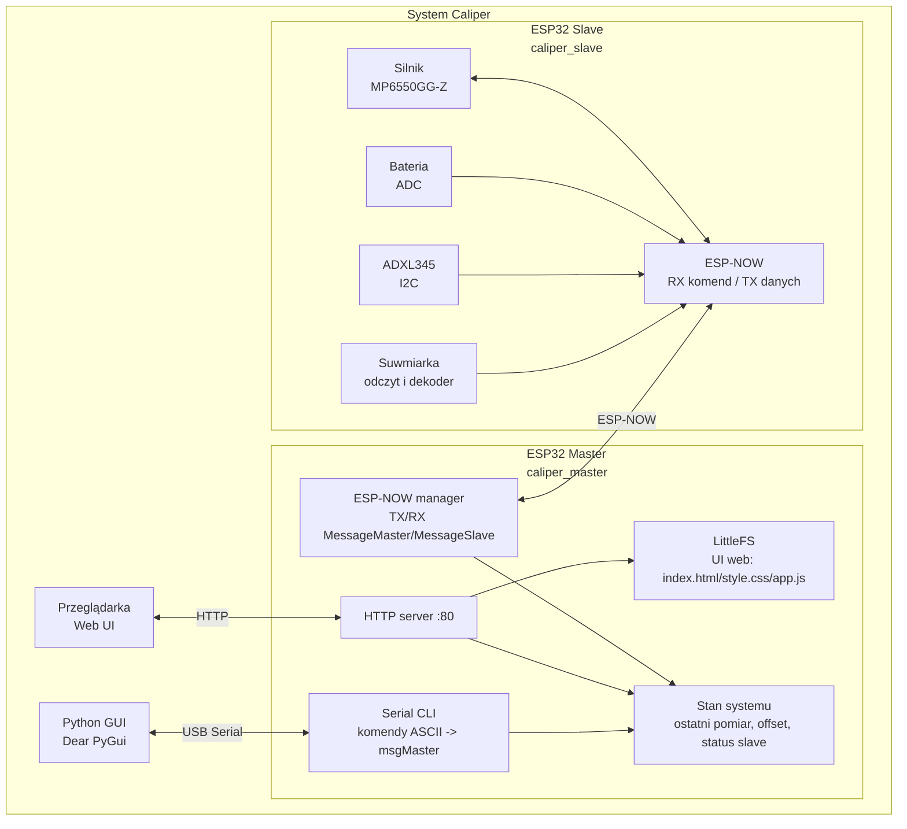
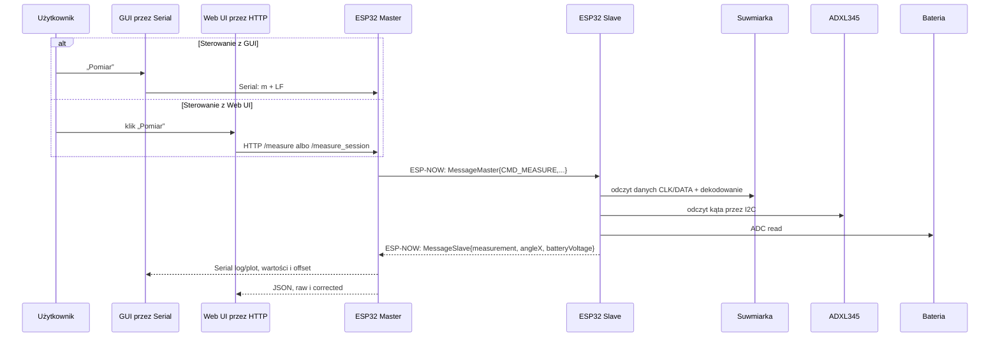
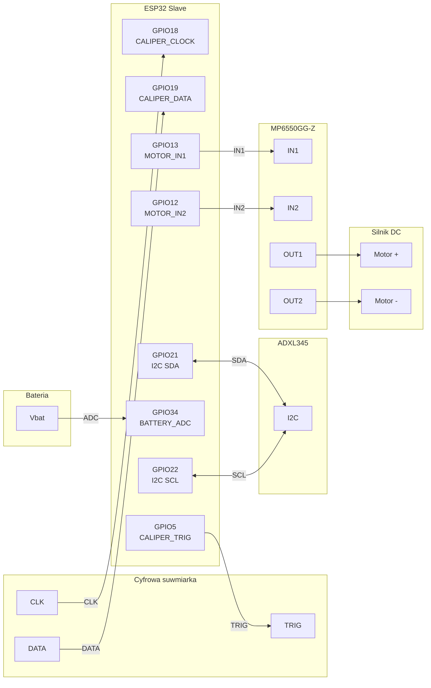

# Caliper — bezprzewodowy system pomiarowy (ESP32 + suwmiarka)

Projekt **Caliper** to system bezprzewodowego pomiaru długości oparty o 2× ESP32, cyfrową suwmiarkę (odczyt strumienia bitów), akcelerometr ADXL345 oraz sterownik silnika MP6550GG-Z. Dane są przesyłane dwukierunkowo przez **ESP-NOW**, a sterowanie odbywa się przez:

- **Web UI** hostowane przez ESP32 Master (WiFi AP + HTTP + LittleFS)
- **Desktop GUI** w Pythonie (Dear PyGui) komunikujące się z Master po **Serial**

## Najważniejsze funkcje

- pomiar z cyfrowej suwmiarki + walidacja zakresów
- odczyt kąta z ADXL345 (I2C)
- pomiar napięcia baterii (ADC)
- sterowanie silnikiem DC przez MP6550GG-Z (PWM na IN1/IN2)
- UI web (LittleFS) + proste API HTTP
- GUI desktop (serial, log, wykresy, zapis do CSV)
- wspólny protokół/typy w bibliotece `lib/CaliperShared`

## Architektura (high-level)

### Komponenty



### Przepływ pomiaru (typowy)



### Połączenia hardware (skrót)



## Repozytorium — najważniejsze katalogi

- `caliper_master/` — firmware Master (PlatformIO)
  - źródła: `caliper_master/src/` (entry-point: `main.cpp`)
  - Web UI (LittleFS): `caliper_master/data/`
- `caliper_slave/` — firmware Slave (PlatformIO)
  - źródła: `caliper_slave/src/` (entry-point: `main.cpp`)
- `caliper_master_gui/` — GUI w Pythonie (Dear PyGui)
  - entry-point: `caliper_master_gui.py`
- `lib/CaliperShared/` — wspólne definicje protokołu i konfiguracji

## Protokół (w skrócie)

Wiadomości Master↔Slave są zdefiniowane we wspólnej bibliotece:

- `lib/CaliperShared/shared_common.h` — `CommandType`, `MessageMaster`, `MessageSlave`, `SystemStatus`
- `lib/CaliperShared/shared_config.h` — wspólne stałe (np. kanał WiFi dla ESP-NOW, piny)

## Build / Flash (Windows + PlatformIO)

Najbardziej aktualne komendy utrzymujemy w **AGENTS.md**.

### Kompilacja

```powershell
cd caliper_slave && C:\Users\tiim\.platformio\penv\Scripts\platformio.exe run --environment esp32doit-devkit-v1
cd caliper_master && C:\Users\tiim\.platformio\penv\Scripts\platformio.exe run --environment esp32doit-devkit-v1
```

### Wgrywanie firmware

```powershell
cd caliper_slave && C:\Users\tiim\.platformio\penv\Scripts\platformio.exe run --target upload -s --environment esp32doit-devkit-v1 --upload-port COM8
cd caliper_master && C:\Users\tiim\.platformio\penv\Scripts\platformio.exe run --target upload -s --environment esp32doit-devkit-v1 --upload-port COM7
```

### Wgrywanie UI web (LittleFS) — tylko Master

Po zmianach w `caliper_master/data/`:

```powershell
cd caliper_master && C:\Users\tiim\.platformio\penv\Scripts\platformio.exe run --target uploadfs -s --environment esp32doit-devkit-v1 --upload-port COM7
```

## Uruchomienie GUI (Python)

```powershell
cd caliper_master_gui
python -m pip install -r requirements.txt
python caliper_master_gui.py
```

## Web UI

1. Połącz się z WiFi utworzonym przez Master (SSID/hasło w `caliper_master/src/config.h`).
2. Otwórz w przeglądarce: `http://192.168.4.1`

## Kluczowe pliki (punkt startowy)

- Master firmware: `caliper_master/src/main.cpp`
- Slave firmware: `caliper_slave/src/main.cpp`
- ESP-NOW manager: `caliper_master/src/communication.h` + `caliper_master/src/communication.cpp`
- Serial CLI: `caliper_master/src/serial_cli.h` + `caliper_master/src/serial_cli.cpp`
- Wspólne typy/protokół: `lib/CaliperShared/shared_common.h`
- Wspólna konfiguracja/piny: `lib/CaliperShared/shared_config.h`
- Web UI: `caliper_master/data/index.html`, `caliper_master/data/style.css`, `caliper_master/data/app.js`
- Python GUI: `caliper_master_gui/caliper_master_gui.py`

## Licencja

Projekt hobbystyczny/edukacyjny.
