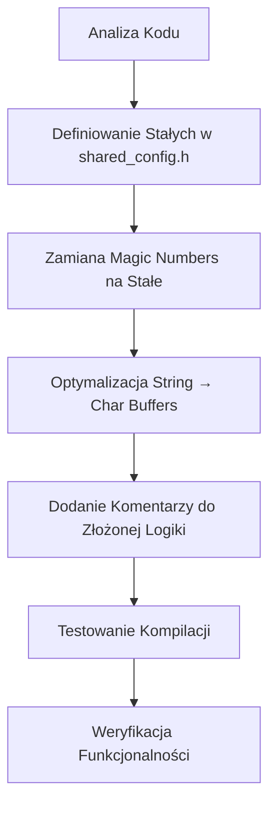

# Plan Czyszczenia Kodu - Caliper Project

## Przegląd

Ten plan szczegółowo opisuje zadania czyszczenia kodu dla projektu Caliper, w tym:
- Zamianę magic numbers na nazwane stałe
- Optymalizację String → char buffers
- Dodanie komentarzy do złożonej logiki

---

## 1. Magic Numbers → Nazwane Stałe

### 1.1 `caliper_master/src/main.cpp`

| Linia | Magic Number | Opis | Proponowana Stała | Lokalizacja |
|-------|-------------|------|-------------------|-------------|
| 22 | 100 | Domyślna prędkość silnika | `DEFAULT_MOTOR_SPEED` | Już zdefiniowana, przenieść do config.h |
| 23 | 100 | Domyślny moment obrotowy | `DEFAULT_MOTOR_TORQUE` | Już zdefiniowana, przenieść do config.h |
| 25 | 1000 | Domyślny timeout (ms) | `DEFAULT_TIMEOUT_MS` | Już zdefiniowana, przenieść do config.h |
| 94 | 1000 | Dodatkowy margines timeoutu | `MEASUREMENT_TIMEOUT_MARGIN_MS` | shared_config.h |
| 98 | 1000 | Dodatkowy margines timeoutu | `MEASUREMENT_TIMEOUT_MARGIN_MS` | shared_config.h |
| 115 | 1 | Opóźnienie w pętli oczekiwania | `POLL_DELAY_MS` | shared_config.h |
| 253 | -14.999 | Min offset kalibracji | `CALIBRATION_OFFSET_MIN` | shared_config.h |
| 253 | 14.999 | Max offset kalibracji | `CALIBRATION_OFFSET_MAX` | shared_config.h |
| 280 | 1 | Minimalna długość nazwy sesji | `SESSION_NAME_MIN_LENGTH` | shared_config.h |
| 286 | 31 | Maksymalna długość nazwy sesji | `SESSION_NAME_MAX_LENGTH` | shared_config.h |

### 1.2 `caliper_slave/src/main.cpp`

| Linia | Magic Number | Opis | Proponowana Stała | Lokalizacja |
|-------|-------------|------|-------------------|-------------|
| 43 | 1 | Opóźnienie timera (ms) | `TIMER_DELAY_MS` | shared_config.h |
| 147 | 100 | Opóźnienie WiFi (ms) | `WIFI_INIT_DELAY_MS` | shared_config.h |
| 150 | 10 | Maksymalna liczba prób WiFi | `WIFI_MAX_ATTEMPTS` | shared_config.h |
| 152 | 100 | Opóźnienie między próbami WiFi | `WIFI_RETRY_DELAY_MS` | shared_config.h |
| 183 | 10 | Maksymalna liczba prób dodania peer | `PEER_MAX_ATTEMPTS` | shared_config.h |
| 186 | 100 | Opóźnienie między próbami peer | `PEER_RETRY_DELAY_MS` | shared_config.h |

### 1.3 `caliper_slave/src/sensors/caliper.cpp`

| Linia | Magic Number | Opis | Proponowana Stała | Lokalizacja |
|-------|-------------|------|-------------------|-------------|
| 20, 25, 44, 45 | 52 | Rozmiar bufora bitów | `CALIPER_BIT_BUFFER_SIZE` | shared_config.h |
| 34, 37 | 26, 51 | Indeksy do odwracania bitów | `CALIPER_BIT_BUFFER_SIZE / 2` | Obliczone w runtime |
| 47 | 8 | Przesunięcie bitów | `CALIPER_BIT_SHIFT` | shared_config.h |
| 52 | 13 | Liczba nibbli | `CALIPER_NIBBLE_COUNT` | shared_config.h |
| 56 | 4 | Bity w nibblu | `BITS_PER_NIBBLE` | shared_config.h |
| 60 | 5 | Liczba cyfr dziesiętnych | `CALIPER_DECIMAL_DIGITS` | shared_config.h |
| 64 | 1000.0 | Dzielnik wartości pomiaru | `CALIPER_VALUE_DIVISOR` | shared_config.h |
| 68 | 25.4 | Konwersja cal → mm | `INCH_TO_MM_FACTOR` | shared_config.h |

### 1.4 `caliper_slave/src/sensors/accelerometer.cpp`

| Linia | Magic Number | Opis | Proponowana Stała | Lokalizacja |
|-------|-------------|------|-------------------|-------------|
| 13 | 0x53 | Adres I2C ADXL345 | `ADXL345_I2C_ADDRESS` | shared_config.h |

### 1.5 `caliper_slave/src/motor/motor_ctrl.cpp`

| Linia | Magic Number | Opis | Proponowana Stała | Lokalizacja |
|-------|-------------|------|-------------------|-------------|
| 33, 36, 44-47, 61-62, 66-67 | 255 | Maksymalna wartość PWM | `PWM_MAX_VALUE` | shared_config.h |
| 80 | 10 | Próg zmiany prędkości do logowania | `MOTOR_SPEED_CHANGE_THRESHOLD` | shared_config.h |

---

## 2. String → Char Buffers

### 2.1 `caliper_master/src/main.cpp`

**Globalne zmienne String:**

| Linia | Obecny kod | Proponowana zmiana |
|-------|-----------|-------------------|
| 31 | `String lastMeasurement = "Brak pomiaru";` | `char lastMeasurement[64];` |
| 32 | `String lastBatteryVoltage = "Brak danych";` | `char lastBatteryVoltage[32];` |

**Użycia String w funkcjach:**

| Funkcja | Linie | Proponowana zmiana |
|---------|-------|-------------------|
| `sendTxToSlave()` | 128, 138, 143 | Użyć `snprintf()` z char buffers |
| `handleCalibrationMeasure()` | 233-237 | Użyć `snprintf()` z char buffer |
| `handleCalibrationSetOffset()` | 262-265 | Użyć `snprintf()` z char buffer |
| `handleStartSession()` | 322 | Użyć `snprintf()` z char buffer |
| `handleMeasureSession()` | 349-361 | Użyć `snprintf()` z char buffer |

**Szczegóły implementacji:**

```cpp
// Zamiast:
lastMeasurement = "Oczekiwanie na odpowiedź...";

// Użyć:
snprintf(lastMeasurement, sizeof(lastMeasurement), "Oczekiwanie na odpowiedź...");

// Zamiast:
String response = "{";
response += "\"success\":true,";
response += "\"measurementRaw\":" + String((double)raw, 3) + ",";
// ...

// Użyć:
char response[256];
snprintf(response, sizeof(response), 
    "{\"success\":true,\"measurementRaw\":%.3f,\"calibrationOffset\":%.3f}", 
    raw, offset);
```

**Nowe stałe rozmiarów buforów (dodać do config.h):**

```cpp
#define LAST_MEASUREMENT_BUFFER_SIZE 64
#define LAST_BATTERY_VOLTAGE_BUFFER_SIZE 32
#define JSON_RESPONSE_BUFFER_SIZE 512
```

---

## 3. Komentarze do Złożonej Logiki

### 3.1 `caliper_master/src/main.cpp`

#### Funkcja `calcMeasurementWaitTimeoutMs()` (linie 90-99)

**Wymagane komentarze:**
- Wyjaśnienie dlaczego timeout = msgMaster.timeout + 1000ms
- Wyjaśnienie logiki saturacji do UINT32_MAX
- Przykład użycia

#### Funkcja `waitForMeasurementReady()` (linie 101-121)

**Wymagane komentarze:**
- Wyjaśnienie mechanizmu blokującej pętli
- Wyjaśnienie znaczenia flagi `measurementReady`
- Wyjaśnienie obsługi timeoutu

#### Funkcja `validateSessionName()` (linie 277-302)

**Wymagane komentarze:**
- Wyjaśnienie reguł walidacji (długość, znaki dozwolone)
- Wyjaśnienie dlaczego 31 znaków (32 z null terminator)
- Przykłady poprawnych i niepoprawnych nazw

#### Funkcja `handleCalibrationMeasure()` (linie 217-240)

**Wymagane komentarze:**
- Wyjaśnienie przepływu: request → wait → validate → response
- Wyjaśnienie formatu JSON response
- Wyjaśnienie znaczenia measurementRaw vs calibrationOffset

#### Funkcja `handleCalibrationSetOffset()` (linie 242-268)

**Wymagane komentarze:**
- Wyjaśnienie walidacji zakresu offsetu
- Wyjaśnienie dlaczego -14.999..14.999
- Wyjaśnienie wpływu offsetu na wyniki pomiarów

#### Funkcja `handleMeasureSession()` (linie 326-364)

**Wymagane komentarze:**
- Wyjaśnienie przepływu sesji pomiarowej
- Wyjaśnienie znaczenia sessionName
- Wyjaśnienie formatu JSON response z wszystkimi polami

### 3.2 `caliper_slave/src/main.cpp`

#### Funkcja `OnDataRecv()` (linie 28-62)

**Wymagane komentarze:**
- Wyjaśnienie obsługi różnych komend (CMD_MEASURE, CMD_UPDATE, CMD_MOTORTEST)
- Wyjaśnienie mechanizmu anulowania i ponownego uruchomienia timera
- Wyjaśnienie dlaczego timerWorker.in(1, runMeasReq)

#### Funkcja `runMeasReq()` (linie 87-130)

**Wymagane komentarze:**
- Wyjaśnienie przepływu: motor forward → delay → measure → motor reverse
- Wyjaśnienie różnicy między CMD_MEASURE a CMD_UPDATE
- Wyjaśnienie mechanizmu retry przy błędzie wysyłki

### 3.3 `caliper_slave/src/sensors/caliper.cpp`

#### Funkcja `reverseBits()` (linie 32-40)

**Wymagane komentarze:**
- Wyjaśnienie dlaczego odwracamy bity (protokół suwmiarki)
- Wyjaśnienie algorytmu zamiany miejscami
- Wyjaśnienie dlaczego tylko 26 iteracji (połowa bufora)

#### Funkcja `decodeCaliper()` (linie 42-70)

**Wymagane komentarze:**
- Wyjaśnienie formatu danych suwmiarki (52 bity, 13 nibbli)
- Wyjaśnienie przesunięcia o 8 bitów (nagłówek)
- Wyjaśnienie dekodowania BCD (Binary Coded Decimal)
- Wyjaśnienie flagi negatywnej i trybu cal/inch
- Wyjaśnienie konwersji do milimetrów

#### Funkcja `performMeasurement()` (linie 80-120)

**Wymagane komentarze:**
- Wyjaśnienie sekwencji: TRIG LOW → attach interrupt → wait → detach → TRIG HIGH
- Wyjaśnienie znaczenia flagi dataReady
- Wyjaśnienie walidacji wyniku (zakres, NaN, Inf)
- Wyjaśnienie obsługi timeoutu

### 3.4 `caliper_slave/src/motor/motor_ctrl.cpp`

#### Funkcja `motorCtrlRun()` (linie 30-87)

**Wymagane komentarze:**
- Wyjaśnienie tabeli motorTable (mapowanie MotorState na piny)
- Wyjaśnienie logiki PWM dla MOTOR_FORWARD i MOTOR_REVERSE
- Wyjaśnienie dlaczego 255 - speed (inwersja PWM)
- Wyjaśnienie mechanizmu optymalizacji logowania (threshold 10)
- Wyjaśnienie znaczenia parametru torque (obecnie nieużywany)

---

## 4. Nowe Stałe do Dodania

### 4.1 Do `lib/CaliperShared/shared_config.h`

```cpp
// ============================================================================
// Calibration Configuration
// ============================================================================
#define CALIBRATION_OFFSET_MIN -14.999f
#define CALIBRATION_OFFSET_MAX 14.999f

// ============================================================================
// Session Configuration
// ============================================================================
#define SESSION_NAME_MIN_LENGTH 1
#define SESSION_NAME_MAX_LENGTH 31

// ============================================================================
// Timing Configuration (Additional)
// ============================================================================
#define MEASUREMENT_TIMEOUT_MARGIN_MS 1000
#define POLL_DELAY_MS 1
#define TIMER_DELAY_MS 1
#define WIFI_INIT_DELAY_MS 100
#define WIFI_MAX_ATTEMPTS 10
#define WIFI_RETRY_DELAY_MS 100
#define PEER_MAX_ATTEMPTS 10
#define PEER_RETRY_DELAY_MS 100

// ============================================================================
// Caliper Configuration
// ============================================================================
#define CALIPER_BIT_BUFFER_SIZE 52
#define CALIPER_BIT_SHIFT 8
#define CALIPER_NIBBLE_COUNT 13
#define BITS_PER_NIBBLE 4
#define CALIPER_DECIMAL_DIGITS 5
#define CALIPER_VALUE_DIVISOR 1000.0f
#define INCH_TO_MM_FACTOR 25.4f

// ============================================================================
// Accelerometer Configuration
// ============================================================================
#define ADXL345_I2C_ADDRESS 0x53

// ============================================================================
// Motor Configuration
// ============================================================================
#define PWM_MAX_VALUE 255
#define MOTOR_SPEED_CHANGE_THRESHOLD 10

// ============================================================================
// Buffer Sizes
// ============================================================================
#define LAST_MEASUREMENT_BUFFER_SIZE 64
#define LAST_BATTERY_VOLTAGE_BUFFER_SIZE 32
#define JSON_RESPONSE_BUFFER_SIZE 512
```

---

## 5. Priorytety Implementacji

### Wysoki priorytet (wpływ na czytelność i łatwość utrzymania)
1. Dodanie stałych dla magic numbers w `shared_config.h`
2. Zamiana globalnych String na char buffers w `main.cpp`
3. Komentarze do złożonych funkcji dekodujących (`decodeCaliper()`, `reverseBits()`)

### Średni priorytet (ulepszenie jakości kodu)
4. Optymalizacja JSON response z String na snprintf
5. Komentarze do funkcji obsługi API (handleCalibration*, handleMeasureSession)
6. Stałe dla wartości PWM i opóźnień w slave

### Niski priorytet (kosmetyczne ulepszenia)
7. Komentarze do prostych funkcji (OnDataRecv, runMeasReq)
8. Stałe dla wartości w tabelach (motorTable)

---

## 6. Diagram Przepływu Zmian



---

## 7. Ryzyka i Środki Ostrożności

### Ryzyko 1: Zmiana rozmiaru buforów może spowodować przepełnienie
**Środek ostrożności:** Użyć `snprintf()` z `sizeof(buffer)` jako limit, aby zapobiec buffer overflow

### Ryzyko 2: Błędna wartość stałej może zmienić zachowanie systemu
**Środek ostrożności:** Zachować oryginalne wartości jako komentarze przy definicjach stałych

### Ryzyko 3: Zmiana String na char może wpłynąć na pamięć
**Środek ostrożności:** Monitorować zużycie pamięci po zmianach, używać odpowiednio dużych buforów

---

## 8. Lista Plików do Modyfikacji

### Pliki konfiguracyjne:
- `lib/CaliperShared/shared_config.h` - dodanie nowych stałych

### Pliki Master:
- `caliper_master/src/main.cpp` - zamiana String na char, komentarze, użycie stałych

### Pliki Slave:
- `caliper_slave/src/main.cpp` - użycie stałych, komentarze
- `caliper_slave/src/sensors/caliper.cpp` - użycie stałych, komentarze
- `caliper_slave/src/sensors/accelerometer.cpp` - użycie stałych
- `caliper_slave/src/motor/motor_ctrl.cpp` - użycie stałych, komentarze

---

## 9. Kryteria Sukcesu

- [ ] Wszystkie magic numbers zastąpione nazwanymi stałymi
- [ ] Wszystkie globalne String zamienione na char buffers
- [ ] Wszystkie JSON response używają snprintf zamiast String concatenation
- [ ] Wszystkie złożone funkcje mają szczegółowe komentarze
- [ ] Kod kompiluje się bez ostrzeżeń
- [ ] Funkcjonalność systemu pozostaje niezmieniona
- [ ] Pamięć RAM używana jest podobnie lub mniej niż przed zmianami
