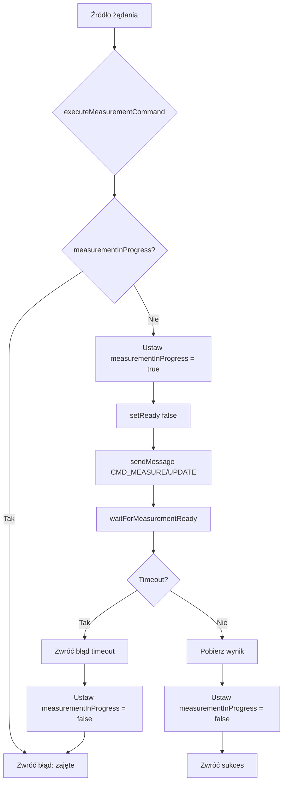
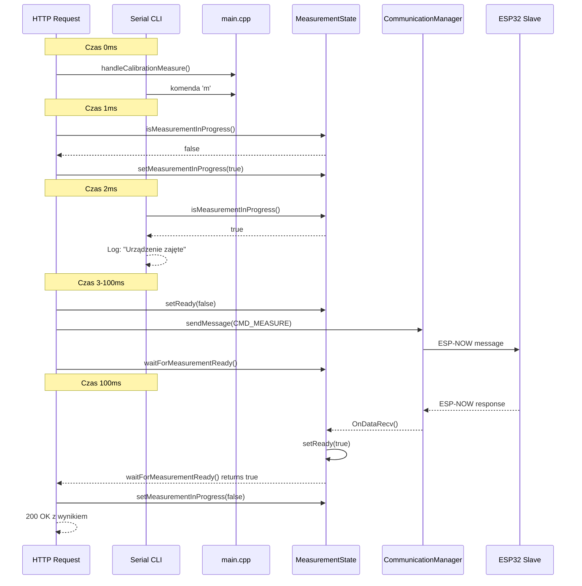

# Plan ujednolicenia logiki pomiarowej z ochroną przed wyścigiem

## Problem

### Obecna sytuacja
1. **Brak ochrony przed wyścigiem**: Wiele źródeł (HTTP, Serial CLI) może jednocześnie wywołać `requestMeasurement()` lub `requestUpdate()`
2. **Niespójne zachowanie**: 
   - HTTP endpoints używają `waitForMeasurementReady()` po wysłaniu komendy
   - Serial CLI tylko wysyła komendę, nie czeka na wynik
3. **Brak synchronizacji**: `measurementState.setReady(false)` jest wywoływane przed wysłaniem komendy, ale nie ma mechanizmu blokującego

### Scenariusz problemu (wyścig)
```
Czas  | HTTP (handleCalibrationMeasure) | Serial CLI (komenda 'm')
------|----------------------------------|-------------------------
0ms   | requestMeasurement()             | requestMeasurement()
      | setReady(false)                  | setReady(false)
1ms   | sendMessage(CMD_MEASURE)         | sendMessage(CMD_MEASURE)
2ms   | waitForMeasurementReady()        | (brak czekania)
...   | czeka na odpowiedź               | (brak czekania)
100ms | ODBIERA ODPOWIEDŹ                | (brak czekania)
```

Wynik: Odpowiedź może być przypisana do niewłaściwego żądania.

## Rozwiązanie

### Architektura



### Zmiany w strukturze

#### 1. Rozszerzenie `MeasurementState`

Plik: `caliper_master/src/measurement_state.h`

```cpp
class MeasurementState
{
private:
    // ... istniejące pola ...
    bool measurementInProgress;  // NOWE: flaga operacji w toku

public:
    // ... istniejące metody ...

    // NOWE metody
    bool isMeasurementInProgress() const;
    void setMeasurementInProgress(bool inProgress);
};
```

Plik: `caliper_master/src/measurement_state.cpp`

```cpp
MeasurementState::MeasurementState()
    : lastValue(0.0f), ready(false), measurementInProgress(false)  // NOWE inicjalizacja
{
    // ... istniejący kod ...
}

bool MeasurementState::isMeasurementInProgress() const
{
    return measurementInProgress;
}

void MeasurementState::setMeasurementInProgress(bool inProgress)
{
    measurementInProgress = inProgress;
}
```

#### 2. Nowa ujednolicona funkcja

Plik: `caliper_master/src/main.cpp`

```cpp
/**
 * @brief Wykonuje operację pomiarową z ochroną przed wyścigiem
 *
 * Funkcja zapewnia atomowe wykonanie operacji CMD_MEASURE lub CMD_UPDATE
 * z ochroną przed jednoczesnymi wywołaniami z różnych źródeł.
 *
 * @details
 * Przepływ operacji:
 * 1. Sprawdza czy operacja już trwa (measurementInProgress)
 * 2. Jeśli tak - zwraca false (błąd: zajęte)
 * 3. Jeśli nie - ustawia measurementInProgress = true
 * 4. Resetuje flagę ready
 * 5. Wysyła komendę do Slave
 * 6. Czeka na odpowiedź z timeoutem
 * 7. Ustawia measurementInProgress = false
 * 8. Zwraca true (sukces) lub false (timeout/błąd)
 *
 * @param command Typ komendy (CMD_MEASURE lub CMD_UPDATE)
 * @param commandName Nazwa komendy dla logowania
 * @return true jeśli operacja zakończyła się sukcesem, false w przeciwnym razie
 */
static bool executeMeasurementCommand(CommandType command, const char *commandName)
{
    // Krok 1: Sprawdź czy operacja już trwa
    if (measurementState.isMeasurementInProgress())
    {
        DEBUG_W("Measurement command %s rejected - operation already in progress", commandName);
        return false;
    }

    // Krok 2: Zablokuj operację
    measurementState.setMeasurementInProgress(true);

    // Krok 3: Resetuj flagę gotowości
    measurementState.setReady(false);
    measurementState.setMeasurementMessage("Oczekiwanie na odpowiedź...");

    // Krok 4: Ustaw i wyślij komendę
    systemStatus.msgMaster.command = command;

    ErrorCode result = commManager.sendMessage(systemStatus.msgMaster);

    if (result != ERR_NONE)
    {
        LOG_ERROR(result, "Failed to send command %s", commandName);
        measurementState.setMeasurementMessage("BLAD: Nie można wysłać komendy");
        measurementState.setMeasurementInProgress(false);  // Zwolnij blokadę
        return false;
    }

    DEBUG_I("Wysłano komendę: %s", commandName);
    measurementState.setMeasurementMessage(commandName);

    // Krok 5: Czekaj na odpowiedź
    bool success = waitForMeasurementReady(calcMeasurementWaitTimeoutMs());

    // Krok 6: Zwolnij blokadę (nawet przy timeout)
    measurementState.setMeasurementInProgress(false);

    return success;
}
```

#### 3. Zmodyfikowane funkcje wywołujące

Plik: `caliper_master/src/main.cpp`

```cpp
// USUNIĘTE: requestMeasurement() - zastąpione przez executeMeasurementCommand()
// USUNIĘTE: requestUpdate() - zastąpione przez executeMeasurementCommand()

// NOWE: funkcje wrapper dla zachowania kompatybilności
void requestMeasurement()
{
    executeMeasurementCommand(CMD_MEASURE, "Pomiar");
}

void requestUpdate()
{
    executeMeasurementCommand(CMD_UPDATE, "Status");
}
```

#### 4. Zmodyfikowane HTTP endpoints

Plik: `caliper_master/src/main.cpp`

```cpp
void handleCalibrationMeasure()
{
    // Zastąp requestMeasurement() bezpośrednim wywołaniem
    if (!executeMeasurementCommand(CMD_MEASURE, "Pomiar"))
    {
        // Sprawdź czy to timeout czy zajętość
        if (!measurementState.isReady())
        {
            server.send(504, "application/json", "{\"success\":false,\"error\":\"Brak odpowiedzi z urządzenia\"}");
        }
        else
        {
            server.send(503, "application/json", "{\"success\":false,\"error\":\"Urządzenie zajęte - operacja w toku\"}");
        }
        return;
    }

    // ... reszta kodu bez zmian ...
}

void handleMeasureSession()
{
    // Sprawdź czy sesja jest aktywna
    if (strlen(systemStatus.sessionName) == 0)
    {
        server.send(400, "application/json", "{\"error\":\"Sesja nieaktywna (nie ustawiono nazwy sesji)\"}");
        return;
    }

    // Zastąp requestMeasurement() bezpośrednim wywołaniem
    if (!executeMeasurementCommand(CMD_MEASURE, "Pomiar"))
    {
        if (!measurementState.isReady())
        {
            server.send(504, "application/json", "{\"error\":\"Brak odpowiedzi z urządzenia\"}");
        }
        else
        {
            server.send(503, "application/json", "{\"error\":\"Urządzenie zajęte - operacja w toku\"}");
        }
        return;
    }

    // ... reszta kodu bez zmian ...
}
```

#### 5. Zmodyfikowany Serial CLI

Plik: `caliper_master/src/serial_cli.cpp`

```cpp
// W funkcji SerialCli_tick():

case 'm':
    if (g_ctx.requestMeasurement)
    {
        // Wywołanie requestMeasurement() - teraz używa executeMeasurementCommand()
        g_ctx.requestMeasurement();
        
        // Dodatkowe logowanie wyniku
        if (g_ctx.systemStatus->measurementReady)  // Zakładamy dostęp do measurementState
        {
            DEBUG_I("Pomiar zakończony: %.3f mm", 
                   (double)g_ctx.systemStatus->msgSlave.measurement);
        }
    }
    break;

case 'u':
    if (g_ctx.requestUpdate)
    {
        // Wywołanie requestUpdate() - teraz używa executeMeasurementCommand()
        g_ctx.requestUpdate();
    }
    break;
```

**UWAGA**: Serial CLI wymaga dostępu do `measurementState`. Należy rozszerzyć `SerialCliContext`:

Plik: `caliper_master/src/serial_cli.h`

```cpp
struct MeasurementState;  // Forward declaration

struct SerialCliContext
{
    SystemStatus *systemStatus = nullptr;
    PreferencesManager *prefsManager = nullptr;
    MeasurementState *measurementState = nullptr;  // NOWE

    // Akcje
    void (*requestMeasurement)() = nullptr;
    void (*requestUpdate)() = nullptr;
    void (*sendMotorTest)() = nullptr;
};
```

Plik: `caliper_master/src/main.cpp` (w setup())

```cpp
SerialCliContext cliCtx;
cliCtx.systemStatus = &systemStatus;
cliCtx.prefsManager = &prefsManager;
cliCtx.measurementState = &measurementState;  // NOWE
cliCtx.requestMeasurement = requestMeasurement;
cliCtx.requestUpdate = requestUpdate;
cliCtx.sendMotorTest = sendMotorTest;
SerialCli_begin(cliCtx);
```

### Przepływ operacji po zmianach



## Lista zadań implementacyjnych

### Krok 1: Rozszerzenie MeasurementState
- [ ] Dodać pole `measurementInProgress` do klasy
- [ ] Dodać metodę `isMeasurementInProgress()`
- [ ] Dodać metodę `setMeasurementInProgress(bool)`
- [ ] Zaktualizować konstruktor

### Krok 2: Stworzenie ujednoliconej funkcji
- [ ] Zaimplementować `executeMeasurementCommand(CommandType, const char*)`
- [ ] Zaimplementować logikę blokowania
- [ ] Zaimplementować logikę zwalniania blokady (nawet przy błędach)
- [ ] Dodać odpowiednie logowanie

### Krok 3: Refaktoryzacja funkcji wywołujących
- [ ] Zmodyfikować `requestMeasurement()` aby używała `executeMeasurementCommand()`
- [ ] Zmodyfikować `requestUpdate()` aby używała `executeMeasurementCommand()`

### Krok 4: Aktualizacja HTTP endpoints
- [ ] Zmodyfikować `handleCalibrationMeasure()` aby obsługiwał błąd "zajęte"
- [ ] Zmodyfikować `handleMeasureSession()` aby obsługiwał błąd "zajęte"
- [ ] Zwracać 503 Service Unavailable gdy zajęte
- [ ] Zwracać 504 Gateway Timeout gdy timeout

### Krok 5: Aktualizacja Serial CLI
- [ ] Rozszerzyć `SerialCliContext` o wskaźnik do `MeasurementState`
- [ ] Zaktualizować inicjalizację kontekstu w `setup()`
- [ ] Zmodyfikować obsługę komend 'm' i 'u' aby logowały wynik

### Krok 6: Testowanie
- [ ] Test jednoczesnych żądań z HTTP
- [ ] Test jednoczesnych żądań z Serial CLI
- [ ] Test mieszanych żądań (HTTP + Serial CLI)
- [ ] Test timeout i zwalniania blokady
- [ ] Test obsługi błędów komunikacji

## Odpowiedzi na pytania użytkownika

### Czy to możliwe?
**TAK**, jest to możliwe i zalecane. Użycie flagi `measurementInProgress` w `MeasurementState` zapewnia:
- Atomową operację (sprawdzenie + ustawienie w jednej funkcji)
- Automatyczne zwalnianie blokady (nawet przy błędach)
- Jednolite zachowanie dla wszystkich źródeł

### Czy nie powinno być zrobione w inny sposób?
**OPCJE ALTERNATYWNE:**

1. **Mutex/Semaphore** (Arduino FreeRTOS):
   - Zaleta: Bardziej profesjonalne podejście
   - Wada: Wymaga FreeRTOS, większa złożoność
   - **Werdykt**: Niepotrzebne dla tego prostego przypadku

2. **Queue system**:
   - Zaleta: Pełna kolejkowanie żądań
   - Wada: Większa złożoność, niepotrzebne dla tego przypadku użycia
   - **Werdykt**: Przesada, użytkownik wybrał "pierwsze wygrywa"

3. **Timeout na blokadzie**:
   - Zaleta: Ochrona przed zakleszczeniem
   - Wada: Dodatkowa złożoność
   - **Werdykt**: Opcjonalne - można dodać w przyszłości

**REKOMENDACJA**: Proponowane rozwiązanie z flagą `measurementInProgress` jest optymalne dla tego przypadku użycia.

## Kody błędów HTTP

| Kod HTTP | Opis | Kiedy używany |
|----------|------|---------------|
| 200 OK | Sukces | Pomiar zakończony pomyślnie |
| 400 Bad Request | Błąd walidacji | Nieprawidłowe parametry |
| 503 Service Unavailable | Zajęte | Operacja już w toku |
| 504 Gateway Timeout | Timeout | Brak odpowiedzi od Slave |

## Podsumowanie

Propozycja zapewnia:
- ✅ Ujednoliconą logikę dla CMD_MEASURE i CMD_UPDATE
- ✅ Ochronę przed wyścigiem (race condition)
- ✅ Spójne zachowanie dla wszystkich źródeł (HTTP, Serial CLI)
- ✅ Serial CLI teraz czeka na wynik
- ✅ Jasne kody błędów HTTP
- ✅ Minimalną złożoność implementacji
- ✅ Łatwą debugowalność
