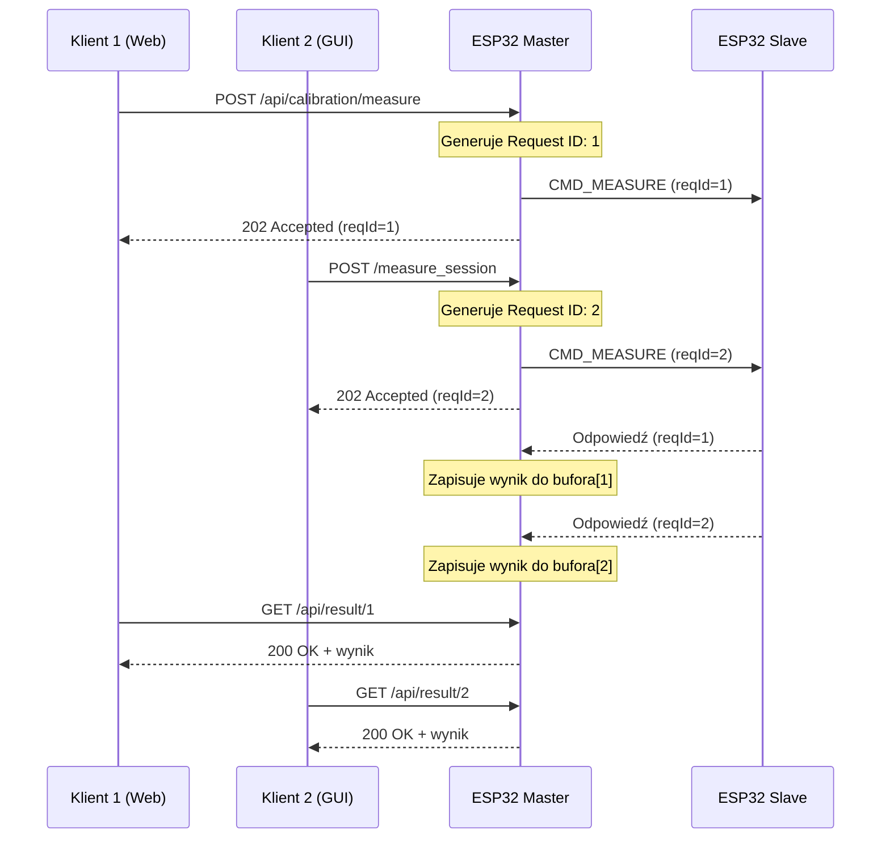

# Plan: Architektura Asynchroniczna z Obsługą Wielu Klientów

## Problem Obecny

### 1. Blokująca pętla `waitForMeasurementReady()`
W pliku [`caliper_master/src/main.cpp`](caliper_master/src/main.cpp:101-121) znajduje się funkcja `waitForMeasurementReady()`, która:
- Blokuje wątek główny w pętli `while (!measurementReady)`
- Wywoływana jest w handlerach HTTP: `handleCalibrationMeasure()` (linia 222) i `handleMeasureSession()` (linia 338)
- Podczas oczekiwania serwer HTTP nie może obsłużyć innych żądań
- GUI Python i web UI nie mogą działać równolegle

### 2. Globalny stan `measurementReady`
- Pojedyncza flaga `measurementReady` nie pozwala na rozróżnienie wielu równoczesnych żądań
- Brak mechanizmu przypisania wyniku do konkretnego żądania

### 3. Brak mechanizmu Request ID
- Odpowiedź od Slave nie jest powiązana z konkretnym żądaniem
- W przypadku wielu równoczesnych żądań, wynik może zostać przypisany do niewłaściwego klienta

## Proponowane Rozwiązanie

### Architektura Asynchroniczna z Request ID



### Kluczowe Elementy

#### 1. Struktura Request ID
```cpp
// Dodaj do shared_common.h
struct RequestInfo {
    uint32_t requestId;           // Unikalny ID żądania
    uint32_t timestamp;           // Czas utworzenia żądania
    uint32_t timeout;             // Timeout w ms
    bool completed;               // Czy wynik jest gotowy
    MessageSlave result;          // Wynik pomiaru
};

// Bufor na wyniki (np. 8 równoczesnych żądań)
#define MAX_CONCURRENT_REQUESTS 8
RequestInfo requestBuffer[MAX_CONCURRENT_REQUESTS];
```

#### 2. Generator Request ID
```cpp
uint32_t generateRequestId() {
    static uint32_t nextId = 1;
    return nextId++;
}
```

#### 3. Zmodyfikowana struktura MessageMaster
```cpp
struct MessageMaster {
    uint32_t requestId;           // Nowe: ID żądania
    uint32_t timeout;             // Timeout dla pomiaru
    CommandType command;
    MotorState motorState;
    uint8_t motorSpeed;
    uint8_t motorTorque;
};
```

#### 4. Zmodyfikowana struktura MessageSlave
```cpp
struct MessageSlave {
    uint32_t requestId;           // Nowe: ID żądania (echo)
    float measurement;
    float batteryVoltage;
    CommandType command;
    uint8_t angleX;
};
```

#### 5. Funkcja asynchroniczna `sendMeasurementRequest()`
```cpp
uint32_t sendMeasurementRequest(CommandType cmd, uint32_t timeoutMs) {
    uint32_t reqId = generateRequestId();
    
    // Znajdź wolny slot w buforze
    int slot = findFreeSlot();
    if (slot < 0) return 0; // Brak wolnych slotów
    
    // Inicjalizuj request
    requestBuffer[slot].requestId = reqId;
    requestBuffer[slot].timestamp = millis();
    requestBuffer[slot].timeout = timeoutMs;
    requestBuffer[slot].completed = false;
    
    // Wyślij komendę do Slave
    systemStatus.msgMaster.requestId = reqId;
    systemStatus.msgMaster.command = cmd;
    systemStatus.msgMaster.timeout = timeoutMs;
    commManager.sendMessage(systemStatus.msgMaster);
    
    return reqId;
}
```

#### 6. Callback `OnDataRecv` z obsługą Request ID
```cpp
void OnDataRecv(const esp_now_recv_info_t *recv_info, const uint8_t *incomingData, int len) {
    MessageSlave msg{};
    memcpy(&msg, incomingData, sizeof(msg));
    
    // Znajdź request w buforze po requestId
    int slot = findRequestSlot(msg.requestId);
    if (slot >= 0) {
        // Zapisz wynik
        requestBuffer[slot].result = msg;
        requestBuffer[slot].completed = true;
    }
    
    // Aktualizuj globalny stan (dla kompatybilności wstecznej)
    systemStatus.msgSlave = msg;
    lastMeasurementValue = msg.measurement;
    measurementReady = true;
}
```

#### 7. Funkcja `waitForRequestResult()` - asynchroniczna
```cpp
bool waitForRequestResult(uint32_t reqId, MessageSlave &result, uint32_t timeoutMs) {
    const uint32_t startMs = millis();
    
    while (millis() - startMs < timeoutMs) {
        // Sprawdź czy wynik jest gotowy
        int slot = findRequestSlot(reqId);
        if (slot >= 0 && requestBuffer[slot].completed) {
            result = requestBuffer[slot].result;
            // Zwolnij slot
            requestBuffer[slot].requestId = 0;
            return true;
        }
        
        // Obsłuż inne zdarzenia (HTTP, timer, itp.)
        server.handleClient();
        timerWorker.tick();
        
        delay(1); // Krótka przerwa
    }
    
    return false; // Timeout
}
```

#### 8. Nowe API HTTP

##### Asynchroniczne endpointy
```cpp
// POST /api/measure/async - wyślij żądanie pomiaru
void handleMeasureAsync() {
    uint32_t reqId = sendMeasurementRequest(CMD_MEASURE, systemStatus.msgMaster.timeout);
    
    if (reqId == 0) {
        server.send(503, "application/json", "{\"error\":\"Brak wolnych slotów\"}");
        return;
    }
    
    String response = "{\"requestId\":" + String(reqId) + "}";
    server.send(202, "application/json", response); // 202 Accepted
}

// GET /api/result/{reqId} - pobierz wynik
void handleGetResult() {
    uint32_t reqId = server.pathArg(0).toInt();
    
    int slot = findRequestSlot(reqId);
    if (slot < 0) {
        server.send(404, "application/json", "{\"error\":\"Nie znaleziono żądania\"}");
        return;
    }
    
    if (!requestBuffer[slot].completed) {
        server.send(202, "application/json", "{\"status\":\"pending\"}");
        return;
    }
    
    // Zwróć wynik
    MessageSlave &msg = requestBuffer[slot].result;
    String response = buildJsonResponse(msg);
    
    // Zwolnij slot
    requestBuffer[slot].requestId = 0;
    
    server.send(200, "application/json", response);
}

// POST /api/measure/sync - synchroniczny endpoint (dla kompatybilności)
void handleMeasureSync() {
    uint32_t reqId = sendMeasurementRequest(CMD_MEASURE, systemStatus.msgMaster.timeout);
    
    MessageSlave result;
    if (waitForRequestResult(reqId, result, calcMeasurementWaitTimeoutMs())) {
        String response = buildJsonResponse(result);
        server.send(200, "application/json", response);
    } else {
        server.send(504, "application/json", "{\"error\":\"Timeout\"}");
    }
}
```

### Zmiany w Slave

#### 1. Zmodyfikowana obsługa `OnDataRecv`
```cpp
void OnDataRecv(const esp_now_recv_info_t *recv_info, const uint8_t *incomingData, int len) {
    if (len != sizeof(msgMaster)) {
        DEBUG_E("BLAD: Nieprawidlowa dlugosc pakietu ESP-NOW");
        return;
    }
    
    memcpy(&msgMaster, incomingData, sizeof(msgMaster));
    
    switch (msgMaster.command) {
    case CMD_MEASURE:
    case CMD_UPDATE:
        // Zapisz requestId do odpowiedzi
        msgSlave.requestId = msgMaster.requestId;
        timerWorker.cancel();
        timerWorker.in(1, runMeasReq);
        break;
        
    case CMD_MOTORTEST:
        motorCtrlRun(msgMaster.motorSpeed, msgMaster.motorTorque, msgMaster.motorState);
        break;
    }
}
```

### Zmiany w Web UI (JavaScript)

#### Asynchroniczny pomiar
```javascript
async function measureAsync() {
    // 1. Wyślij żądanie
    const response1 = await fetch('/api/measure/async', { method: 'POST' });
    const data1 = await response1.json();
    const reqId = data1.requestId;
    
    // 2. Polluj wynik
    while (true) {
        const response2 = await fetch(`/api/result/${reqId}`);
        if (response2.status === 200) {
            const result = await response2.json();
            updateUI(result);
            break;
        } else if (response2.status === 202) {
            // Wciąż przetwarzane
            await new Promise(resolve => setTimeout(resolve, 50));
        } else {
            throw new Error('Błąd pobierania wyniku');
        }
    }
}
```

### Zmiany w GUI Python

#### Asynchroniczny pomiar
```python
async def measure_async(self):
    # 1. Wyślij żądanie przez Serial (nowa komenda 'a' = async)
    req_id = await self.send_async_command('m')
    
    # 2. Polluj wynik przez Serial
    while True:
        result = await self.check_async_result(req_id)
        if result is not None:
            return result
        await asyncio.sleep(0.05)
```

### Mechanizm Czyszczenia Starych Żądań

```cpp
void cleanupExpiredRequests() {
    const uint32_t now = millis();
    
    for (int i = 0; i < MAX_CONCURRENT_REQUESTS; i++) {
        if (requestBuffer[i].requestId != 0 && !requestBuffer[i].completed) {
            if (now - requestBuffer[i].timestamp > requestBuffer[i].timeout + 1000) {
                // Timeout - zwolnij slot
                requestBuffer[i].requestId = 0;
            }
        }
    }
}
```

## Korzyści

1. **Obsługa wielu klientów** - Web UI i GUI Python mogą działać równolegle
2. **Brak blokowania** - Serwer HTTP pozostaje responsywny
3. **Lepsze wykorzystanie zasobów** - Maksymalnie 8 równoczesnych żądań
4. **Kompatybilność wsteczna** - Synchroniczne endpointy nadal działają
5. **Lepsze timeout** - Każde żądanie ma własny timeout
6. **Możliwość skalowania** - Łatwe zwiększenie `MAX_CONCURRENT_REQUESTS`

## Ryzyka i Ograniczenia

1. **Pamięć RAM** - Każdy slot zużywa ~32 bajty (8 slotów = ~256 bajtów)
2. **Złożoność** - Asynchroniczny kod jest trudniejszy do debugowania
3. **Race conditions** - Należy uważać na współbieżny dostęp do bufora
4. **ESP-NOW kolejka** - ESP-NOW ma ograniczenia w liczbie pakietów w locie

## Kolejność Implementacji

1. Dodaj `requestId` do struktur `MessageMaster` i `MessageSlave`
2. Zaimplementuj bufor `requestBuffer` i funkcje pomocnicze
3. Zmodyfikuj `OnDataRecv` w Masterze do obsługi Request ID
4. Zmodyfikuj `OnDataRecv` w Slave do echo Request ID
5. Zaimplementuj asynchroniczne API HTTP
6. Zaktualizuj Web UI do obsługi asynchronicznej
7. Zaktualizuj GUI Python do obsługi asynchronicznej
8. Testy i walidacja

## Alternatywa: WebSocket

Alternatywą jest użycie WebSocket zamiast pollingu:
- Klient nawiązuje połączenie WebSocket
- Master wysyła wynik przez WebSocket gdy jest gotowy
- Mniejsze opóźnienia, ale większa złożoność

## Decyzja

Zalecam implementację asynchronicznego API z Request ID, ponieważ:
- Prostsze niż WebSocket
- Łatwiejsze do debugowania
- Kompatybilne z obecnym HTTP
- Dostatecznie szybkie dla tego zastosowania
