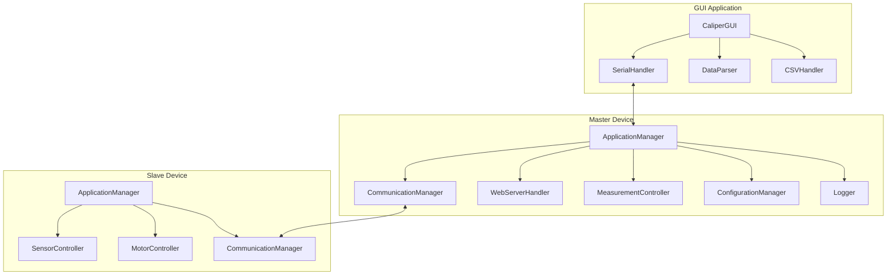
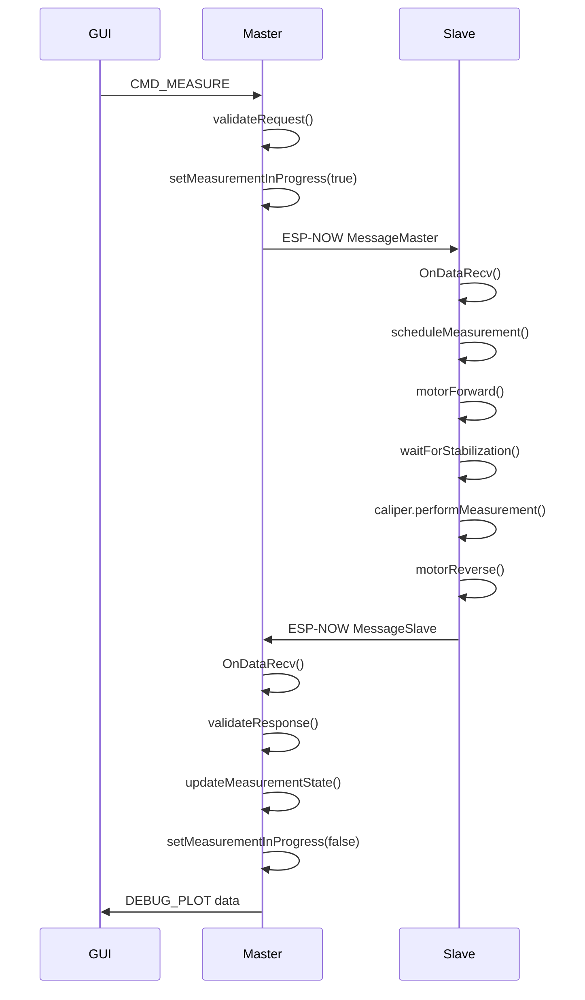

# Plan Optymalizacji Projektu Caliper

## Przegląd

Dokument ten przedstawia szczegółowy plan optymalizacji projektu Caliper (system pomiarowy z ESP32, suwmiarką, akcelerometrem i silnikiem) pod kątem wydajności, czytelności i najlepszych praktyk.

---

## Zidentyfikowane Problemy i Obszary do Optymalizacji

### 1. Zmienne Globalne i Stan Globalny

**Problem:** W [`caliper_master/src/main.cpp`](caliper_master/src/main.cpp:16-22) i [`caliper_slave/src/main.cpp`](caliper_slave/src/main.cpp:17-25) używane są liczne zmienne globalne:

```cpp
// caliper_master/src/main.cpp
uint8_t slaveAddress[] = SLAVE_MAC_ADDR;
WebServer server(WEB_SERVER_PORT);
CommunicationManager commManager;
SystemStatus systemStatus;
PreferencesManager prefsManager;
static MeasurementState measurementState;

// caliper_slave/src/main.cpp
uint8_t masterAddress[] = MASTER_MAC_ADDR;
esp_now_peer_info_t peerInfo;
CaliperInterface caliper;
AccelerometerInterface accelerometer;
BatteryMonitor battery;
MessageMaster msgMaster;
MessageSlave msgSlave;
volatile bool measurementInProgress = false;
```

**Dlaczego to problem:**
- Narusza zasady enkapsulacji i hermetyzacji (SOLID - Single Responsibility)
- Utrudnia testowanie jednostkowe
- Powoduje trudności w zarządzaniu cyklem życia obiektów
- Utrudnia wielowątkowość i współbieżność
- Zwiększa ryzyko błędów przy refaktoryzacji

**Optymalizacja:**
1. Stworzyć klasę `Application` lub `SystemManager` enkapsulującą stan
2. Przenieść zmienne globalne do pól prywatnych klasy
3. Udostępnić metody dostępowe (getters/setters) tam gdzie to konieczne

---

### 2. Duplikacja Kodu w Handlerach HTTP

**Problem:** Funkcje obsługujące pliki statyczne w [`caliper_master/src/main.cpp`](caliper_master/src/main.cpp:255-289) powielają ten sam wzorzec:

```cpp
void handleRoot() {
  File file = LittleFS.open("/index.html", "r");
  if (!file) {
    server.send(500, "text/plain", "Failed to open index.html");
    return;
  }
  server.streamFile(file, "text/html");
  file.close();
}

void handleCSS() {
  File file = LittleFS.open("/style.css", "r");
  if (!file) {
    server.send(404, "text/plain", "CSS file not found");
    return;
  }
  server.streamFile(file, "text/css");
  file.close();
}

void handleJS() {
  File file = LittleFS.open("/app.js", "r");
  if (!file) {
    server.send(404, "text/plain", "JS file not found");
    return;
  }
  server.streamFile(file, "application/javascript");
  file.close();
}
```

**Dlaczego to problem:**
- Narusza zasadę DRY (Don't Repeat Yourself)
- Trzy funkcje wykonują to samo z różnymi parametrami
- Utrudnia dodawanie nowych plików statycznych
- Zwiększa ryzyko błędów przy zmianach

**Optymalizacja:**
1. Stworzyć uniwersalną funkcję `serveStaticFile(path, contentType)`
2. Używać mapowania ścieżek do typów MIME
3. Zredukować kod do jednej funkcji generycznej

---

### 3. Brak Obsługi Błędów w Callbackach ESP-NOW

**Problem:** Callback [`OnDataRecv`](caliper_master/src/main.cpp:34-53) i [`OnDataSent`](caliper_master/src/main.cpp:55-66) mają ograniczoną obsługę błędów:

```cpp
void OnDataRecv(const esp_now_recv_info_t *recv_info, const uint8_t *incomingData, int len)
{
  (void)recv_info;
  MessageSlave msg{};

  if (len != sizeof(msg))
  {
    RECORD_ERROR(ERR_ESPNOW_INVALID_LENGTH, "Received packet length: %d, expected: %d", len, (int)sizeof(msg));
    return;
  }

  memcpy(&msg, incomingData, sizeof(msg));

  systemStatus.msgSlave = msg;
  measurementState.setMeasurement(systemStatus.msgSlave.measurement);
  measurementState.setBatteryVoltage(msg.batteryVoltage);
  measurementState.setReady(true);
}
```

**Dlaczego to problem:**
- Brak walidacji danych poza długością
- Brak ochrony przed nullptr w `incomingData`
- Bezpośrednia modyfikacja globalnego stanu w callbacku
- Brak mechanizmu retry lub retransmisji

**Optymalizacja:**
1. Dodać pełną walidację danych (nullptr, zakresy, NaN)
2. Użyć mechanizmu kolejki wiadomości zamiast bezpośredniej modyfikacji stanu
3. Zaimplementować timeout dla nieodebranych potwierdzeń
4. Dodać statystyki jakości połączenia (packet loss, latency)

---

### 4. Blokujące Pętle w Funkcjach Pomiarowych

**Problem:** Funkcja [`waitForMeasurementReady`](caliper_master/src/main.cpp:119-149) używa blokującej pętli:

```cpp
static bool waitForMeasurementReady(uint32_t timeoutMs)
{
  const uint32_t startMs = millis();

  while (!measurementState.isReady())
  {
    const uint32_t elapsedMs = millis() - startMs;
    if (elapsedMs >= timeoutMs)
    {
      DEBUG_W("Measurement timeout after %u ms (limit=%u ms)", (unsigned)elapsedMs, (unsigned)timeoutMs);
      return false;
    }

    delay(POLL_DELAY_MS);
  }
  // ...
}
```

**Dlaczego to problem:**
- Blokuje główną pętlę `loop()`, uniemożliwiając obsługę innych zdarzeń
- Utrudnia skalowalność systemu
- Może powodować timeouty w innych operacjach (np. HTTP)
- Narusza zasadę nieblokującego I/O

**Optymalizacja:**
1. Zaimplementować state machine zamiast blokującej pętli
2. Użyć FreeRTOS tasks lub timerów dla operacji asynchronicznych
3. Dodać mechanizm anulowania operacji
4. Zaimplementować callback-based API zamiast blokującego

---

### 5. Niewydajna Obsługa Stringów w Python GUI

**Problem:** W [`caliper_master_gui/caliper_master_gui.py`](caliper_master_gui/caliper_master_gui.py:93-280) funkcja `process_measurement_data` używa wielu operacji na stringach:

```python
if data.startswith("calibrationOffset:"):
    val_str = data.split(":", 1)[1].strip()
    try:
        self.current_calibration_offset = float(val_str)
    except Exception:
        # ...
```

**Dlaczego to problem:**
- Powtarzanie wzorca `data.split(":", 1)[1].strip()` wielokrotnie
- Brak walidacji formatu przed parsowaniem
- Brak obsługi wyjątków specyficznych dla każdego typu danych
- Brak buforowania lub cache'owania parsowanych wartości

**Optymalizacja:**
1. Stworzyć klasę `DebugPlotParser` do parsowania danych DEBUG_PLOT
2. Użyć wyrażeń regularnych dla walidacji i ekstrakcji
3. Zaimplementować cache dla ostatnich wartości
4. Dodać typowane struktury danych (dataclasses) dla parsowanych wiadomości

---

### 6. Brak Obsługi Timeout w Operacjach Motor

**Problem:** W [`caliper_slave/src/main.cpp`](caliper_slave/src/main.cpp:178-223) funkcja `runMeasReq` nie ma pełnej obsługi timeout dla operacji silnika:

```cpp
bool runMeasReq(void *arg)
{
  measurementInProgress = true;
  
  if (msgMaster.command == CMD_MEASURE)
  {
    timerMotorStopTimeout.cancel();
    motorCtrlRun(msgMaster.motorSpeed, msgMaster.motorTorque, MOTOR_FORWARD);
    delay(msgMaster.timeout); // wait for motor to stabilize
    // ...
  }
  // ...
}
```

**Dlaczego to problem:**
- Brak monitorowania czy silnik faktycznie się obraca
- Brak zabezpieczenia przed zablokowaniem silnika
- Brak wykrywania awarii sprzętowej
- Funkcja `delay()` blokuje cały system

**Optymalizacja:**
1. Zaimplementować monitorowanie prądu silnika
2. Dodać watchdog dla operacji silnika
3. Użyć asynchronicznych timerów zamiast `delay()`
4. Zaimplementować mechanizm awaryjnego zatrzymania

---

### 7. Niewydajne Operacje na Tablicach w Dekoderze Suwmiarki

**Problem:** W [`caliper_slave/src/sensors/caliper.cpp`](caliper_slave/src/sensors/caliper.cpp:130-158) funkcja `decodeCaliper` wykonuje wiele operacji na tablicach:

```cpp
float CaliperInterface::decodeCaliper()
{
    uint8_t shifted[CALIPER_BIT_BUFFER_SIZE];
    for (int i = 0; i < CALIPER_BIT_BUFFER_SIZE; i++)
    {
        if (i + CALIPER_BIT_SHIFT < CALIPER_BIT_BUFFER_SIZE)
            shifted[i] = bitBuffer[i + CALIPER_BIT_SHIFT];
        else
            shifted[i] = 0;
    }
    uint8_t nibbles[CALIPER_NIBBLE_COUNT];
    for (int i = 0; i < CALIPER_NIBBLE_COUNT; i++)
    {
        nibbles[i] = 0;
        for (int j = 0; j < BITS_PER_NIBBLE; j++)
            nibbles[i] |= (shifted[i * BITS_PER_NIBBLE + (BITS_PER_NIBBLE - 1 - j)] << j);
    }
    long value = 0;
    for (int i = 0; i < CALIPER_DECIMAL_DIGITS; i++)
        value += nibbles[i] * pow(10, i);
    // ...
}
```

**Dlaczego to problem:**
- Używanie `pow()` w pętli jest nieefektywne (floating point)
- Tworzenie tymczasowych tablic na stosie
- Zagnieżdżone pętle mogą być zoptymalizowane
- Brak prekompilowanych wartości potęg

**Optymalizacja:**
1. Użyć prekompilowanej tablicy potęg 10^n
2. Zastąpić `pow()` mnożeniem lub tabelą lookup
3. Zoptymalizować operacje bitowe
4. Rozważyć użycie constexpr dla stałych

---

### 8. Brak Testów Jednostkowych

**Problem:** Projekt ma minimalną pokrycie testami - tylko [`caliper_master_gui/tests/test_serial.py`](caliper_master_gui/tests/test_serial.py:1):

**Dlaczego to problem:**
- Brak pewności, że refaktoryzacje nie wprowadzą błędów
- Trudna weryfikacja poprawności logiki biznesowej
- Utrudniona praca w zespole
- Brak dokumentacji zachowania przez testy

**Optymalizacja:**
1. Stworzyć testy jednostkowe dla modułów C++ (Unity framework)
2. Dodać testy dla parserów danych
3. Zaimplementować mocki dla sprzętu (suwmiarka, akcelerometr)
4. Dodać testy integracyjne dla komunikacji ESP-NOW

---

### 9. Brak Obsługi Konfiguracji Runtime

**Problem:** Wszystkie parametry są zdefiniowane w plikach nagłówkowych jako `#define`:

```cpp
// shared_config.h
#define ESPNOW_WIFI_CHANNEL 1
#define ESPNOW_RETRY_DELAY_MS 100
#define ESPNOW_MAX_RETRIES 3
```

**Dlaczego to problem:**
- Wymaga rekompilacji przy zmianie parametrów
- Brak możliwości dynamicznej konfiguracji
- Trudne testowanie różnych konfiguracji
- Brak walidacji konfiguracji

**Optymalizacja:**
1. Stworzyć klasę `Configuration` z parametrami runtime
2. Zaimplementować API do zmiany konfiguracji przez WWW/Serial
3. Dodać walidację wartości konfiguracyjnych
4. Obsłużyć zapis konfiguracji do NVS/Preferences

---

### 10. Niewydajne Logowanie

**Problem:** Makra debugowania w [`lib/CaliperShared/MacroDebugger.h`](lib/CaliperShared/MacroDebugger.h:1) mogą powodować narzut wydajnościowy:

**Dlaczego to problem:**
- Formatowanie stringów nawet gdy debug jest wyłączony
- Brak poziomów logowania (DEBUG, INFO, WARNING, ERROR)
- Brak filtrowania logów
- Zbyt dużo logów produkcyjnych

**Optymalizacja:**
1. Zaimplementować poziomy logowania
2. Dodać filtrowanie logów według modułu
3. Użyć buforowanego logowania z asynchronicznym zapisem
4. Dodać rotację logów

---

### 11. Brak Obsługi Błędów w Operacjach LittleFS

**Problem:** Funkcje obsługujące pliki w [`caliper_master/src/main.cpp`](caliper_master/src/main.cpp:255-289) nie mają pełnej obsługi błędów:

```cpp
void handleRoot() {
  File file = LittleFS.open("/index.html", "r");
  if (!file) {
    server.send(500, "text/plain", "Failed to open index.html");
    return;
  }
  server.streamFile(file, "text/html");
  file.close();
}
```

**Dlaczego to problem:**
- Brak obsługi błędów przy `streamFile()`
- Brak zamykania pliku przy błędzie (RAII)
- Brak walidacji rozmiaru pliku
- Brak obsługi błędów systemu plików

**Optymalizacja:**
1. Użyć RAII wrapper dla File
2. Dodać pełną obsługę błędów dla każdej operacji
3. Zaimplementować cache dla plików statycznych
4. Dodać walidację integralności plików

---

### 12. Brak Dokumentacji API

**Problem:** Brak spójnej dokumentacji API dla publicznych interfejsów:

**Dlaczego to problem:**
- Trudne zrozumienie jak używać modułów
- Brak przykładów użycia
- Trudna integracja z innymi systemami
- Utrudniona praca w zespole

**Optymalizacja:**
1. Stworzyć dokumentację API w formacie Markdown
2. Dodać przykłady użycia dla każdego modułu
3. Zaimplementować OpenAPI/Swagger dla endpointów HTTP
4. Dodać diagramy sekwencji dla głównych przepływów

---

## Architektura Propozowanych Rozwiązań

### Diagram Architektury Systemu



### Diagram Przepływu Pomiaru



---

## Plan Implementacji

### Faza 1: Refaktoryzacja Strukturalna (Priorytet: Wysoki)

1. **Stworzenie klasy ApplicationManager**
   - [`caliper_master/src/application_manager.h`](caliper_master/src/application_manager.h)
   - [`caliper_master/src/application_manager.cpp`](caliper_master/src/application_manager.cpp)
   - Przeniesienie zmiennych globalnych do pól klasy
   - Implementacja metod inicjalizacji i czyszczenia

2. **Stworzenie klasy WebServerHandler**
   - [`caliper_master/src/web_server_handler.h`](caliper_master/src/web_server_handler.h)
   - [`caliper_master/src/web_server_handler.cpp`](caliper_master/src/web_server_handler.cpp)
   - Uniwersalna funkcja `serveStaticFile()`
   - Refaktoryzacja handlerów HTTP

3. **Stworzenie klasy MeasurementController**
   - [`caliper_master/src/measurement_controller.h`](caliper_master/src/measurement_controller.h)
   - [`caliper_master/src/measurement_controller.cpp`](caliper_master/src/measurement_controller.cpp)
   - Implementacja state machine dla pomiarów
   - Asynchroniczne API z callbackami

### Faza 2: Optymalizacja Wydajności (Priorytet: Średni)

4. **Optymalizacja dekodera suwmiarki**
   - Prekompilowane tablice potęg
   - Zoptymalizowane operacje bitowe
   - Usunięcie niepotrzebnych alokacji

5. **Implementacja buforowania plików statycznych**
   - Cache w RAM dla często używanych plików
   - Lazy loading dla rzadziej używanych

6. **Optymalizacja parsowania danych w GUI**
   - Klasa `DebugPlotParser` z regex
   - Cache dla ostatnich wartości
   - Dataclasses dla struktur danych

### Faza 3: Poprawa Obsługi Błędów (Priorytet: Wysoki)

7. **Rozszerzona walidacja w callbackach ESP-NOW**
   - Walidacja nullptr, zakresów, NaN
   - Kolejka wiadomości zamiast bezpośredniej modyfikacji
   - Statystyki jakości połączenia

8. **RAII wrapper dla File (LittleFS)**
   - Klasa `ScopedFile`
   - Automatyczne zamykanie plików
   - Obsługa błędów

9. **Watchdog dla operacji silnika**
   - Monitorowanie prądu
   - Awaryjne zatrzymanie
   - Timeout z asynchronicznymi timerami

### Faza 4: Konfiguracja Runtime (Priorytet: Średni)

10. **Klasa ConfigurationManager**
    - [`caliper_master/src/configuration_manager.h`](caliper_master/src/configuration_manager.h)
    - [`caliper_master/src/configuration_manager.cpp`](caliper_master/src/configuration_manager.cpp)
    - API do zmiany konfiguracji przez WWW/Serial
    - Walidacja wartości
    - Zapis do NVS/Preferences

### Faza 5: Testy i Dokumentacja (Priorytet: Średni)

11. **Testy jednostkowe dla modułów C++**
    - Framework Unity
    - Mocki dla sprzętu
    - Testy integracyjne ESP-NOW

12. **Dokumentacja API**
    - Markdown dla C++
    - OpenAPI/Swagger dla HTTP
    - Diagramy sekwencji

13. **Ulepszony system logowania**
    - Poziomy logowania
    - Filtrowanie według modułu
    - Asynchroniczny zapis
    - Rotacja logów

---

## Zasady Projektowe

### SOLID
- **Single Responsibility:** Każda klasa ma jedną odpowiedzialność
- **Open/Closed:** Klasy są otwarte na rozszerzenie, zamknięte na modyfikację
- **Liskov Substitution:** Podtypy mogą zastąpić typy bazowe
- **Interface Segregation:** Małe, spójne interfejsy
- **Dependency Inversion:** Zależność od abstrakcji, nie implementacji

### DRY
- Eliminacja duplikacji kodu
- Wspólne funkcje pomocnicze
- Dziedziczenie dla wspólnego zachowania

### KISS
- Proste rozwiązania są preferowane
- Unikanie nadmiernego inżynierowania
- Czytelny kod ponad złożoność

### Separacja Zagadnień
- Warstwa prezentacji (WWW/GUI)
- Warstwa logiki biznesowej (kontrolery)
- Warstwa danych (sensory, komunikacja)
- Warstwa infrastruktury (logowanie, konfiguracja)

---

## Metryki Sukcesu

1. **Pokrycie kodu testami:** > 70%
2. **Liczba zmiennych globalnych:** 0
3. **Duplikacja kodu:** < 5%
4. **Czas odpowiedzi na pomiar:** < 500ms
5. **Użycie pamięci RAM:** < 80% dostępnej
6. **Liczba błędów w logach:** 0 w normalnej operacji

---

## Ryzyka i Mitigacje

| Ryzyko | Prawdopodobieństwo | Wpływ | Mitigacja |
|--------|-------------------|-------|-----------|
| Zmiana zachowania systemu | Średnie | Wysoki | Kompleksowe testy, stopniowa migracja |
| Problemy z pamięcią | Niskie | Wysoki | Profilowanie, optymalizacja alokacji |
| Zwiększona złożoność | Średnie | Średni | Dokumentacja, code review |
| Problemy z backward compatibility | Niskie | Średni | Wersjonowanie API, testy regresyjne |
