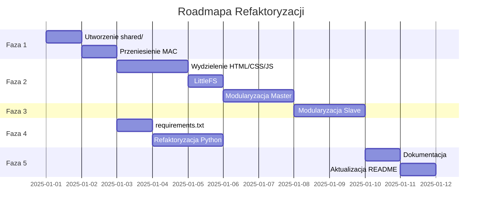

# Plan Refaktoryzacji Projektu Caliper

## Status Implementacji

| Faza | Status | Data |
|------|--------|------|


### 2.2 Reorganizacja modułów Master

**Docelowa struktura:**
```
caliper_master/src/
├── main.cpp              # Główna logika, zredukowana
├── config.h              # Konfiguracja specyficzna dla Master
├── communication/
│   ├── communication.h
│   └── communication.cpp
├── web/
│   ├── web_server.h      # Nowy moduł serwera HTTP
│   └── web_server.cpp
└── handlers/
    ├── serial_handler.h  # Obsługa komend serialowych
    └── serial_handler.cpp
```

---

## Faza 3: Refaktoryzacja Slave

### 3.1 Modularyzacja kodu Slave

**Docelowa struktura:**
```
caliper_slave/src/
├── main.cpp              # Główna logika, zredukowana
├── config.h              # Konfiguracja specyficzna dla Slave
├── sensors/
│   ├── caliper.h         # Obsługa suwarki
│   ├── caliper.cpp
│   ├── accelerometer.h   # Obsługa ADXL345
│   └── accelerometer.cpp
├── motor/
│   ├── motor_ctrl.h      # Przemianowany caliper_slave_motor_ctrl.h
│   └── motor_ctrl.cpp
└── power/
    ├── battery.h         # Obsługa baterii
    └── battery.cpp
```

### 3.2 Wyodrębnienie logiki suwarki

**Nowy plik `sensors/caliper.h`:**
```cpp
#ifndef CALIPER_H
#define CALIPER_H

#include <Arduino.h>
#include "../config.h"

class CaliperInterface {
private:
    static volatile uint8_t bitBuffer[52];
    static volatile int bitCount;
    static volatile bool dataReady;
    
    static void IRAM_ATTR clockISR();
    void reverseBits();
    float decodeCaliper();
    
public:
    void begin();
    float performMeasurement();
    bool isDataReady() const { return dataReady; }
};

#endif // CALIPER_H
```

---

## Faza 4: Aplikacja Python GUI

### 4.1 Utworzenie requirements.txt

**Lokalizacja:** `caliper_master_gui/requirements.txt`

```txt
# Caliper Master GUI Dependencies
dearpygui>=1.9.0
pyserial>=3.5
```

### 4.2 Refaktoryzacja aplikacji Python

**Problem:** Cały kod w jednym pliku (351 linii).

**Docelowa struktura:**
```
caliper_master_gui/
├── caliper_master_gui.py    # Główny punkt wejścia
├── requirements.txt
├── src/
│   ├── __init__.py
│   ├── app.py               # Klasa CaliperApp
│   ├── serial_handler.py    # Obsługa portu szeregowego
│   ├── gui/
│   │   ├── __init__.py
│   │   ├── main_window.py   # Główne okno
│   │   ├── measurement_tab.py
│   │   └── log_tab.py
│   └── utils/
│       ├── __init__.py
│       └── csv_handler.py   # Obsługa CSV
└── tests/
    └── test_serial.py
```

---

## Faza 5: Dokumentacja i CI/CD

### 5.1 Struktura dokumentacji

```
caliper/
├── AGENTS.md                # Instrukcje dla AI
├── README.md                # Główna dokumentacja
├── CHANGELOG.md             # Historia zmian (NOWY)
├── CONTRIBUTING.md          # Zasady współpracy (NOWY)
├── plans/
│   └── refactoring-plan.md  # Ten dokument
└── doc/
    ├── architecture.md      # Dokumentacja architektury (NOWY)
    ├── hardware/
    │   ├── ESP32-DevKit-V1-Pinout...
    │   ├── MP6550GG-Z.pdf
    │   └── schematic.png
    └── api/
        └── protocol.md      # Dokumentacja protokołu (NOWY)
```

### 5.2 Aktualizacja AGENTS.md

Dodanie informacji o nowej strukturze i instrukcji kompilacji.

---

## Podsumowanie Zmian

| Obszar | Przed | Po | Korzyści | Status |
|--------|-------|-----|----------|--------|
| Duplikacja kodu | 2 kopie common.h | 1 współdzielony plik w lib/ | Łatwiejsze utrzymanie | ✅ Ukończone |
| Wrappery common.h | 2 pliki wrapper | Bezpośrednie include | Prostszy kod | ✅ Ukończone |
| HTML w C++ | 240 linii inline | Osobne pliki CSS/JS/HTML w LittleFS | Czytelność, możliwość edycji | ✅ Ukończone |
| Adresy MAC | Hardkodowane | W config.h | Łatwa konfiguracja | ✅ Ukończone |
| Struktura folderów | Płaska | Modułowa | Skalowalność | ⏳ Oczekuje |
| Python deps | Brak | requirements.txt | Łatwa instalacja | ✅ Ukończone |

---

## Kolejność Implementacji



---

## Ryzyko i Mitrygacja

| Ryzyko | Prawdopodobieństwo | Wpływ | Mitygacja |
|--------|-------------------|-------|-----------|
| Błędy kompilacji po przeniesieniu | Średnie | Wysoki | Kompilacja po każdej zmianie |
| Problemy z LittleFS | Niskie | Średni | Fallback do PROGMEM |
| Niezgodność protokołu | Niskie | Krytyczny | Testy ESP-NOW przed i po |

---

## Notatki Implementacyjne

1. **Kompilacja współdzielonej biblioteki:**
   - Użycie `lib_extra_dirs` w platformio.ini
   - Alternatywnie: symlinki (nie działa na Windows)

2. **LittleFS upload:**
   ```bash
   cd caliper_master && pio run --target uploadfs
   ```

3. **Testowanie:**
   - Przed każdą fazą: kompilacja obu projektów
   - Po fazie 2: test interfejsu webowego
   - Po fazie 3: test pomiarów

---

*Dokument utworzony: 2025-12-26*
*Wersja: 1.0*
