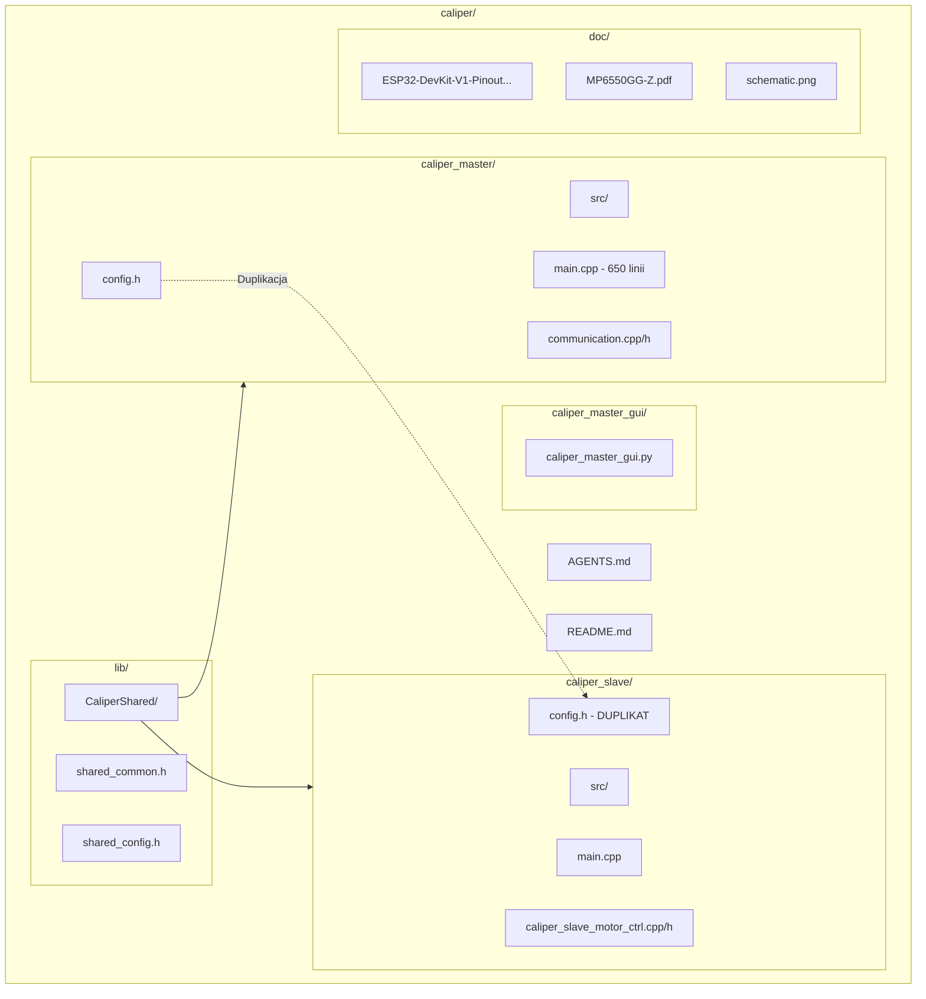
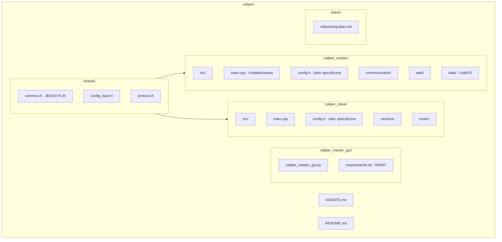
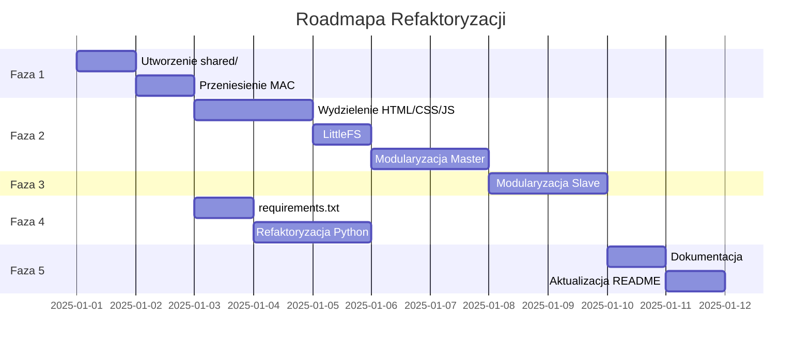

# Plan Refaktoryzacji Projektu Caliper

## Status Implementacji

| Faza | Status | Data |
|------|--------|------|
| Faza 1: Współdzielona biblioteka | ✅ Ukończona | 2025-12-26 |
| Faza 1.1: Usunięcie wrapperów common.h | ✅ Ukończona | 2025-12-26 |
| Faza 2: Refaktoryzacja Master | ⏳ Oczekuje | - |
| Faza 3: Modularyzacja Slave | ⏳ Oczekuje | - |
| Faza 4: Aplikacja Python | ✅ requirements.txt utworzony | 2025-12-26 |
| Faza 5: Dokumentacja | ⏳ Oczekuje | - |

## Przegląd

Ten dokument opisuje kompletny plan reorganizacji i refaktoryzacji projektu Caliper, który składa się z dwóch podprojektów PlatformIO (`caliper_master` i `caliper_slave`) oraz aplikacji Python GUI.

## Diagram Aktualnej Struktury



## Diagram Docelowej Struktury



---

## Faza 1: Podstawowa Reorganizacja

### 1.1 Utworzenie współdzielonej biblioteki ✅ UKOŃCZONE

**Problem:** Pliki [`common.h`](../caliper_master/src/common.h) i [`common.h`](../caliper_slave/src/common.h) zawierają niemal identyczny kod.

**Rozwiązanie:** Utworzenie biblioteki `lib/CaliperShared` ze wspólnymi definicjami.

**Status:** ✅ Zakończone (2025-12-26)
- Utworzono `lib/CaliperShared/shared_common.h` z ujednoliconymi strukturami
- Utworzono `lib/CaliperShared/shared_config.h` z konfiguracją
- Utworzono `lib/CaliperShared/library.json` dla PlatformIO
- Usunięto pliki wrapperowe `caliper_master/src/common.h` i `caliper_slave/src/common.h`
- Zaktualizowano wszystkie dołączenia do bezpośredniego użycia `#include <shared_common.h>`

#### Struktura docelowa:
```
shared/
├── common.h          # Wspólne struktury i enumy
├── config_base.h     # Wspólne parametry konfiguracyjne
└── protocol.h        # Definicje protokołu komunikacji
```

#### Zawartość `shared/common.h`:
```cpp
#ifndef SHARED_COMMON_H
#define SHARED_COMMON_H

#include <stdint.h>

// Command types for ESP-NOW communication
enum CommandType : char {
  CMD_MEASURE = 'M',
  CMD_FORWARD = 'F',
  CMD_REVERSE = 'R',
  CMD_STOP = 'S',
  CMD_UPDATE = 'U'
};

// Motor state enumeration
enum MotorState : uint8_t {
  MOTOR_STOP = 0,
  MOTOR_FORWARD = 1,
  MOTOR_REVERSE = 2,
  MOTOR_BRAKE = 3
};

// Error codes
enum ErrorCode : uint8_t {
  ERR_NONE = 0,
  ERR_ESPNOW_SEND,
  ERR_MEASUREMENT_TIMEOUT,
  ERR_INVALID_DATA,
  ERR_ADC_READ,
  ERR_INVALID_COMMAND
};

// Communication message structure
struct Message {
  float measurement;
  bool valid;
  uint32_t timestamp;
  CommandType command;
  uint16_t batteryVoltage;
};

// System status structure (only for Master)
#ifdef CALIPER_MASTER
struct SystemStatus {
  float lastMeasurement;
  uint16_t batteryVoltage;
  bool motorRunning;
  MotorState motorDirection;
  uint32_t lastUpdate;
  bool measurementValid;
  bool communicationActive;
};
#endif

#endif // SHARED_COMMON_H
```

#### Zmodyfikowane pliki (2025-12-26):
- [`caliper_slave/src/main.cpp`](../caliper_slave/src/main.cpp) - zmieniono na `#include <shared_common.h>`
- [`caliper_slave/src/caliper_slave_motor_ctrl.h`](../caliper_slave/src/caliper_slave_motor_ctrl.h) - zmieniono na `#include <shared_common.h>`
- [`caliper_master/src/main.cpp`](../caliper_master/src/main.cpp) - zmieniono na `#include <shared_common.h>`
- [`caliper_master/src/communication.h`](../caliper_master/src/communication.h) - zmieniono na `#include <shared_common.h>`

#### Usunięte pliki wrapperowe (2025-12-26):
- `caliper_slave/src/common.h` - wrapper już niepotrzebny
- `caliper_master/src/common.h` - wrapper już niepotrzebny

#### Konfiguracja w `platformio.ini`:
```ini
[env:esp32doit-devkit-v1]
lib_deps =
    file:///../lib/CaliperShared
build_flags = -DCALIPER_MASTER  ; lub -DCALIPER_SLAVE
```

---

### 1.2 Przeniesienie adresów MAC do konfiguracji

**Problem:** Adresy MAC są hardkodowane w [`main.cpp`](../caliper_master/src/main.cpp:9) i [`main.cpp`](../caliper_slave/src/main.cpp:14).

**Rozwiązanie:** Przeniesienie do plików `config.h`.

#### Zmiany w `caliper_master/src/config.h`:
```cpp
// Device MAC Addresses
#define SLAVE_MAC_ADDR {0xA0, 0xB7, 0x65, 0x21, 0x77, 0x5C}
```

#### Zmiany w `caliper_slave/src/config.h`:
```cpp
// Device MAC Addresses
#define MASTER_MAC_ADDR {0xA0, 0xB7, 0x65, 0x20, 0xC0, 0x8C}
```

---

## Faza 2: Refaktoryzacja Master

### 2.1 Wydzielenie HTML/CSS/JS

**Problem:** Plik [`main.cpp`](../caliper_master/src/main.cpp:170-410) zawiera 240 linii kodu HTML/CSS/JS inline.

**Rozwiązanie A - Pliki nagłówkowe:**
```cpp
// web_content.h
const char HTML_HEADER[] PROGMEM = R"rawliteral(
<!DOCTYPE html><html>...
)rawliteral";

const char HTML_STYLES[] PROGMEM = R"rawliteral(
<style>body { font-family: Arial; }...</style>
)rawliteral";

const char HTML_SCRIPTS[] PROGMEM = R"rawliteral(
<script>function showView(viewId) {...}</script>
)rawliteral";
```

**Rozwiązanie B - LittleFS (zalecane):**

#### Struktura plików:
```
caliper_master/
├── data/                    # Folder dla LittleFS
│   ├── index.html
│   ├── style.css
│   └── app.js
├── src/
│   └── main.cpp
```

#### Konfiguracja w `platformio.ini`:
```ini
[env:esp32doit-devkit-v1]
board_build.filesystem = littlefs
```

#### Przykład `data/index.html`:
```html
<!DOCTYPE html>
<html>
<head>
    <meta charset="UTF-8">
    <meta name="viewport" content="width=device-width, initial-scale=1.0">
    <title>ESP32 System Pomiarowy</title>
    <link rel="stylesheet" href="/style.css">
</head>
<body>
    <div class="container">
        <!-- Widok Menu -->
        <div id="menu-view" class="view">
            <h1>System Pomiarowy ESP32</h1>
            <button onclick="showView('calibration')">Kalibracja</button>
            <button onclick="showView('session-name')">Nowa sesja pomiarowa</button>
        </div>
        <!-- ... pozostałe widoki ... -->
    </div>
    <script src="/app.js"></script>
</body>
</html>
```

### 2.2 Reorganizacja modułów Master

**Docelowa struktura:**
```
caliper_master/src/
├── main.cpp              # Główna logika, zredukowana
├── config.h              # Konfiguracja specyficzna dla Master
├── communication/
│   ├── communication.h
│   └── communication.cpp
├── web/
│   ├── web_server.h      # Nowy moduł serwera HTTP
│   └── web_server.cpp
└── handlers/
    ├── serial_handler.h  # Obsługa komend serialowych
    └── serial_handler.cpp
```

---

## Faza 3: Refaktoryzacja Slave

### 3.1 Modularyzacja kodu Slave

**Docelowa struktura:**
```
caliper_slave/src/
├── main.cpp              # Główna logika, zredukowana
├── config.h              # Konfiguracja specyficzna dla Slave
├── sensors/
│   ├── caliper.h         # Obsługa suwarki
│   ├── caliper.cpp
│   ├── accelerometer.h   # Obsługa ADXL345
│   └── accelerometer.cpp
├── motor/
│   ├── motor_ctrl.h      # Przemianowany caliper_slave_motor_ctrl.h
│   └── motor_ctrl.cpp
└── power/
    ├── battery.h         # Obsługa baterii
    └── battery.cpp
```

### 3.2 Wyodrębnienie logiki suwarki

**Nowy plik `sensors/caliper.h`:**
```cpp
#ifndef CALIPER_H
#define CALIPER_H

#include <Arduino.h>
#include "../config.h"

class CaliperInterface {
private:
    static volatile uint8_t bitBuffer[52];
    static volatile int bitCount;
    static volatile bool dataReady;
    
    static void IRAM_ATTR clockISR();
    void reverseBits();
    float decodeCaliper();
    
public:
    void begin();
    float performMeasurement();
    bool isDataReady() const { return dataReady; }
};

#endif // CALIPER_H
```

---

## Faza 4: Aplikacja Python GUI

### 4.1 Utworzenie requirements.txt

**Lokalizacja:** `caliper_master_gui/requirements.txt`

```txt
# Caliper Master GUI Dependencies
dearpygui>=1.9.0
pyserial>=3.5
```

### 4.2 Refaktoryzacja aplikacji Python

**Problem:** Cały kod w jednym pliku (351 linii).

**Docelowa struktura:**
```
caliper_master_gui/
├── caliper_master_gui.py    # Główny punkt wejścia
├── requirements.txt
├── src/
│   ├── __init__.py
│   ├── app.py               # Klasa CaliperApp
│   ├── serial_handler.py    # Obsługa portu szeregowego
│   ├── gui/
│   │   ├── __init__.py
│   │   ├── main_window.py   # Główne okno
│   │   ├── measurement_tab.py
│   │   └── log_tab.py
│   └── utils/
│       ├── __init__.py
│       └── csv_handler.py   # Obsługa CSV
└── tests/
    └── test_serial.py
```

---

## Faza 5: Dokumentacja i CI/CD

### 5.1 Struktura dokumentacji

```
caliper/
├── AGENTS.md                # Instrukcje dla AI
├── README.md                # Główna dokumentacja
├── CHANGELOG.md             # Historia zmian (NOWY)
├── CONTRIBUTING.md          # Zasady współpracy (NOWY)
├── plans/
│   └── refactoring-plan.md  # Ten dokument
└── doc/
    ├── architecture.md      # Dokumentacja architektury (NOWY)
    ├── hardware/
    │   ├── ESP32-DevKit-V1-Pinout...
    │   ├── MP6550GG-Z.pdf
    │   └── schematic.png
    └── api/
        └── protocol.md      # Dokumentacja protokołu (NOWY)
```

### 5.2 Aktualizacja AGENTS.md

Dodanie informacji o nowej strukturze i instrukcji kompilacji.

---

## Podsumowanie Zmian

| Obszar | Przed | Po | Korzyści | Status |
|--------|-------|-----|----------|--------|
| Duplikacja kodu | 2 kopie common.h | 1 współdzielony plik w lib/ | Łatwiejsze utrzymanie | ✅ Ukończone |
| Wrappery common.h | 2 pliki wrapper | Bezpośrednie include | Prostszy kod | ✅ Ukończone |
| HTML w C++ | 240 linii inline | Osobne pliki CSS/JS/HTML | Czytelność, możliwość edycji | ⏳ Oczekuje |
| Adresy MAC | Hardkodowane | W config.h | Łatwa konfiguracja | ⏳ Oczekuje |
| Struktura folderów | Płaska | Modułowa | Skalowalność | ⏳ Oczekuje |
| Python deps | Brak | requirements.txt | Łatwa instalacja | ✅ Ukończone |

---

## Kolejność Implementacji



---

## Ryzyko i Mitrygacja

| Ryzyko | Prawdopodobieństwo | Wpływ | Mitygacja |
|--------|-------------------|-------|-----------|
| Błędy kompilacji po przeniesieniu | Średnie | Wysoki | Kompilacja po każdej zmianie |
| Problemy z LittleFS | Niskie | Średni | Fallback do PROGMEM |
| Niezgodność protokołu | Niskie | Krytyczny | Testy ESP-NOW przed i po |

---

## Notatki Implementacyjne

1. **Kompilacja współdzielonej biblioteki:**
   - Użycie `lib_extra_dirs` w platformio.ini
   - Alternatywnie: symlinki (nie działa na Windows)

2. **LittleFS upload:**
   ```bash
   cd caliper_master && pio run --target uploadfs
   ```

3. **Testowanie:**
   - Przed każdą fazą: kompilacja obu projektów
   - Po fazie 2: test interfejsu webowego
   - Po fazie 3: test pomiarów

---

*Dokument utworzony: 2025-12-26*
*Wersja: 1.0*
